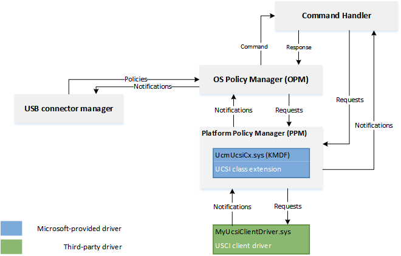

# Write a UCSI client driver

A USB Type-C Connector System Software Interface (UCSI) driver serves as the controller driver for a USB Type-C system with an embedded controller (EC).

If your system that implements Platform Policy Manager (PPM), as described in the UCSI specification, in an EC that is connected to the system over:

- An ACPI transport, you do _not_ need to write a driver. Load the Microsoft provided in-box driver, (UcmUcsiCx.sys and UcmUcsiAcpiClient.sys). (See [UCSI driver](ucsi.md)).

- A non-ACPI transport, such as  USB, PCI, I2C or UART, you need to write a client driver for the controller.

> If your USB Type-C hardware does not have the capability of handling the power delivery (PD) state machine, consider writing a USB Type-C port controller driver. For more information, see [Write a USB Type-C port controller driver](bring-up-a-usb-type-c-connector-on-a-windows-system.md).

Starting in Windows 10, version 1809, a new class extension for UCSI (UcmUcsiCx.sys) has been added,which implements the UCSI specification in a transport agnostic way. With minimal amount of code, your driver, which is a client to UcmUcsiCx, can communicate with the USB Type-C hardware over non-ACPI transport. This topic describes the services provided by the UCSI class extension and the expected behavior of the client driver.

**Official specifications**
-   [Intel BIOS Implementation of UCSI](http://go.microsoft.com/fwlink/p/?LinkId=760658)
-   [USB 3.1 and USB Type-C specifications](http://go.microsoft.com/fwlink/p/?LinkId=699515)
-   [UCSI driver](ucsi.md)

Applies to:

- Windows 10, version 1809

**WDF version**

-   KMDF version 1.27


**Important APIs**

[UcmUcsiCx class extensions reference](https://docs.microsoft.com/windows-hardware/drivers/ddi/content/_usbref/#type-c-driver-reference)

**Sample**

[UcmUcsiCx client driver sample](https://github.com/Microsoft/Windows-driver-samples/tree/master/usb/UcmUcsiAcpiSample)

Replace the ACPI portions with your implementation for the required bus.

## UCSI class extension architecture
UCSI class extension, UcmUcsiCx, allows you to write a driver that communicates with its embedded controller by using non-ACPI transport. The controller driver is a client driver to UcmUcsiCx. UcmUcsiCx is in turn a client to USB connector manager (UCM). Hence, UcmUcsiCx does not make any policy decisions of its own. Instead, it implements policies provided by UCM. UcmUcsiCx implements state machines for handling Platform Policy Manager (PPM) notifications from the client driver and sends commands to implement UCM policy decisions, allowing for a more reliable problem detection and error handling.



**OS Policy Manager (OPM)**

OS Policy Manager (OPM) implements the logic to interact with PPM, as described in the UCSI specification. OPM is responsible for:

- Converting UCM policies into UCSI commands and UCSI notifications into UCM notifications.
- Sending UCSI commands required for initializing PPM, detecting error, and recovery mechanisms.

**Handling UCSI commands** 

A typical operation involves several commands to be completed by the UCSI-complicant hardware. For example, let's consider the GET_CONNECTOR_STATUS command.

1. The PPM firmware sends a connect change notification to the UcmUcsiCx/client driver.
2. In response, the UcmUcsiCx/client driver sends a GET_CONNECTOR_STATUS command back to the PPM firmware.  
3. The PPM firmware executes GET_CONNECTOR_STATUS and asynchronously sends a command-complete notification to the UcmUcsiCx/client driver. That notification contains data about the actual connect status.
4. The UcmUcsiCx/client driver processes that status information and sends an ACK_CC_CI to the PPM firmware.
5. The PPM firmware executes ACK_CC_CI and asynchronously sends a command-complete notification to the UcmUcsiCx/client driver.
6. The UcmUcsiCx/client driver considers the GET_CONNECTOR_STATUS command to be complete.

**Communication with Platform Policy Manager (PPM)**

UcmUcsiCx abstracts the details of sending UCSI commands from OPM to the PPM firmware and receiving notifications from the PPM firmware. It converts PPM commands to WDFREQUEST objects and forwards them to the client driver.

- PPM Notifications

    The client driver notifies UcmUcsiCx about PPM notifications from the firmware. The driver provides the UCSI data block containing CCI. UcmUcsiCx forwards notifications to OPM and other components which take appropriate actions based on the data.

- IOCTLs to the client driver

    UcmUcsiCx sends UCSI commands (through IOCTL requests) to client driver to send to the PPM firmware. The driver is responsible for completing the request after it has sent the UCSI command to the firmware.


**Handling power transitions**

The client driver is the power policy owner.  

If the client driver enters a Dx state because of S0-Idle, WDF brings the driver to D0 when the UcmUcsiCx sends a IOCTL containing a UCSI command to the client driver's power-managed queue. The client driver in S0-Idle should reenter a powered state when there is a PPM notification from the firmware because in S0-Idle, PPM notifications are still enabled.  

## Before you begin...

-   Determine the type of driver you need to write depending on whether your hardware or firmware implements PD state machine, and the transport.

    
    For more information, see [Developing Windows drivers for USB Type-C connectors](developing-windows-drivers-for-usb-type-c-connectors.md).  

-   Install Windows 10 for desktop editions (Home, Pro, Enterprise, and Education).

-   [Install](https://developer.microsoft.com/windows/hardware/windows-driver-kit) the latest Windows Driver Kit (WDK) on your development computer. The kit has the required header files and libraries for writing the client driver, specifically, you'll need:

    -   The stub library, (UcmUcsiCxStub.lib). The library translates calls made by the client driver and pass them up to the class extension.
    -   The header file, Ucmucsicx.h.
    - The client driver runs in kernel mode and binds to  KMDF 1.27 library.

-   Familiarize yourself with Windows Driver Foundation (WDF). Recommended reading: [Developing Drivers with Windows Driver Foundation]( http://go.microsoft.com/fwlink/p/?LinkId=691676), written by Penny Orwick and Guy Smith.

## 1. Register your client driver with UcmUcsiCx

In your [**EVT_WDF_DRIVER_DEVICE_ADD**](https://docs.microsoft.com/windows-hardware/drivers/ddi/content/wdfdriver/nc-wdfdriver-evt_wdf_driver_device_add) implementation, 

1. After you have set the Plug and Play and power management event callback functions ([**WdfDeviceInitSetPnpPowerEventCallbacks**](https://docs.microsoft.com/windows-hardware/drivers/ddi/content/wdfdevice/nf-wdfdevice-wdfdeviceinitsetpnppowereventcallbacks)), call [**UcmUcsiDeviceInitInitialize**](https://docs.microsoft.com/windows-hardware/drivers/ddi/content/ucmucsidevice/nf-ucmucsidevice-ucmucsideviceinitinitialize) to initialize the [**WDFDEVICE_INIT**](https://docs.microsoft.com/windows-hardware/drivers/wdf/wdfdevice_init) opaque structure. The call associates the client driver with the framework.

2. After creating the framework device object (WDFDEVICE), call [**UcmUcsiDeviceInitialize**](https://docs.microsoft.com/windows-hardware/drivers/ddi/content/ucmucsidevice/nf-ucmucsidevice-ucmucsideviceinitialize.md) to register the client diver with UcmUcsiCx.

## 2. Create the PPM object with UcmUcsiCx

In your implementation of [**EVT_WDF_DEVICE_PREPARE_HARDWARE**](https://docs.microsoft.com/windows-hardware/drivers/ddi/content/wdfdevice/nc-wdfdevice-evt_wdf_device_prepare_hardware), after you have recieved the list of raw and translated resources, use the resources to prepare the hardware. For example, if your transport is I2C, read the hardware resources to open a communication channel. Next, create a PPM object. To create the object, you need to set certain configuration options.

1. Provide a handle to the connector collection on the device. 
   1. Create the connector collection by calling [**UcmUcsiConnectorCollectionCreate**](https://docs.microsoft.com/windows-hardware/drivers/ddi/content/ucmucsippm/nf-ucmucsippm-ucmucsiconnectorcollectioncreate).
   2. Enumerate the connectors on the device and add them to the collection by calling [**UcmUcsiConnectorCollectionAddConnector**](https://docs.microsoft.com/windows-hardware/drivers/ddi/content/ucmucsippm/nf-ucmucsippm-ucmucsiconnectorcollectionaddconnector)

      ```cpp
      // Create the connector collection.

      UCMUCSI_CONNECTOR_COLLECTION* ConnectorCollectionHandle;

      status = UcmUcsiConnectorCollectionCreate(Device, //WDFDevice
               WDF_NO_OBJECT_ATTRIBUTES,
               ConnectorCollectionHandle);

      // Enumerate the connectors on the device.
      // ConnectorId of 0 is reserved for the parent device.
      // In this example, we assume the parent has no children connectors.

      UCMUCSI_CONNECTOR_INFO_INIT(&connectorInfo);
      connectorInfo.ConnectorId = 0;

      status = UcmUcsiConnectorCollectionAddConnector ( &ConnectorCollectionHandle,
                   &connectorInfo);
      ```
2. Decide whether you want to enable the device controller.

3. Configure and create the PPM object.
   1. Initialize a [**UCMUCSI_PPM_CONFIG**](https://docs.microsoft.com/windows-hardware/drivers/ddi/content/ucmucsippm/ns-ucmucsippm-ucmucsi-ppm-config) structure by providing the connector handle you created in step 1.
   2. Set **UsbDeviceControllerEnabled** member to a boolean value determined in step 2.
   3. Set your event callbacks in WDF_OBJECT_ATTRIBUTES.
   4. Call [**UcmUcsiPpmCreate**](https://docs.microsoft.com/windows-hardware/drivers/ddi/content/ucmucsippm/nf-ucmucsippm-ucmucsippmcreate) by passing all the configured structures.

      ```cpp
      UCMUCSIPPM ppmObject = WDF_NO_HANDLE;
      PUCMUCSI_PPM_CONFIG UcsiPpmConfig;
      WDF_OBJECT_ATTRIBUTES attrib;

      UCMUCSI_PPM_CONFIG_INIT(UcsiPpmConfig, ConnectorCollectionHandle);

      UcsiPpmConfig->UsbDeviceControllerEnabled = TRUE;

      WDF_OBJECT_ATTRIBUTES_INIT_CONTEXT_TYPE(&attrib, Ppm);
      attrib->EvtDestroyCallback = &EvtObjectContextDestroy;

      status = UcmUcsiPpmCreate(wdfDevice, UcsiPpmConfig, &attrib, &ppmObject);
      ```
      ## 3. Set up IO queues

UcmUcsiCx sends UCSI commands to client driver to send to the PPM firmware. The commands are sent in form of these IOCTL requests in a WDF queue.

-  [IOCTL_UCMUCSI_PPM_SEND_UCSI_DATA_BLOCK](https://docs.microsoft.com/windows-hardware/drivers/ddi/content/ucmucsippmrequests/ni-ucmucsippmrequests-ioctl_ucmucsi_ppm_send_ucsi_data_block)
-  [IOCTL_UCMUCSI_PPM_GET_UCSI_DATA_BLOCK](https://docs.microsoft.com/windows-hardware/drivers/ddi/content/ucmucsippmrequests/ni-ucmucsippmrequests-ioctl_ucmucsi_ppm_get_ucsi_data_block)

The client driver is responsible for creating and registering that queue to UcmUcsiCx by calling [**UcmUcsiPpmSetUcsiCommandRequestQueue**](https://docs.microsoft.com/windows-hardware/drivers/ddi/content/ucmucsippm/nf-ucmucsippm-ucmucsippmsetucsicommandrequestqueue). The queue must be power-managed.

UcmUcsiCx guarantees that there can be at most one outstanding request in the WDF queue. The client driver also is responsible of completing the WDF request after it has sent the UCSI command to the firmware.

Typically the driver sets up queues in its implementation of [**EVT_WDF_DEVICE_PREPARE_HARDWARE**](https://docs.microsoft.com/windows-hardware/drivers/ddi/content/wdfdevice/nc-wdfdevice-evt_wdf_device_prepare_hardware).

```cpp
WDFQUEUE UcsiCommandRequestQueue = WDF_NO_HANDLE;
WDF_OBJECT_ATTRIBUTES attrib;
WDF_IO_QUEUE_CONFIG queueConfig;

WDF_OBJECT_ATTRIBUTES_INIT(&attrib);
attrib.ParentObject = GetObjectHandle();

// In this example, even though the driver creates a sequential queue, 
// UcmUcsiCx guarantees that will not send another request 
// until the previous one has been completed.


WDF_IO_QUEUE_CONFIG_INIT(&queueConfig, WdfIoQueueDispatchSequential);

// The queue must be power-managed.

queueConfig.PowerManaged = WdfTrue;
queueConfig.EvtIoDeviceControl = EvtIoDeviceControl;

status = WdfIoQueueCreate(device, &queueConfig, &attrib, &UcsiCommandRequestQueue);

UcmUcsiPpmSetUcsiCommandRequestQueue(ppmObject, UcsiCommandRequestQueue);
```

Also, the client driver must also call [**UcmUcsiPpmStart**](https://docs.microsoft.com/windows-hardware/drivers/ddi/content/ucmucsippm/nf-ucmucsippm-ucmucsippmstart) to notify UcmUcsiCx that the driver is ready to receive the IOCTL requests.  We recommend that you make that call in your in [**EVT_WDF_DEVICE_PREPARE_HARDWARE**](https://docs.microsoft.com/windows-hardware/drivers/ddi/content/wdfdevice/nc-wdfdevice-evt_wdf_device_prepare_hardware) after creating the WDFQUEUE handle for receiving UCSI commands, through [**UcmUcsiPpmSetUcsiCommandRequestQueue**](https://docs.microsoft.com/windows-hardware/drivers/ddi/content/ucmucsippm/nf-ucmucsippm-ucmucsippmsetucsicommandrequestqueue).
Conversely, when the driver does not want to process any more requests, it must call [**UcmUcsiPpmStop**](https://docs.microsoft.com/windows-hardware/drivers/ddi/content/ucmucsippm/nf-ucmucsippm-ucmucsippmstop). Do this is in your [**EVT_WDF_DEVICE_RELEASE_HARDWARE**](https://docs.microsoft.com/windows-hardware/drivers/ddi/content/wdfdevice/nc-wdfdevice-evt_wdf_device_release_hardware) implementation.

## 4. Handle the IOCTL requests

Consider this example sequence of the events that occurs when a USB Type-C partner is attached to a connector.

1. PPM firmware determines an attach event and sends a notification to the client driver.
2. Client driver calls [**UcmUcsiPpmNotification**](https://docs.microsoft.com/windows-hardware/drivers/ddi/content/ucmucsippm/nf-ucmucsippm-ucmucsippmnotification) to send that notification to UcmUcsiCx.
3. UcmUcsiCx notfies the OPM state machine and it sends a Get Connector Status command to UcmUcsiCx.
4. UcmUcsiCx creates a request and sends [IOCTL_UCMUCSI_PPM_SEND_UCSI_DATA_BLOCK](https://docs.microsoft.com/windows-hardware/drivers/ddi/content/ucmucsippmrequestsni-ucmucsippmrequests-ioctl_ucmucsi_ppm_send_ucsi_data_block) to the client driver.
5. The client driver processes that request and sends the command to the PPM firmware. The driver completes this request asynchronously and sends another notification to UcmUcsiCx.
6. On successful command complete notification, the OPM state machine reads the payload (containing connector status info) and notifies UCM of the Type-C attach event.

In this example, the payload also indicated that a change in power delivery negotiation status between the firmware and the port partner was successful. The OPM state machine sends another UCSI command: Get PDOs.
Similar to Get Connector Status command, when Get PDOs command completes successfully, the OPM state machine notifies UCM of this event.

The client driver's handler for [EVT_WDF_IO_QUEUE_IO_DEVICE_CONTROL](https://docs.microsoft.com/windows-hardware/drivers/ddi/content/wdfio/nc-wdfio-evt_wdf_io_queue_io_device_control) is similar to this example code. For information about handling requests, see [Request Handlers](https://docs.microsoft.com/windows-hardware/drivers/wdf/request-handlers)

```cpp
void EvtIoDeviceControl(
    _In_ WDFREQUEST Request,
    _In_ ULONG IoControlCode
    )
{
...
    switch (IoControlCode)
    {
    case IOCTL_UCMUCSI_PPM_SEND_UCSI_DATA_BLOCK:
        EvtSendData(Request);
        break;

    case IOCTL_UCMUCSI_PPM_GET_UCSI_DATA_BLOCK:
        EvtReceiveData(Request);
        break;

    default:
        status = STATUS_NOT_SUPPORTED;
        goto Exit;
    }

    status = STATUS_SUCCESS;

Exit:

    if (!NT_SUCCESS(status))
    {
        WdfRequestComplete(Request, status);
    }

}

VOID EvtSendData(
    WDFREQUEST Request
    )
{
    NTSTATUS status;
    PUCMUCSI_PPM_SEND_UCSI_DATA_BLOCK_IN_PARAMS inParams;

    status = WdfRequestRetrieveInputBuffer(Request, sizeof(*inParams),
        reinterpret_cast<PVOID*>(&inParams), nullptr);
    if (!NT_SUCCESS(status))
    {
        goto Exit;
    }

    // Build a UCSI command request and send to the PPM firmware.

Exit:
    WdfRequestComplete(Request, status);
}

VOID EvtReceiveData(
    WDFREQUEST Request
    )
{

    NTSTATUS status;

    PUCMUCSI_PPM_GET_UCSI_DATA_BLOCK_IN_PARAMS inParams;
    PUCMUCSI_PPM_GET_UCSI_DATA_BLOCK_OUT_PARAMS outParams;

    status = WdfRequestRetrieveInputBuffer(Request, sizeof(*inParams),
        reinterpret_cast<PVOID*>(&inParams), nullptr);
    if (!NT_SUCCESS(status))
    {
        goto Exit;
    }

    status = WdfRequestRetrieveOutputBuffer(Request, sizeof(*outParams),
        reinterpret_cast<PVOID*>(&outParams), nullptr);
    if (!NT_SUCCESS(status))
    {
        goto Exit;
    }

    // Receive data from the PPM firmware.
    if (!NT_SUCCESS(status))
    {
        goto Exit;
    }
    WdfRequestSetInformation(Request, sizeof(*outParams));

Exit:
    WdfRequestComplete(Request, status);
}
```
