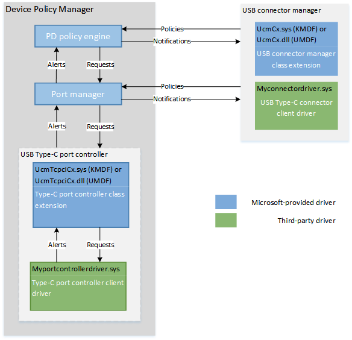
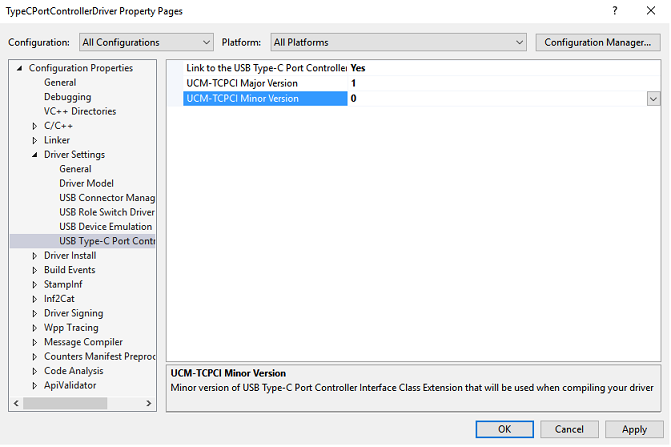

# Write a USB Type-C port controller driver

You need to write a USB Type-C port controller driver if your USB Type-C hardware implements the USB Type-C or Power Delivery (PD) physical layer but does not implement the state machines required for Power Delivery. 

In Windows 10, version 1703, the USB Type-C architecture has been improved to support hardware designs that implement the USB Type-C or Power Delivery (PD) physical layer but do not have a corresponding PD policy engine or protocol layer implementation. For these designs, Windows 10 version 1703 provides a software-based PD policy engine and device policy manager through a new class extension called "USB Connector Manager Type-C Port Controller Interface Class Extension" (UcmTcpciCx). A client driver written by an IHV or OEM/ODM communicates with UcmTcpciCx to provide information about the hardware events needed for the PD policy engine and device policy manager in UcmTcpciCx to function. That communication is enabled through a set of programming interfaces described in this topic and in the reference section.

The UcmTcpciCx class extension is itself a client driver of UcmCx. The policy decisions about power contracts, data roles, are made in UcmCx and forwarded to UcmTcpciCx. UcmTcpciCx implements those policies and manages the Type-C and PD state machines, by using the port controller interface provided by your UcmTcpciCx client driver. 

**Summary**
- Services provided by the UcmTcpci class extension
- Expected behavior of the client driver

**Official specifications**
-   [USB Type-C Port Controller Interface Specification]
-   [USB 3.1 and USB Type-C specifications](http://go.microsoft.com/fwlink/p/?LinkId=699515)
-   [USB Power Delivery](http://go.microsoft.com/fwlink/p/?LinkID=623310)

Applies to:

- Windows 10

**WDF version**

-   KMDF version 1.15

**Last updated:**

-   May 2017

**Important APIs**

[USB Type-C Port Controller Interface driver class extensions reference](https://docs.microsoft.com/windows-hardware/drivers/ddi/content/_usbref/#type-c-driver-reference)

**UcmTcpciCx client driver template**

[UcmTcpciCx client driver template](https://github.com/Microsoft/Windows-driver-samples/tree/master/usb/UcmTcpciCxClientSample)

## Before you begin...

-   Determine the type of driver you need to write depending on whether your hardware or firmware implements PD state machine. For more information, see [Developing Windows drivers for USB Type-C connectors](developing-windows-drivers-for-usb-type-c-connectors.md).  

-   Install Windows 10 for desktop editions (Home, Pro, Enterprise, and Education) on your target computer or Windows 10 Mobile with a USB Type-C connector.
-   [Install](http://go.microsoft.com/fwlink/p/?LinkID=845980) the latest Windows Driver Kit (WDK) on your development computer. The kit has the required header files and libraries for writing the client driver, specifically, you'll need:

    -   The stub library, (UcmTcpciCxStub.lib). The library translates calls made by the client driver and pass them up to the class extension .
    -   The header file, UcmTcpciCx.h.

    The client driver runs in kernel mode and binds to  KMDF 1.15 library. 

    

-  Decide whether the client driver will support alerts.

- Your port controller is not required to be TCPCI-compliant. The interface captures the capabilities of any Type-C port controller. Writing a UcmTcpciCx client driver for hardware that is not TCPCI-compliant simply involves mapping the meanings of registers and commands in the TCPCI specification to those of the hardware. 

- Most TCPCI controllers are I2C-connected. Your client driver will use a serial peripheral bus (SPB) connection resource and an interrupt line to communicate with the hardware. The driver will use the SPB Framework Extension (SpbCx) programming intefaces. Familiarize yourself with SpbCx by reading these topics:
    - [Simple Peripheral Bus (SPB) Driver Design Guide]
    - [SPB driver programming reference] 

-   Familiarize yourself with Windows Driver Foundation (WDF). Recommended reading: [Developing Drivers with Windows Driver Foundation]( http://go.microsoft.com/fwlink/p/?LinkId=691676), written by Penny Orwick and Guy Smith.

## Behavior of the UcmTcpci class extension

 -  As part of state machine execution, UcmTcpciCx sends IOCTL requests to the port controller. For example, in PD messaging, it sends an IOCTL_UCMTCPCI_PORT_CONTROLLER_SET_TRANSMIT_BUFFER  request to set the transmit buffer. That request (TRANSMIT_BUFFER) is handed off to the client driver. The driver then sets the transmit buffer with the details provided by the class extension. 

-   UcmTcpciCx implements policies about power contracts, data roles, and so on.  

## Expected behavior of the client driver

The client driver to the UcmTcpciCx is expected to:

-   Be the power policy owner. UcmTcpciCx does not participate in power management of the port controller. 

-   Translate requests, received from UcmTcpciCx, into a hardware read or write commands. The commands must be asynchronous because DPM cannot block waiting for a hardware transfer to complete.  

-   Provide a framework queue object that contains framework request objects. For each request that the UcmTcpci class extension wants to send to the client driver, the extension adds a request object in the driver's queue object. When the driver is finished processing the request, it calls WdfRequestComplete. It is the client driver’s responsibility to complete requests in a timely manner. 

-   Discover and report the capabilities of the port controller. Those capabilities include information such as the roles the port controller can operate in (such as Source-only, Sink-only, DRP). However, there are other capabilities of the connector (see the Note about Capability Store) and of the system as a whole, that the DPM is required to know in order to properly implement the USB Type-C and PD policy. For instance, the DPM needs to know the source capabilities of the system/connector to advertise it to the port partner. 

    **Note    Capability Store** 
        
    In addition to the client driver-related capabilities, additional information comes from a system-global location referred to as the _Capability Store_. This system-global Capability Store is stored in ACPI. It is a static description of the capabilities of the system and each of its USB Type-C connectors that the DPM uses to determine the policies to implement. 
      
    By separating the description of the system capabilities from the client driver for the port controller(s), the design allows for a driver to be used on different systems of varying capabilities. UcmCx, not UcmTcpciCx, interfaces with the Capability Store. UcmTcpciCx (or its client driver) does not interact with the Capability Store. 
      
    Wherever applicable, the information from the Capability Store overrides information coming directly from the port controller client driver. For instance, a port controller is capable of Sink-only operation and the client driver reports that information. However, the rest of the system might not be configured correctly for Sink-only operation. In that case, the system manufacturer can report that the connectors are capable of Source-only operation in the Capability Store. The setting in the Capability Store takes precedence over the driver reported information. 

-   Notify UcmTcpciCx with all relevant data related to the alerts. 
 
-   Optional. Perform some extra processing after an alternate mode is entered/exited. The driver is informed about those states by the class extension through IOCTL requests. 

## 1. Register the client driver with UcmTcpciCx

    Sample reference: See EvtPrepareHardware in Device.cpp

1.  In your EVT_WDF_DRIVER_DEVICE_ADD implementation, call UcmTcpciDeviceInitInitialize to initialize the WDFDEVICE_INIT opaque structure. The call associates the client driver with the framework.

2.  After creating the framework device object (WDFDEVICE), call UcmTcpciDeviceInitialize to register the client diver with UcmTcpciCx.

## 2. Initialize the I2C communications channel to the port controller hardware.

    Sample reference: See EvtCreateDevice in Device.cpp

In your EVT_WDF_DEVICE_PREPARE_HARDWARE implementation, read the hardware resources to open a communication channel. This is required to retrieve PD capabilities and get notified about alerts. 

Most TCPCI controllers are I2C-connected. In the reference sample, the client driver opens an I2 channel by using SPB Framework Extension (SpbCx) programming intefaces. 

The client driver enumerates the hardware resources by calling WdfCmResourceListGetDescriptor. 

Alerts are received as interrupts. Therefore, the driver creates a framework interrupt object and registers the ISR that will handle the alerts.  The ISR performs hardware read and write operations which block until the hardware access is complete. Because waiting is unacceptable at DIRQL, the driver performs the ISR at PASSIVE_LEVEL. 

## 3. Initialize the port controller's Type-C and PD capabilities
    
    Sample reference: See EvtDeviceD0Entry in Device.cpp

 In your EVT_WDF_DEVICE_D0_EXIT implementation, 
 
 1. Communicate with the port controller hardware and retrieve device identificaton and capabilities by reading various registers. 
 
 2. Initialize  UCMTCPCI_PORT_CONTROLLER_IDENTIFICATION and UCMTCPCI_PORT_CONTROLLER_CAPABILITIES with the retrieved information. 

 3. Initialize  UCMTCPCI_PORT_CONTROLLER_CONFIG structure with the preceding information by passing the initialized structures to  UCMTCPCI_PORT_CONTROLLER_CONFIG_INIT.

 4. Call UcmTcpciPortControllerCreate to create the port controller object and retrieve the UCMTCPCIPORTCONTROLLER handle.

## 4. Set up a framework queue object for receiving requests from UcmTcpciCx

    Sample reference: See EvtDeviceD0Entry in Device.cpp and HardwareRequestQueueInitialize in Queue.cpp.

 1. In your EVT_WDF_DEVICE_D0_EXIT implementation, create a framework queue object by calling WdfIoQueueCreate. In that call, you will need to register your callback implementation to handle IOCTL requests sent by UcmTpciCx. The client driver may use a power-managed queue. 

    During the execution of the Type-C and PD state machines, UcmTpciCx sends commands to the client driver to execute. UcmTcpciCx guarantees that there will be at most one outstanding port controller request at any given time.  
 
 2. Call UcmTcpciPortControllerSetHardwareRequestQueue to register the new framework queue object with UcmTpciCx. After that call succeeds, UcmTcpciCx puts framework queue objects (WDFREQUEST) in this queue when it requires action from the driver. 

 3. Implement EvtIoDeviceControl callback funciton to handle these IOCTLs. 

|  Control Code |  Description | 
|---            |           ---|
|IOCTL_UCMTCPCI_PORT_CONTROLLER_GET_STATUS|   Gets values of all status registers as per the Universal Serial Bus Type-C Port Controller Interface Specification. The client driver must retrieve the values of the CC_STATUS, POWER_STATUS, and FAULT_STATUS registers.|
|IOCTL_UCMTCPCI_PORT_CONTROLLER_GET_CONTROL|Gets the values of all control registers defined as per the Universal Serial Bus Type-C Port Controller Interface Specification.|
|IOCTL_UCMTCPCI_PORT_CONTROLLER_SET_CONTROL|Sets the value of a control register defined as per the Universal Serial Bus Type-C Port Controller Interface Specification.| 
|IOCTL_UCMTCPCI_PORT_CONTROLLER_SET_TRANSMIT|Sets the TRANSMIT Register defined as per the Universal Serial Bus Type-C Port Controller Interface Specification.|
|IOCTL_UCMTCPCI_PORT_CONTROLLER_SET_TRANSMIT_BUFFER|Sets the TRANSMIT_BUFER Register defined as per the Universal Serial Bus Type-C Port Controller Interface Specification.|
|IOCTL_UCMTCPCI_PORT_CONTROLLER_SET_RECEIVE_DETECT|Sets the RECEIVE_DETECT Register defined as per the Universal Serial Bus Type-C Port Controller Interface Specification.|
|IOCTL_UCMTCPCI_PORT_CONTROLLER_SET_CONFIG_STANDARD_OUTPUT|Sets the CONFIG_STANDARD_OUTPUT Register defined as per the Universal Serial Bus Type-C Port Controller Interface Specification.|
|IOCTL_UCMTCPCI_PORT_CONTROLLER_SET_COMMAND|Sets the value of a command register defined as per the Universal Serial Bus Type-C Port Controller Interface Specification.|
|IOCTL_UCMTCPCI_PORT_CONTROLLER_SET_MESSAGE_HEADER_INFO|Sets the value of the MESSAGE_HEADER_INFO Register defined as per the Universal Serial Bus Type-C Port Controller Interface Specification.|
|IOCTL_UCMTCPCI_PORT_CONTROLLER_ALTERNATE_MODE_ENTERED|Notifies the client driver that an alternate mode is entered so that the driver can perform additional tasks.|
|IOCTL_UCMTCPCI_PORT_CONTROLLER_ALTERNATE_MODE_EXITED|Notifies the client driver that an alternate mode is exited so that the driver can perform additional tasks.|
|IOCTL_UCMTCPCI_PORT_CONTROLLER_DISPLAYPORT_CONFIGURED|Notifies the client driver that the DisplayPort alternate mode on the partner device has been configured with pin assignment so that the driver can perform additional tasks.|
|IOCTL_UCMTCPCI_PORT_CONTROLLER_DISPLAYPORT_HPD_STATUS_CHANGED|Notifies the client driver that the hot-plug detect status of the DisplayPort connection has changed so that the driver can perform additional tasks.|

4. Call UcmTcpciPortControllerStart to instruct UcmTcpciCx to start the port controller. UcmTcpciCx assume control of USB Type-C and Power Delivery. After the port controller is started, UcmTcpciCx may start putting requests into the 
hardware request queue. 

 
## 5. Handlle alerts from the port controller hardware

    Sample reference: See ProcessAndSendAlerts in Alert.cpp.

The client driver must handle alerts (or events) received from the port controller hardware and send them to UcmTcpciCx with data related to the event. 

When a hardware alert occurs, the port controller hardware drives the ALERT pin high. This causes the client driver's 
ISR (registered in step 2) to get invoked. The routine services the hardware interrupt at PASSIVE_LEVEL. The routine determines if an interrupt is an alert from the port controller hardware; if so, it completes the processing of the alert and notifies UcmTcpciCx by calling UcmTcpciPortControllerAlert. 

Before calling UcmTcpciPortControllerAlert, the client is responsible for including all relevant data related to the alert in a UCMTCPCI_PORT_CONTROLLER_ALERT_DATA structure. The client provides an array of all alerts that are active because there is a possibility that the hardware could assert multiple alerts simultaneously. 

Here is an example flow of tasks to report change in CC Status. 

1. Client receives a hardware alert. 

2. Client reads the ALERT register and determines the type alerts that are active. 

3. Client reads the CC STATUS register and describes the contents of the CC STATUS register in UCMTCPCI_PORT_CONTROLLER_ALERT_DATA. The driver sets AlertType member to UcmTcpciPortControllerAlertCCStatus and CCStatus member of register.

4. Client calls UcmPortControllerAlert to send the array hardware alerts to UcmTcpciCx. 

5. Client clears the alert (this may happen at any time after the client retrieves the alert information) 

## 6. Process requests received from UcmTcpciCx

    Sample reference: See PortControllerInterface.cpp.

As part of state machine execution, UcmTcpciCx needs to send requests to the port controller. For example, it needs to set the TRANSMIT_BUFFER. This request is handed off to the client driver. The driver sets the transmit buffer with the details provided by UcmTcpciCx. Most of those requests translate into a hardware read or write by the client driver. The commands must be asynchronous because the DPM cannot block waiting for a hardware transfer to complete.

UcmTcpciCx sends the commands as I/O Control Code describing the get/set operation that is required from the client driver. In the client driver's queue setup, the driver registered its queue with UcmTcpciCx.  UcmTcpciCx starts placing framework request objects in the queue it requires operation from the driver. The I/O Control codes are listed in the table in step 4.

It is the client driver’s responsibility to complete requests in a timely fashion.TBD,

The client driver calls WdfRequestComplete on the framework request object with a completion status when it has finished the requested operation. 

The client driver might need to send an I/O request to another driver to perform the hardware operation. For example, in the sample, the driver sends an SPB request to the I2C-connected port controller. In that case, the driver cannot forward the framework request object it received from UcmTcpciCx because the request object might not have the correct number of stack locations in the WDM IRP. The client driver must create another framework request object and forward it to another driver. The client driver can preallocate request objects it needs during initialization, instead of creating a one every time it gets a request from UcmTcpciCx. This is possible because UcmTcpciCx guarantees that there will be only one request outstanding at any given time. 

## See Also
[USB Type-C Port Controller Interface driver class extensions reference](https://msdn.microsoft.com/library/windows/hardware/mt805826)
