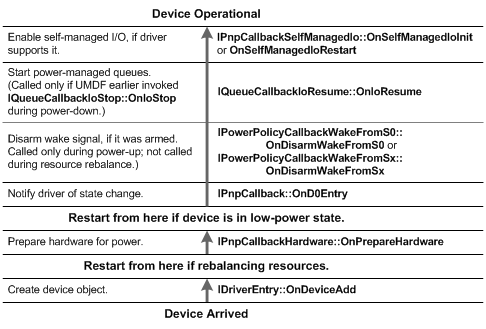

# A User Plugs in a Device

[!include[UMDF 1 Deprecation](../umdf-1-deprecation.md)]

When a user plugs in a device, the framework calls a UMDF driver's PnP and Power Management callback methods in the following sequence, starting from the Device Arrived state at the bottom of the figure:

The framework begins by calling the driver’s [**IDriverEntry::OnDeviceAdd**](https://msdn.microsoft.com/library/windows/hardware/ff554896) callback so that the driver can create a device callback object and a framework device object to represent the device. The framework continues calling the driver’s callback routines by progressing up through the sequence until the device is operational.

The framework proceeds through this sequence for each UMDF function or filter driver that supports the device, one driver at a time, starting with the driver that is lowest in the driver stack.

 

 

