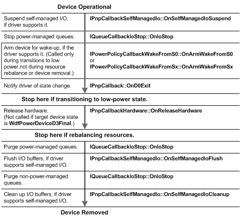
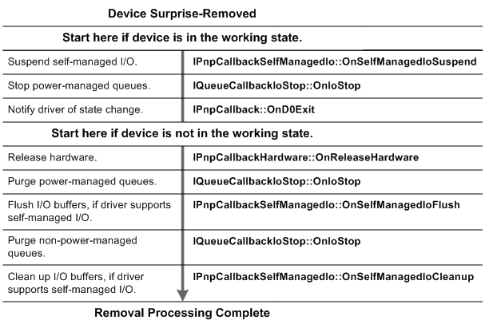

# A User Unplugs a Device

[!include[UMDF 1 Deprecation](../umdf-1-deprecation.md)]

While a system is running, a user can remove a device in one of the following two ways: by *orderly removal*, which means that the user informs the system that the device is about to be removed (for example, by using the Unplug or Eject Hardware program); or by *surprise removal*, which means that the user unplugs the device without informing the system. If the bus supports surprise removal (for example, USB), the device's drivers must be able to handle the device's sudden disappearance.

**Orderly Removal**   
The user requests removal by using the system's Unplug or Eject Hardware program, by disabling the device by using Device Manager, or by pushing an ejectable device's eject button. The framework allows the device to be removed or disabled, unless the driver has supplied an [**IPnpCallback::OnQueryRemove**](https://msdn.microsoft.com/library/windows/hardware/ff556808) callback function, and the callback function has vetoed the removal.

The following figure shows the sequence of UMDF callbacks in power-down and removal. The sequence starts at the top of the figure with a device that is in the working power state (D0).

**Surprise Removal**   
In this scenario, a user unplugs a device unexpectedly. In the surprise-removal sequence, UMDF calls the [**IPnpCallback::OnSurpriseRemoval**](https://msdn.microsoft.com/library/windows/hardware/ff556812) callback to notify the driver that the device has been unexpectedly removed. This callback is not guaranteed to occur in any particular order with the other callbacks in the removal sequence.

Generally, the driver should avoid accessing the hardware in the remove path. The reflector times out if an attempt to access the hardware waits indefinitely. The following figure shows the surprise-removal sequence for a UMDF driver.

 

 

