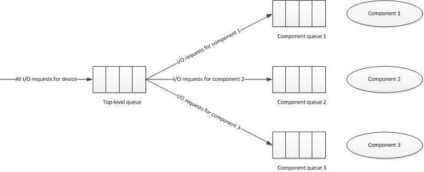

# Coordinating I/O Requests with Component Power State

\[Applies to KMDF only\]

A KMDF driver for a multiple-component device must only send requests to components that are in an active state. Typically, the driver assigns I/O queues to components or sets of components.

Consider first a queue that is assigned to a single component. The driver starts the queue when the component becomes active and stops the queue when the component becomes idle. As such, when KMDF calls a request handler for the queue, the device is in its fully on (D0) state, and the required component is active. The request handler can safely access component hardware.

The same concept applies to a queue that is assigned to a set of components. In this case, the driver starts the queue when all of the components in the set are active. The driver stops the queue when any one of the components becomes idle.

This topic describes how a KMDF driver for a multiple-component device might implement such support in a situation involving multiple request types that require different combinations of components.

## Example

For each request type supported by the driver, identify the required components. For example, consider a device that has three components: 0, 1 and 2, for which the driver receives three types of requests: A, B, and C. The component requirements of the requests are as follows:

| Request type | Components needed |
|--------------|-------------------|
| A            | 0,2               |
| B            | 1                 |
| C            | 0,1,2             |

 

In this example, there are three distinct sets of components, one for each request type.
The driver supplies one default, power-managed I/O queue for the device, as well as one additional power-managed queue corresponding to each set of components. In the example above, the driver creates one primary queue and three secondary queues, one corresponding to each component set. This queue configuration is shown in the following diagram:

The driver maintains a bitmask for each component set. Each bit in the bitmask represents the active/idle state of one of the components. If the bit is set, the component is active. If the bit is cleared, the component is idle.

When a request arrives, a [request handler](request-handlers.md) for the top-level queue determines which components the request needs and calls [**PoFxActivateComponent**](https://msdn.microsoft.com/library/windows/hardware/hh406650) for each one. The request handler then forwards the request to the secondary I/O queue corresponding to that component’s set.

When a component becomes active, the power management framework (PoFx) calls the driver’s [*ComponentActiveConditionCallback*](https://msdn.microsoft.com/library/windows/hardware/hh406416) routine. In this callback, the driver sets the bit corresponding to the specified component, in each bitmask where that component is represented. If all of the bits in a given bitmask are set, all of the components in the corresponding set are active. For each component set that is fully active, the driver calls [**WdfIoQueueStart**](https://msdn.microsoft.com/library/windows/hardware/ff548478) to start the corresponding secondary I/O queue.

For example, consider the hypothetical device above. Suppose that component 0 is active, while components 1 and 2 are idle. When component 2 becomes active, PoFx calls that component's [*ComponentActiveConditionCallback*](https://msdn.microsoft.com/library/windows/hardware/hh406416) routine. Request types A and C use component 2, so the driver manipulates the bitmasks for these two request types. Because all the bits in the bitmask for request type A are now set, the driver starts the queue for request type A. However, not all bits are set for request type C (component 1 is still idle). The driver does not start the queue for request type C.

When a secondary I/O queue is started, the framework begins delivering the requests that are stored in the queue. In the [request handler](request-handlers.md) for the secondary I/O queue, the driver can safely process the requests because the component is active and a power reference has been taken on the component for each of the requests.

When the driver finishes processing a request, it calls [**PoFxIdleComponent**](https://msdn.microsoft.com/library/windows/hardware/hh406717) for each component that the request was using, and then completes the request. When there are no more requests using a component, the power framework calls the driver’s [*ComponentIdleConditionCallback*](https://msdn.microsoft.com/library/windows/hardware/hh406420) routine.

In this callback, the driver clears the bit corresponding to the specified component, in each bitmask where that component is represented. If a given bitmask indicates that the component is the first one in the corresponding set to transition to the idle condition, the driver calls [**WdfIoQueueStop**](https://msdn.microsoft.com/library/windows/hardware/ff548482) to stop the corresponding secondary I/O queue. By doing so, the driver ensures that the queue does not dispatch requests unless all of the components in the corresponding set are active.

Consider again the above example. Suppose that all components are active and therefore all queues are started. When component 1 becomes idle, PoFx calls the [*ComponentIdleConditionCallback*](https://msdn.microsoft.com/library/windows/hardware/hh406420) routine for component 1. In this callback, the driver manipulates the bitmasks for request types B and C because they use component 1. Because component 1 is the first component to become idle for both these request types, the driver stops the queues for request types B and C.

Suppose that at this point, component 0 becomes idle. In the [*ComponentIdleConditionCallback*](https://msdn.microsoft.com/library/windows/hardware/hh406420) for component 0, the driver manipulates the bitmasks for request types A and C. Because component 0 is the first component to become idle for request type A (component 2 is still active), the driver stops the queue for request type A. However, for request type C, component 0 is not the first component to become idle. The driver does not stop the queue for request type C (it did so earlier).

To use the technique described in this example, the driver must also register an [*EvtIoCanceledOnQueue*](https://msdn.microsoft.com/library/windows/hardware/ff541756) callback function for each of its secondary queues. If a request were to be canceled while in the secondary queue, the driver could use this callback to call [**PoFxIdleComponent**](https://msdn.microsoft.com/library/windows/hardware/hh406717) for each corresponding component. Doing so releases the power reference that the request handler took when it called [**PoFxActivateComponent**](https://msdn.microsoft.com/library/windows/hardware/hh406650) before forwarding the request to the secondary queue.

 

 

