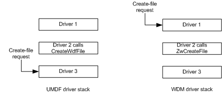

# Creating and Using Driver-Created File Objects

[!include[UMDF 1 Deprecation](../umdf-1-deprecation.md)]

If your driver needs to create and send an I/O request that is independent of the application to the next driver in the stack (the default I/O target), the driver must create and close its own file objects.

### Creating a File Object

Your driver must call the [**IWDFDevice::CreateWdfFile**](https://msdn.microsoft.com/library/windows/hardware/ff558828) method to create a file object for the driver's use. When the driver calls **IWDFDevice::CreateWdfFile**, the framework sends a create request to the next driver in the stack. The next driver in the stack could be in kernel mode or in user mode.

This create-file request processing is different in the Windows Driver Model (WDM). In WDM, a call to the [**ZwCreateFile**](https://msdn.microsoft.com/library/windows/hardware/ff566424) function causes a create IRP to go to the top of the kernel-mode stack. The following figure shows create-file request processing in UMDF versus WDM:

By calling [**IWDFDevice::CreateWdfFile**](https://msdn.microsoft.com/library/windows/hardware/ff558828), the driver can create a file object and then send I/O requests during device start, before the whole stack has started.

The next driver in the stack must determine if it can handle the create-file request or if it must forward the request further down the stack.

After calling [**IWDFDevice::CreateWdfFile**](https://msdn.microsoft.com/library/windows/hardware/ff558828), a driver cannot cancel the create operation.

## Using the File Object

To send an asynchronous read request to the next driver stacked below it, your driver can use the following pattern.

1.  Call [**IWDFDevice::CreateWdfFile**](https://msdn.microsoft.com/library/windows/hardware/ff558828) to create the file object.
2.  Call [**IWDFDevice::GetDefaultIoTarget**](https://msdn.microsoft.com/library/windows/hardware/ff558831) to retrieve the interface representing the lower level driver.
3.  Call [**IWDFDevice::CreateRequest**](https://msdn.microsoft.com/library/windows/hardware/ff557021) to create an unformatted [**IWDFIoRequest**](https://msdn.microsoft.com/library/windows/hardware/ff558985) object.
4.  Call [**IWDFIoRequest::SetCompletionCallback**](https://msdn.microsoft.com/library/windows/hardware/ff559153) to register a [**IRequestCallbackRequestCompletion**](https://msdn.microsoft.com/library/windows/hardware/ff556904) interface for the [**OnCompletion**](https://msdn.microsoft.com/library/windows/hardware/ff556905) method that the framework calls when an I/O request completes.
5.  Call [**IWDFIoTarget::FormatRequestForRead**](https://msdn.microsoft.com/library/windows/hardware/ff559233), providing a pointer to the [**IWDFDriverCreatedFile**](https://msdn.microsoft.com/library/windows/hardware/ff558895) interface in the *pFile* parameter.
6.  Call [**IWDFIoRequest::Send**](https://msdn.microsoft.com/library/windows/hardware/ff559149) to send the request.

## Closing the File Object

The driver that called [**IWDFDevice::CreateWdfFile**](https://msdn.microsoft.com/library/windows/hardware/ff558828) must later call [**IWDFDriverCreatedFile::Close**](https://msdn.microsoft.com/library/windows/hardware/ff558897).

Typically, your driver calls [**IWDFDriverCreatedFile::Close**](https://msdn.microsoft.com/library/windows/hardware/ff558897) either from its [**IPnpCallbackHardware::OnReleaseHardware**](https://msdn.microsoft.com/library/windows/hardware/ff556768) or [**IPnpCallbackSelfManagedIo::OnSelfManagedIoCleanup**](https://msdn.microsoft.com/library/windows/hardware/ff556780) callback method.

When the driver calls [**IWDFDriverCreatedFile::Close**](https://msdn.microsoft.com/library/windows/hardware/ff558897), the framework calls the next driver's [**IFileCallbackCleanup::OnCleanupFile**](https://msdn.microsoft.com/library/windows/hardware/ff554905) method. In this method, the next driver must cancel or complete all pending I/O requests that are associated with the file object. The framework then cancels any I/O requests created by the driver that called [**IWDFDevice::CreateWdfFile**](https://msdn.microsoft.com/library/windows/hardware/ff558828). The framework does not cancel any I/O requests that lower drivers in the stack may have associated with the file object. It is the driver's responsibility to cancel any such requests. The file object only closes after all I/O requests associated with it have completed.

Next, the framework calls the next driver's [**IFileCallbackClose::OnCloseFile**](https://msdn.microsoft.com/library/windows/hardware/ff554910) method. At this point, the framework guarantees that the next driver will not receive additional I/O requests for this file object.

After the framework calls [**OnCloseFile**](https://msdn.microsoft.com/library/windows/hardware/ff554910), it destroys the [IWDFFile](https://msdn.microsoft.com/library/windows/hardware/ff558912) interface that represents the file object.

If driver-created file objects remain after the driver's device-removal methods (for example [**IPnpCallbackHardware::OnReleaseHardware**](https://msdn.microsoft.com/library/windows/hardware/ff556768) and [**IPnpCallbackSelfManagedIo::OnSelfManagedIoCleanup**](https://msdn.microsoft.com/library/windows/hardware/ff556780)) return, the framework generates a driver stop. For information about troubleshooting this problem, see [Determining Why UMDF Indicates Outstanding Files at Device Removal Time](determining-why-umdf-indicates-outstanding-files-at-device-removal-tim.md).

 

 

