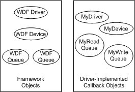
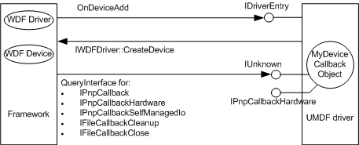

# Creating Callback Objects

[!include[UMDF 1 Deprecation](../umdf-1-deprecation.md)]

A UMDF driver can create *callback objects*, which consist of context data and interface methods. The framework accesses the driver's callback objects through the driver's callback interface methods.

The following figure shows how driver-implemented callback objects correspond to [framework objects](framework-objects.md).

A UMDF driver can create several types of callback objects, including the following:

-   Driver callback object

    The framework uses the driver callback object to initialize the driver and notify the driver of the arrival of a new device.

-   Device callback object

    The driver uses the device callback object to store device context and to handle the cleanup and closing of file objects and Plug and Play (PnP) and power management (PM) events.

-   Queue callback object

    The driver uses the queue callback object to process I/O.

The following figure shows how a UMDF driver creates a device callback object.

The following topics contain code examples that show how to create a callback object:

-   [Creating Callback Objects Example](creating-callback-objects-example.md)

-   [Defining Callback Objects Example](defining-callback-objects-example.md)

-   [Associating Callback Interfaces Example](associating-callback-interfaces-example.md)

 

 

