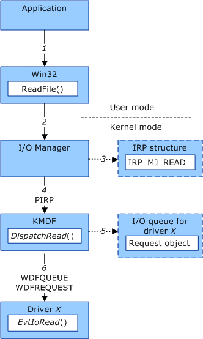

# Creating Framework Request Objects

Most framework request objects are created by the framework, but your driver can also create request objects.

### Request Objects Created by the Framework

When a framework-based driver receives an I/O request packet (IRP) from the I/O manager, the framework intercepts the IRP and creates a framework request object. The framework places the request object into an I/O queue and, if the driver has registered [request handlers](request-handlers.md) for the queue, calls the appropriate handler.

The following diagram illustrates the steps that occur when the framework creates a request object for a read operation.

The following steps correspond to the numbers in the preceding diagram:

1.  A user-mode application reads a file by calling the Microsoft Win32 **ReadFile** function.

2.  The **ReadFile** function calls the I/O manager, which runs in kernel mode.

3.  The I/O manager allocates an IRP structure and stores an [**IRP\_MJ\_READ**](https://msdn.microsoft.com/library/windows/hardware/ff550794) function code in the structure.

4.  The I/O manager calls the [**DispatchRead**](https://msdn.microsoft.com/library/windows/hardware/ff543376) standard driver routine for driver *x*, passing a pointer to the IRP structure. Because driver *x* is a framework-based driver, the framework provides the driver's *DispatchRead* routine.

5.  The framework creates a request object that represents the IRP structure. The framework adds the request object to one of the driver's queue objects.

6.  The framework calls the driver's [*EvtIoRead*](https://msdn.microsoft.com/library/windows/hardware/ff541776) request handler, passing a queue object handle and a request object handle.

### Request Objects Created by a Driver

Framework-based drivers can also create request objects. For example, a driver might create request objects if it receives a read or write request for an amount of data that is larger than the driver's [I/O targets](using-i-o-targets.md) can handle at one time. In such a situation, the driver can divide the data into several smaller requests and use additional request objects to send these smaller requests to one or more I/O targets.

To create a request object, your driver should call [**WdfRequestCreate**](https://msdn.microsoft.com/library/windows/hardware/ff549951) followed by framework object methods that initialize the request, such as [**WdfUsbTargetPipeFormatRequestForRead**](https://msdn.microsoft.com/library/windows/hardware/ff551136).

If a driver receives WDM IRPs in a WDM dispatch routine and then services or forwards them by using the framework, the driver can call [**WdfRequestCreateFromIrp**](https://msdn.microsoft.com/library/windows/hardware/ff549953).

 

 

