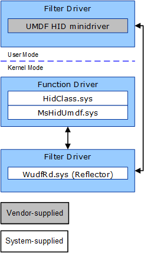
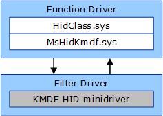

# Creating WDF HID Minidrivers


This topic describes how to create a Human Interface Device (HID) minidriver using Windows Driver Frameworks (WDF).

You can write a HID minidriver using either KMDF or UMDF. We recommend starting with the vhidmini2 minidriver sample. You can compile this sample driver using either KMDF or UMDF 2.x.

**What to provide**

1.  You'll write a lower filter driver under *MsHidUmdf.sys* (for UMDF) or *MsHidKmdf.sys* (for KMDF), both of which are included as part of the operating system.
2.  Download and review the [vhidmini2 sample](https://github.com/Microsoft/Windows-driver-samples/tree/master/hid/vhidmini2).

3.  Call [**WdfFdoInitSetFilter**](https://msdn.microsoft.com/library/windows/hardware/ff547273) from the driver's [*EvtDriverDeviceAdd*](https://msdn.microsoft.com/library/windows/hardware/ff541693) callback function.

4.  Create I/O queues to receive I/O requests that *MsHidUmdf.sys* or *MsHidKmdf.sys* pass from the class driver to your driver.

5.  Provide an [*EvtIoDeviceControl*](https://msdn.microsoft.com/library/windows/hardware/ff541758) callback function that branches to IOCTL-specific method handlers. Review the IOCTLs described in [WDF HID Minidriver IOCTLs](https://msdn.microsoft.com/library/windows/hardware/hh463977) and ensure that your driver handles the relevant ones for your device.
6.  For UMDF, if your driver is enumerated by ACPI, optionally enable selective suspend. In the device's hardware key, add a **EnableDefaultIdleNotificationHandler** subkey and set it to 1.
7.  For UMDF, set the following [INF directives](specifying-wdf-directives-in-inf-files.md) in a WDF-specific *DDInstall* section of your INF file:

    -   **UmdfKernelModeClientPolicy** to **AllowKernelModeClients** so that the kernel-mode pass-through driver can be loaded in the stack.
    -   **UmdfMethodNeitherAction** to **Copy** to allow UMDF to process IOCTLs of METHOD\_NEITHER type.
    -   **UmdfFileObjectPolicy** to **AllowNullAndUnknownFileObjects**
    -   **UmdfFsContextUsePolicy** to **CanUseFsContext2**

    For example:

    ```cpp
    [hidumdf.NT.Wdf]
    UmdfKernelModeClientPolicy = AllowKernelModeClients
    UmdfMethodNeitherAction=Copy
    UmdfFileObjectPolicy=AllowNullAndUnknownFileObjects
    UmdfFsContextUsePolicy = CanUseFsContext2
    ```

If you are writing a UMDF HID minidriver for Windows 7, download [Windows Driver Kit (WDK) 8.1](https://go.microsoft.com/fwlink/p/?LinkId=733614) to obtain source code for *HidUmdf.sys*. Then, write a UMDF 1.11 driver and include *HidUmdf.sys* and UMDF 1.11 in your driver package.

## Architecture


The HID class driver (*HidClass.sys*) and the framework provide conflicting WDM dispatch routines to handle some I/O requests (such as Plug and Play and power management requests) for minidrivers. As a result, a HID minidriver cannot link to both the class driver and the framework. Therefore, Microsoft provides *MsHidUmdf.sys* and *MsHidKmdf.sys*, which are WDM drivers that reside between the class driver and the minidriver.

Both *MsHidUmdf.sys* and *MsHidKmdf.sys* call the HID class driver's [**HidRegisterMinidriver**](https://msdn.microsoft.com/library/windows/hardware/ff539835) routine to register as the actual HID minidriver. Although these drivers act as the device's function driver, they just pass I/O requests from the class driver to your driver (and are thus sometimes called *pass-through drivers*). For both KMDF and UMDF, the only component that you supply is the HID minidriver, which is a lower filter driver that sits under the pass-through driver.

|                                                                                     |                                                                                        |
|-------------------------------------------------------------------------------------|----------------------------------------------------------------------------------------|
| UMDF architecture                                                                   | KMDF architecture                                                                      |
|  |  |

 

 

 


