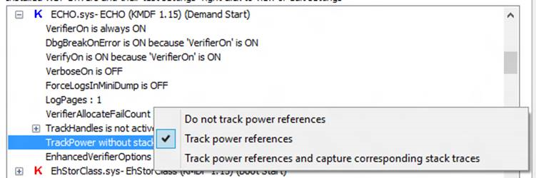

# Debugging Power Reference Leaks in WDF


When a Windows Driver Frameworks (WDF) driver calls [**WdfDeviceStopIdle**](/windows-hardware/drivers/ddi/wdfdevice/nf-wdfdevice-wdfdevicestopidle), the framework increments the device's power reference count. Every successful call to **WdfDeviceStopIdle** must be matched by a call to [**WdfDeviceResumeIdle**](/windows-hardware/drivers/ddi/wdfdevice/nf-wdfdevice-wdfdeviceresumeidle) to decrement the power reference count.

Starting in Kernel-Mode Driver Framework (KMDF) 1.15 and User-Mode Driver Framework (UMDF) 2.15, you can monitor power reference usage by using the [**!wdfkd.wdfdevice**](../debugger/-wdfkd-wdfdevice.md) and [**!wdfkd.wdftagtracker**](../debugger/-wdfkd-wdftagtracker.md) debugger extensions. This functionality is disabled by default for performance reasons, so you need to turn it on with the WdfVerifier application or by manually editing the driver’s service key.

## WdfVerifier


Open the settings list for your driver and right-click the **TrackPower** setting. Choose the option appropriate for your scenario.

**Tip**  Avoid capturing stack traces in performance-critical code paths.

 



## Editing the Registry


You can also turn on Verifier support and power reference tracking by editing your driver’s service key.

For a KMDF driver:

**HKLM\\SYSTEM\\ControlSet001\\Services\\&lt;Driver Service Name&gt;\\Parameters\\Wdf**

For a UMDF driver:

**HKLM\\SOFTWARE\\Microsoft\\Windows NT\\CurrentVersion\\WUDF\\Services\\&lt;Driver Service Name&gt;\\Parameters\\Wdf**

```cpp
(REG_DWORD) VerifierOn = 0x1
(REG_DWORD) TrackPower = 0x0 (disabled)
                       = 0x1 (capture tick count, file name, line number)
                       = 0x2 (capture tick count, file name, line number, and stack traces)
```

## Driver Code


Drivers call [**WdfDeviceStopIdle**](/windows-hardware/drivers/ddi/wdfdevice/nf-wdfdevice-wdfdevicestopidle) and [**WdfDeviceResumeIdle**](/windows-hardware/drivers/ddi/wdfdevice/nf-wdfdevice-wdfdeviceresumeidle) to manage the device’s working power state as follows:

```cpp
//
// Take power reference
//
status = WdfDeviceStopIdle(device, FALSE);
if (NT_SUCCESS(status)) {
    //
    // Release power reference
    //
    WdfDeviceResumeIdle(device);
}
```

## Debugging with WdfKd


To display the power references taken on the device, as well as a tag tracker that shows the reference history, use [**!wdfkd.wdfdevice**](../debugger/-wdfkd-wdfdevice.md) with verbose flags:

```cpp
kd> !wdfkd.wdfdevice 0x6d939790 ff
Power references: 0 !wdftagtracker 0x9ea030a8
```

Calling the [**!wdfkd.wdftagtracker**](../debugger/-wdfkd-wdftagtracker.md) shows the device’s power reference history:

```cpp
kd> !wdftagtracker 0x9ea030a8
Reference and Release History:
# (showing most recent first; refcount is approximate in multi-threaded scenarios)

## 3 entries, history depth is 25

(--) 0 ref: Tag '....' at Time 0x1331e ticks
##      path\to\your\driver\code.c @ 374

(++) 1 refs: Tag '....' at Time 0x1331e ticks
##      path\to\your\driver\code.c @ 372

(++) Initial Tag '....' at Time 0x12c9a ticks
```

## Specifying a Tag


Optionally, specify a tag name to facilitate identification of specific power references. To do so, use [**WdfDeviceStopIdleWithTag**](/windows-hardware/drivers/ddi/wdfdevice/nf-wdfdevice-wdfdevicestopidlewithtag) and [**WdfDeviceResumeIdleWithTag**](/windows-hardware/drivers/ddi/wdfdevice/nf-wdfdevice-wdfdeviceresumeidlewithtag):

```cpp
status = WdfDeviceStopIdleWithTag(device, FALSE, (PVOID)'oyeH');
if (NT_SUCCESS(status)) {
    WdfDeviceResumeIdleWithTag(device, (PVOID)'oyeH');
}
```

Corresponding [**!wdftagtracker**](../debugger/-wdfkd-wdftagtracker.md) sample output:

```cpp
(--) 0 ref: Tag 'Heyo' at Time 0x24e40 ticks
##      path\to\your\driver\code.c @ 374

(++) 1 refs: Tag 'Heyo' at Time 0x24e40 ticks
##      path\to\your\driver\code.c @ 372

(++) Initial Tag '....' at Time 0x12c9a ticks
```

 

