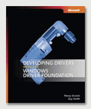

# Developing Drivers with the Windows Driver Foundation: Reference Book

The *Developing Drivers with Windows Driver Foundation* book is also available to help you learn the concepts and fundamentals of Windows Driver Frameworks (WDF). This book introduces Windows drivers and basic kernel-mode programming, and then describes the WDF architecture and programming model. It provides a practical, sample-oriented guide to using the frameworks to develop Windows drivers.

Orwick, Penny and Guy Smith. *Developing Drivers with Windows Driver Foundation*. Redmond, WA: Microsoft Press, 2007.

## Where can I find the book?

You can purchase the book from O'Reilly using the following link:

-   [Preview or read entire content](http://safari.oreilly.com/9780735623743) with a Safari subscription

 

 

