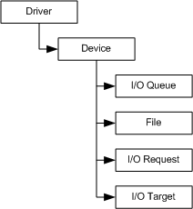

# Framework Object Hierarchy

[!include[UMDF 1 Deprecation](../includes/umdf-1-deprecation.md)]

The following figure shows the parent-child framework object hierarchy.

The lifetime scope of framework objects is determined by their location in the hierarchy and how the objects are created. The lifetime scope of framework objects falls into one of the following categories:

-   The framework controls the creation and destruction of the objects.

    The framework creates and destroys objects, such as the [driver object](framework-driver-object.md) and [device object](framework-device-object.md), in response to system events. When a user-mode driver calls the [**IWDFDriver::CreateDevice**](/windows-hardware/drivers/ddi/wudfddi/nf-wudfddi-iwdfdriver-createdevice) method to create the device object, the driver can optionally register to be notified by the framework before the device object is destroyed.

-   The framework creates the object; however, the driver controls when the object is released.

    The [I/O request object](framework-i-o-request-object.md) follows this pattern when I/O is presented to the driver. The framework creates the request object, and the request object's lifetime is valid until the driver calls the [**IWDFIoRequest::Complete**](/windows-hardware/drivers/ddi/wudfddi/nf-wudfddi-iwdfiorequest-complete) method.

-   The driver creates the object and associates the object with another framework object.

    Some framework objects are created by a method that is exposed by a parent framework object instance that the objects are to be associated to for lifetime-management purposes. The [**IWDFDevice::CreateIoQueue**](/windows-hardware/drivers/ddi/wudfddi/nf-wudfddi-iwdfdevice-createioqueue) method is an example of this pattern. If a call to **IWDFDevice::CreateIoQueue** succeeds, the newly created I/O queue is associated with the device instance that the [IWDFDevice](/windows-hardware/drivers/ddi/wudfddi/nn-wudfddi-iwdfdevice) interface represents. When the parent object is destroyed, the framework automatically cleans up child instances. Drivers are notified of these events if the drivers register appropriate callback functions with the framework.

 

