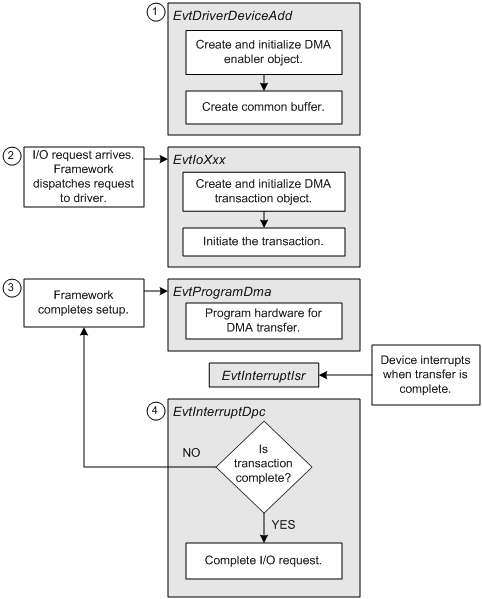

# Handling I/O Requests in a KMDF Driver for a Bus-Master DMA Device

\[Applies to KMDF only\]

This topics in this section describe how a KMDF driver for a bus-master DMA device processes an I/O request. If you are writing a KMDF driver that implements system-mode DMA, see [Supporting System-Mode DMA](supporting-system-mode-dma.md).

Handling I/O requests in a KMDF driver for a bus-master DMA device requires code in several of the driver’s event callback functions, as shown in the following figure:

As shown above, DMA-related processing takes place in four phases:

1.  Your driver's [*EvtDriverDeviceAdd*](https://msdn.microsoft.com/library/windows/hardware/ff541693) or [*EvtDevicePrepareHardware*](https://msdn.microsoft.com/library/windows/hardware/ff540880) callback function must [enable DMA transactions](enabling-dma-transactions.md) for the device, so that your driver can use the framework's DMA capabilities. The same callback function must also [create a common buffer](using-common-buffers.md) if your device and driver require access to a shared memory buffer.

2.  When your driver receives an I/O request that requires the device to perform a DMA operation, one of the driver's [request handlers](request-handlers.md) must [create and initialize a new DMA transaction](creating-and-initializing-a-dma-transaction.md). (Note that if your driver [reuses DMA transaction objects](reusing-dma-transaction-objects.md), your driver's [*EvtDriverDeviceAdd*](https://msdn.microsoft.com/library/windows/hardware/ff541693) callback function can create the transaction objects.) Then, the request handler must [initiate the DMA transaction](starting-a-dma-transaction.md) so that the framework can begin breaking the transaction into smaller DMA transfers, if necessary, and call the driver's [*EvtProgramDma*](https://msdn.microsoft.com/library/windows/hardware/ff541816) callback function.

3.  Your driver's [*EvtProgramDma*](https://msdn.microsoft.com/library/windows/hardware/ff541816) callback function [programs the DMA hardware](programming-dma-hardware.md) for a single DMA transfer and enables device interrupts.

4.  When the device interrupts, the framework calls your driver's [*EvtInterruptIsr*](https://msdn.microsoft.com/library/windows/hardware/ff541735) callback function, which saves volatile device information and schedules execution of the driver's [*EvtInterruptDpc*](https://msdn.microsoft.com/library/windows/hardware/ff541721) callback function.

    Your driver's [*EvtInterruptDpc*](https://msdn.microsoft.com/library/windows/hardware/ff541721) callback function [completes each DMA transfer](completing-a-dma-transfer.md) after the hardware finishes processing it. After a DMA transaction's final transfer is complete, the *EvtInterruptDpc* callback function [completes the DMA transaction](completing-a-dma-transaction.md).

Your driver might [reuse its DMA transaction objects](reusing-dma-transaction-objects.md) to ensure that they can operate when memory resources are low.

Your driver can provide a set of callback functions that handle [DMA-specific power management operations](supporting-power-management-for-dma-devices.md).

Some drivers [use common buffers](using-common-buffers.md) that both a device and the driver can access.

 

 

