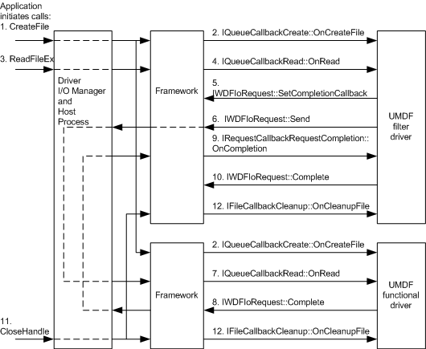

# Operation Flow with Double Device Stack

[!include[UMDF 1 Deprecation](../umdf-1-deprecation.md)]

The following figure shows the flow of operations that occur to and from UMDF filter and functional drivers in a double device stack.

**Note**   All I/O that is initiated by applications is routed through kernel mode as shown in the figures in the [Architecture of the UMDF](https://msdn.microsoft.com/library/windows/hardware/ff554461) section, even though the preceding figure does not show this situation.

 

The UMDF filter and function drivers might also call the [**IWDFIoRequest::GetCreateParameters**](https://msdn.microsoft.com/library/windows/hardware/ff559088) method if they require information about the file that is associated with the read request. The UMDF filter and function drivers might also call the [**IWDFIoRequest::GetReadParameters**](https://msdn.microsoft.com/library/windows/hardware/ff559113) method if they require more information about the read request.

The UMDF functional driver calls the [**IWDFIoRequest::Complete**](https://msdn.microsoft.com/library/windows/hardware/ff559070) or [**IWDFIoRequest::CompleteWithInformation**](https://msdn.microsoft.com/library/windows/hardware/ff559074) method to signal to the filter driver that it is done with the read operation. The UMDF filter driver might also call methods of the [IWDFIoRequestCompletionParams](https://msdn.microsoft.com/library/windows/hardware/ff559055) interface if it requires more information to complete the read request. The UMDF filter driver calls **Complete** or **CompleteWithInformation** to signal that the read operation is complete; the application can then access the read data.

 

 

