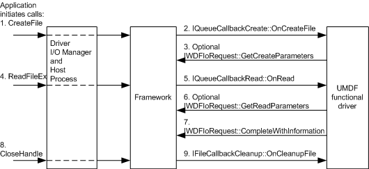

# Operation Flow with Single Device Stack

[!include[UMDF 1 Deprecation](../includes/umdf-1-deprecation.md)]

The following figure shows the flow of operations that occur to and from the UMDF functional driver in a single device stack.

**Note**   All I/O that is initiated by applications is routed through kernel mode as shown in the figures in the [Architecture of the UMDF](/previous-versions/ff554461(v=vs.85)) section, even though the preceding figure does not show this situation.

 

The UMDF driver calls the [**IWDFIoRequest::GetCreateParameters**](/windows-hardware/drivers/ddi/wudfddi/nf-wudfddi-iwdfiorequest-getcreateparameters) method only if it requires information about the file that is associated with the read request. The UMDF driver calls the [**IWDFIoRequest::GetReadParameters**](/windows-hardware/drivers/ddi/wudfddi/nf-wudfddi-iwdfiorequest-getreadparameters) method only if it requires more information about the read request.

The UMDF driver can call the [**IWDFIoRequest::Complete**](/windows-hardware/drivers/ddi/wudfddi/nf-wudfddi-iwdfiorequest-complete) method rather than the [**IWDFIoRequest::CompleteWithInformation**](/windows-hardware/drivers/ddi/wudfddi/nf-wudfddi-iwdfiorequest-completewithinformation) method if specifying the number of bytes that are transferred in the read operation is not required. The UMDF driver calls **Complete** or **CompleteWithInformation** to signal that the read operation is complete; the application can then access the read data.

 

