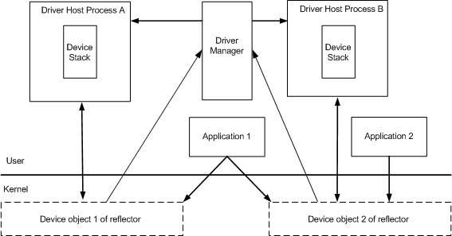

# Overview of UMDF

This topic provides a high-level overview of User-Mode Driver Framework (UMDF) components and describes how your driver interacts with system-supplied components. It applies to both UMDF versions 1 and 2.

UMDF drivers abstract hardware functionality, run in the user-mode environment, and can access various services. UMDF drivers operate as part of a stack of drivers that manage a device. File system drivers, display drivers (for full display devices, not display-only display devices), and print drivers cannot be UMDF drivers.

A UMDF driver interacts with the following system-supplied components:

-   Driver host process

    The driver host process loads vendor-supplied UMDF drivers and framework DLLs, provides an execution environment for user-mode drivers, and routes messages between drivers in a user-mode stack. For more information, see [UMDF Driver Host Process](umdf-driver-host-process.md).

-   Driver manager

    The driver manager is a Windows service that manages all instances of the Wudfhost driver host process. The driver manager launches and tracks information about each driver host process. Each host is a child process of the driver manager. Only one driver manager exists per system. The driver manager starts during installation of the first UMDF device and runs on the system thereafter.

-   Reflector

    The reflector is a kernel-mode driver that permits an application and a driver host process (and user-mode device stacks) to communicate. The reflector creates a separate device object for each device instance and handles Plug and Play (PnP) and power I/O requests associated with each device instance. All communication between the application and the driver host process happens through the reflector. For more information, see [Architecture of UMDF](detailed-view-of-the-umdf-architecture.md).

All function and filter drivers for a given device must run in the same driver host process, but multiple host processes can be running concurrently.

The following diagram shows how driver host processes, driver manager, and reflector communicate across the user mode/kernel mode boundary.

 

 

