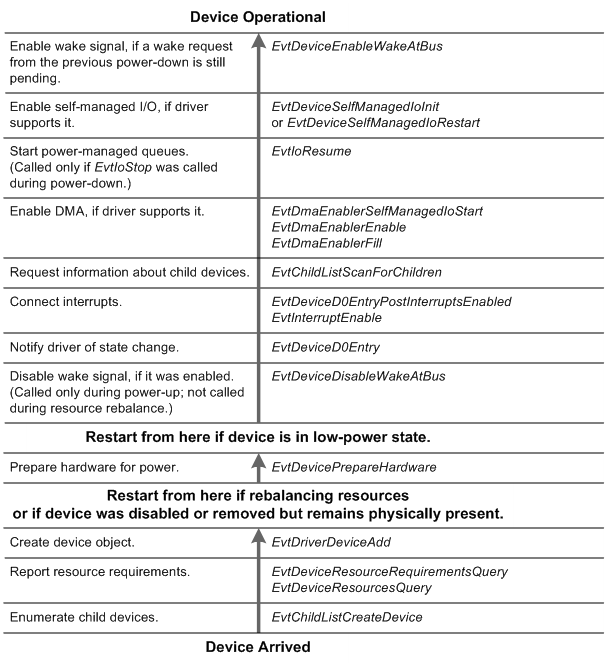

# Power-Up Sequence for a Bus Driver

The following figure shows the order in which the framework calls a KMDF bus driver's event callback functions when bringing a device to the fully operational state, starting from the Device Inserted state at the bottom of the figure:

The framework does not physically delete a PDO until the corresponding device is physically removed from the system. For example, if a user disables the device in Device Manager but does not physically remove it, the framework retains its device object. Thus, the three steps at the bottom of the figure occur only during Plug and Play enumeration—that is, during initial boot or when the user inserts a new device. If the device was previously disabled but not physically removed, the framework starts by calling the [*EvtDevicePrepareHardware*](https://msdn.microsoft.com/library/windows/hardware/ff540880) callback.

 

 

