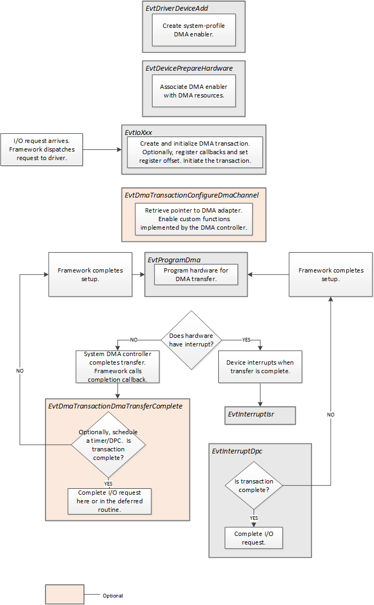

# Supporting System-Mode DMA

\[Applies to KMDF only\]

System-mode DMA, in contrast to *bus-master* DMA, describes a configuration in which multiple devices share a single, typically multichannel DMA controller.

Starting in Kernel-Mode Driver Framework (KMDF) version 1.11, the framework supports system-mode DMA on System on a Chip (SoC)–based systems running on Windows 8 or later versions of the Windows operating system.

This topic describes the code that a KMDF driver must provide in its event callback functions, as well as optional event callback functions it can register, to handle I/O requests for a system-mode DMA device.

For information about KMDF and bus-master DMA, see [Handling I/O Requests in a KMDF Driver for a Bus-Master DMA Device](handling-i-o-requests-in-a-kmdf-driver-for-a-bus-master-dma-device.md).

The following figure shows the event callback functions that your driver uses to support system-mode DMA:

## Creating a System-Mode DMA Enabler

Creating a system-mode DMA profile is a two-step process. The following steps represent a typical scenario:

1.  Typically in its [*EvtDriverDeviceAdd*](https://msdn.microsoft.com/library/windows/hardware/ff541693) callback function, the driver calls [**WDF\_DMA\_ENABLER\_CONFIG\_INIT**](https://msdn.microsoft.com/library/windows/hardware/ff551292), setting the **Profile** parameter to **SystemMode** or **SystemModeDuplex**. The driver then calls [**WdfDmaEnablerCreate**](https://msdn.microsoft.com/library/windows/hardware/ff546983), passing the [**WDF\_DMA\_ENABLER\_CONFIG**](https://msdn.microsoft.com/library/windows/hardware/ff551290) structure that it just received.

    The driver might alternatively create the enabler during [*EvtDevicePrepareHardware*](https://msdn.microsoft.com/library/windows/hardware/ff540880).

2.  Your driver's [*EvtDevicePrepareHardware*](https://msdn.microsoft.com/library/windows/hardware/ff540880) callback function associates the DMA enabler with its DMA resources by calling the [**WdfDmaEnablerConfigureSystemProfile**](https://msdn.microsoft.com/library/windows/hardware/hh451108) method. For a duplex enabler, the driver calls [**WdfDmaEnablerConfigureSystemProfile**](https://msdn.microsoft.com/library/windows/hardware/hh451108) twice, once to configure each transfer direction.

    The driver can call [**WdfDmaEnablerConfigureSystemProfile**](https://msdn.microsoft.com/library/windows/hardware/hh451108) after [*EvtDevicePrepareHardware*](https://msdn.microsoft.com/library/windows/hardware/ff540880) has completed, but the driver must call this method before it initializes DMA transactions.

## Providing Optional Callback Functions

### Configuring a DMA Channel

Typically, KMDF drivers do not configure DMA channels. However, in certain circumstances, drivers may need to perform channel-specific configuration. For example, a driver might call a custom function that is implemented by the DMA controller by using the following steps:

1.  In one of the driver's [request handlers](request-handlers.md), the driver calls [**WdfDmaTransactionSetChannelConfigurationCallback**](https://msdn.microsoft.com/library/windows/hardware/hh451184) to register a [*EvtDmaTransactionConfigureDmaChannel*](https://msdn.microsoft.com/library/windows/hardware/hh406414) callback function.
2.  Your driver's [*EvtDmaTransactionConfigureDmaChannel*](https://msdn.microsoft.com/library/windows/hardware/hh406414) callback function calls [**WdfDmaEnablerWdmGetDmaAdapter**](https://msdn.microsoft.com/library/windows/hardware/ff547020) to retrieve a pointer to the WDM [**DMA\_ADAPTER**](https://msdn.microsoft.com/library/windows/hardware/ff544062). This structure is the adapter object that represents the driver's system-mode DMA channel.
3.  The driver can then call [**ConfigureAdapterChannel**](https://msdn.microsoft.com/library/windows/hardware/hh450939) to enable custom functions implemented by the DMA controller. This routine is callable only by pointer from the address returned in a [**DMA\_OPERATIONS**](https://msdn.microsoft.com/library/windows/hardware/ff544071) structure.
4.  Your driver's [*EvtDmaTransactionConfigureDmaChannel*](https://msdn.microsoft.com/library/windows/hardware/hh406414) callback function returns TRUE if it successfully configures the DMA channel.
5.  The framework calls the driver's [*EvtProgramDma*](https://msdn.microsoft.com/library/windows/hardware/ff541816) callback function.

### Receiving Notification of Transfer Completion

Unlike devices that use bus-mastering controllers, the hardware for a system-mode DMA device might not signal DMA transfer completion by issuing an interrupt.

If your device does not raise an interrupt to signal DMA transfer completion, your driver can provide an [*EvtDmaTransactionDmaTransferComplete*](https://msdn.microsoft.com/library/windows/hardware/hh406418) event callback function that the framework calls when a system-mode DMA transfer has completed.

To register this callback function, a driver calls [**WdfDmaTransactionSetTransferCompleteCallback**](https://msdn.microsoft.com/library/windows/hardware/hh439261) from one of its [request handlers](request-handlers.md).

 

 

