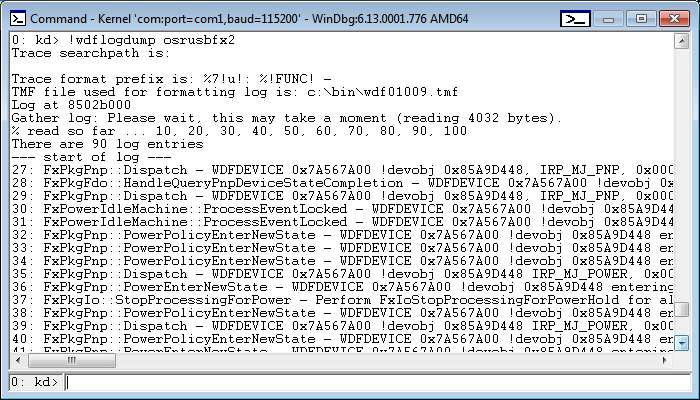

# Using the Framework's Event Logger


WDF includes an internal trace logger, sometimes called the framework's *In-flight Recorder* (IFR). The WDF logger creates a trace log that contains a recent history of events for each WDF driver. The trace logs track the progress of I/O request packets (IRPs) through the framework and the corresponding requests through a driver. Each Kernel-Mode Driver Framework (KMDF) and User-Mode Driver Framework (UMDF) driver has its own log.

The WDF logger is always enabled. For each trace log, the logger stores event records in a circular memory buffer. Optionally, you can turn on verbosity, which causes the event logger to record additional information that can help you debug your driver, such as entries into or exits from internal code paths. By default, the size of the buffer is one memory page and verbosity is turned off. You can change the buffer's size and verbosity by adjusting these values within the [WdfVerifier application](../devtest/wdf-verifier-control-application.md). Note that turning on verbosity might degrade system performance.

You can use WDF debugger extensions to view and save the WDF log during interactive debugging. To view the WDF log during a debugging session:

1.  Load the correct symbols. You can use the [**.symfix**](../debugger/-symfix--set-symbol-store-path-.md)+ debugger command to append the Microsoft public symbol store to your existing symbol path. The public symbol store includes symbols for the WDF binaries. You might also want to load symbols for your driver symbols.

    For additional information about how to obtain Window symbols and how to set the debugger's symbol path, see the documentation that is supplied with the [Windows Debugging](../debugger/index.md) package.

2.  Load the [Wdfkd.dll extension library](debugger-extensions-for-kmdf-drivers.md) into your debugger. If you are using the kernel debugger, you can do this by using the [**.load**](../debugger/-load---loadby--load-extension-dll-.md) command. To load the correct version of Wdfkd.dll you need to specify the fully qualified path to the DLL. For example, you would use the following path on an x86-based debugger host machine:

    ```cpp
    .load "C:\Program Files (x86)\Windows Kits\10\Debuggers\x64\winext\wdfkd.dll"
    ```

    You can then confirm that the extension is loaded by using the [**!chain**](../debugger/-chain--list-debugger-extensions-.md) command to display all loaded extensions.

    For more information about the framework debugger extension, use the [**!wdfhelp**](../debugger/-wdfkd-wdfhelp.md) extension. For more information about the kernel debugger, see the documentation that is supplied with the [Windows Debugging](../debugger/index.md) package.

3.  If your driver uses framework version 1.11 or later, and you are using the kernel debugger from Windows 8 or later, you can skip this step.

    If your driver uses a framework version that is earlier than 1.11, use [**!wdftmffile**](../debugger/-wdfkd-wdftmffile.md) or [**!wdfsearchpath**](../debugger/-wdfkd-wdfsearchpath.md) to specify a platform-specific trace message format (.tmf) file, or a path to a .tmf file. The .tmf files are located in platform-specific subdirectories in the WDK.

    Because .tmf files are version specific, you must specify a .tmf file that corresponds to the version of the framework's runtime library that is currently running. For example, if KMDF version 1.9 is running on the host machine:

    ```cpp
    !wdftmffile c:\WinDDK\<version>\tools\tracing\x86\wdf01009.tmf
    ```

    You can also set the search path by setting the TRACE\_FORMAT\_SEARCH\_PATH environment variable. The [**!wdftmffile**](../debugger/-wdfkd-wdftmffile.md) command takes precedence over the search path that is set by the environment variable.

    To verify the framework version number, you can run the [**!wdfldr**](../debugger/-wdfkd-wdfldr.md) debugger extension command from the kernel debugger.

4.  Use the [**!wdflogdump**](../debugger/-wdfkd-wdflogdump.md) extension to display the event logger's records. For example, the following screenshot of a WinDbg Command window shows a typical example of the output of **!wdflogdump**:

    

Each line in the framework's log is preceded by a string that is called the [trace message prefix](../devtest/trace-message-prefix.md). The trace logger prepends this prefix to each message that is written to the log. By default, the prefix includes a standard set of data elements, but you can change the default elements to suit your particular requirements. You can change the prefix string for a WDF driver by setting the TRACE\_FORMAT\_PREFIX environment variable or by using the [**!wdfsettraceprefix**](../debugger/-wdfkd-wdfsettraceprefix.md) debugger extension command.

To set the environment variable, use a command similar to the following:

```cpp
Set TRACE_FORMAT_PREFIX=%2!s!: %!FUNC!: %8!04x!.%3!04x!: %4!s!:
```

This command sets the trace message prefix to the following:

```cpp
SourceFile_LineNumber: FunctionName: ProcessID.ThreadID: SystemTime
```

You can also use the [**!wdflogsave**](../debugger/-wdfkd-wdflogsave.md) extension command to save the event logger's records in an event trace log (.etl) file that you can view by using [TraceView](../devtest/traceview.md).

You can sometimes use the [**!wdfcrashdump**](../debugger/-wdfkd-wdfcrashdump.md) debugger extension on a crash dump to display log information after the system bug checks. The log information is available in the crash dump only if the framework can determine that your driver caused the bug check or if you have set the [ForceLogsInMiniDump](registry-values-for-debugging-kmdf-drivers.md) registry value for the driver.

If a debugger is attached when the bug check occurs, you can either use [**!wdfcrashdump**](../debugger/-wdfkd-wdfcrashdump.md) to view the log information immediately, or you can view the information by loading the memory dump file. Due to size limitations of a small memory dump file, the log for the driver that caused the crash might not appear in the dump.

The framework can determine whether a particular driver caused the following bug check codes:

-   [**Bug Check 0xD1: DRIVER\_IRQL\_NOT\_LESS\_OR\_EQUAL**](../debugger/bug-check-0xd1--driver-irql-not-less-or-equal.md)
-   [**Bug Check 0xA: IRQL\_NOT\_LESS\_OR\_EQUAL**](../debugger/bug-check-0xa--irql-not-less-or-equal.md)
-   [**Bug Check 0x20: KERNEL\_APC\_PENDING\_DURING\_EXIT**](../debugger/bug-check-0x20--kernel-apc-pending-during-exit.md)
-   [**Bug Check 0x8E: KERNEL\_MODE\_EXCEPTION\_NOT\_HANDLED**](../debugger/bug-check-0x8e--kernel-mode-exception-not-handled.md)
-   [**Bug Check 0x1E: KMODE\_EXCEPTION\_NOT\_HANDLED**](../debugger/bug-check-0x1e--kmode-exception-not-handled.md)
-   [**Bug Check 0x50: PAGE\_FAULT\_IN\_NONPAGED\_AREA**](../debugger/bug-check-0x50--page-fault-in-nonpaged-area.md)
-   [**Bug Check 0x7E: SYSTEM\_THREAD\_EXCEPTION\_NOT\_HANDLED**](../debugger/bug-check-0x7e--system-thread-exception-not-handled.md)

Starting in UMDF version 2, UMDF stores the UMDF trace log (or UMDF *IFR*) in kernel non-paged memory. The framework allocates one IFR per driver host (Wudfhost) instance.

For more information about the debugger extension commands, see [Debugger Extensions for Framework-based Drivers](debugger-extensions-for-kmdf-drivers.md).

 

