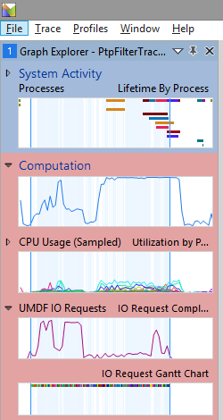
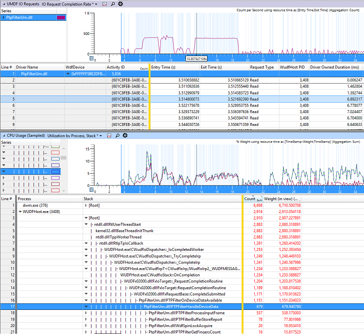
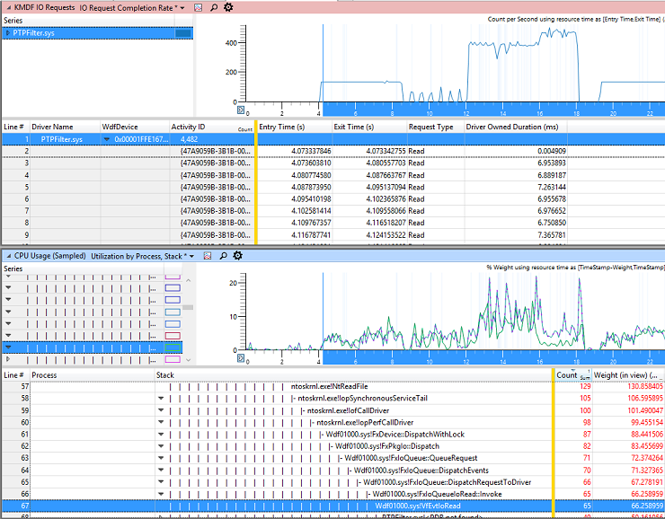
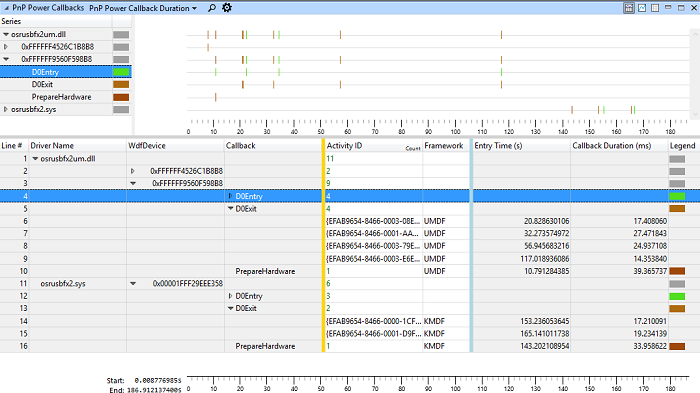

# Using the Windows Performance Toolkit (WPT) with WDF


Starting in Windows 10, you can use the Windows Performance Toolkit (WPT) to view performance data for a given Kernel-Mode Driver Framework (KMDF) or User-Mode Driver Framework (UMDF) 2 driver.

## How can the Windows Driver Frameworks (WDF) extensions for WPT help?


You can use WPT to obtain performance insights or troubleshoot performance issues. For example:

-   Examine the driver’s WDF I/O request completion rate, CPU utilization, and time spent in PnP and power callbacks.
-   Compare a UMDF 2 driver against a similar KMDF driver and determine if UMDF meets your performance requirements.
-   Identify performance glitches in the WDF I/O path.
-   Determine which instance of a given callback is taking a long time. Then examine sampled CPU usage to understand why.
-   Check if the device is making power transitions in and out of the D0 power state too frequently.

## Getting started


The WPT is part of the Windows Assessment and Deployment Kit (ADK). You can install the ADK from the [Windows hardware tools](https://developer.microsoft.com/windows/featured/hardware/windows-10-hardware-preview-tools) site.

The WPT consists of two separate tools: Windows Performance Recorder and Windows Performance Analyzer (WPA). In this topic, we use WPR to record a trace, and then WPA to view the trace in a configurable GUI format.

To learn how to use the Windows Performance Toolkit to measure the performance of a WDF driver, either watch the following video, or read the steps below the video. The video and the steps cover the same procedure.
>[!VIDEO https://www.microsoft.com/videoplayer/embed/fc37f465-9456-45d7-bbe9-6f7d44342563]

**Recording and viewing an event log for a WDF driver**

1.  Install your driver, if it's not already installed.

2.  In an elevated command prompt, enter the following command.

    **WdfPerfEnhancedVerifier.cmd** *&lt;ServiceName&gt;&lt;UMDF or KMDF&gt;*

    **Note**  WdfPerfEnhancedVerifier.cmd should be copied from the location you installed WPT. If you installed WPT on a development machine, you'll need to copy the script from the WPT installation directory to the target machine.


This script sets registry entries for the specified driver so that the framework logs the events required to enable performance analysis when the ETW provider is enabled in step 4.


3.  Reboot the computer.
4.  In an elevated command prompt, enter the following command.

    **Wpr.exe** **-Start WdfTraceLoggingProvider -filemode**

    This command enables the ETW provider for WDF. The computer starts recording a trace.

    **Note**  As in step 2, Wpr.exe should be copied from the location you installed WPT. If you installed WPT on a development machine, copy these files from the WPT installation directory to the target machine.

    On Windows 10 for desktop editions (Home, Pro, Enterprise, and Education), you can also start the trace with Wprui.exe, which provides a GUI for recording traces. Under more options, expand **Resource Analysis** and select **WDF Driver Activity**.

5.  Exercise your scenario of interest.
6.  Stop the ETW trace session: **Wpr.exe -Stop MyPerfTrace.etl**
7.  Open the event trace log in the Windows Performance Analyzer viewer:

    **Wpa.exe MyPerfTrace.etl**

To capture another trace for the same driver, use Wpr.exe to start and stop a new trace. To capture a trace for a different driver, first rerun WdfPerfEnhancedVerifier.cmd for the new driver.

## Analyzing the trace


To start analyzing the driver's performance, find the **Graph Explorer** on the left, open the **Computation** category, and then drag the UMDF or KMDF graph to the main work area, under the **Analysis** tab. This screenshot shows the **Graph Explorer** pane:



There is a dedicated table for UMDF and another for KMDF drivers.

## UMDF I/O Request Graph and summary table


WPT can display WDF I/O request completion throughput in two ways:

-   Number of I/O requests completing per second
-   Time duration of each I/O request (formatted as a Gantt chart)

The following screenshot shows sample summary graphs and tables for CPU and UMDF I/O request performance. In the UMDF I/O Request Completion Rate graph, the number of requests per second is shown on the y axis.



In the [summary table](/previous-versions/windows/it-pro/windows-8.1-and-8/hh448109(v=win.10)), most columns are self-explanatory, but there are a couple things to note. The WdfDevice column contains the WDFDEVICE handle associated with the I/O request. The ActivityID contains a unique identifier for the I/O request. The framework creates this identifier when it delivers an I/O request to the driver. If an activity identifier is already associated with the corresponding IRP, the framework uses that identifier. For more information, see [Using Activity Identifiers](using-activity-identifiers.md).

Entry time is the trace timestamp when the framework delivered the request to the driver, and exit time is the timestamp when the driver called [**WdfRequestComplete**](/windows-hardware/drivers/ddi/wdfrequest/nf-wdfrequest-wdfrequestcomplete) or a related method to complete the request.

## KMDF I/O Request Graph and summary table


Here's a similar screenshot showing I/O request info for a KMDF driver.



## PnP Power callback graph and summary table


WPT can also display the processing time of each PnP and power callback. The following screenshot shows [*EvtDeviceD0Entry*](/windows-hardware/drivers/ddi/wdfdevice/nc-wdfdevice-evt_wdf_device_d0_entry), [*EvtDeviceD0Exit*](/windows-hardware/drivers/ddi/wdfdevice/nc-wdfdevice-evt_wdf_device_d0_exit) and [*EvtDevicePrepareHardware*](/windows-hardware/drivers/ddi/wdfdevice/nc-wdfdevice-evt_wdf_device_prepare_hardware) callback duration for a sample KMDF driver and a sample UMDF driver.

The WdfDevice column contains the WDFDEVICE handle associated with the callback. The ActivityID contains a unique identifier for the callback instance.



## Which calls are instrumented?


This section describes which events are used to build the graphs and tables shown above.

After you run WdfPerfEnhancedVerifier.cmd for a specific driver, the framework records events in the ETL trace log when the system calls some of the specified driver's callbacks, and also when the specified driver calls some framework methods.

To determine when I/O requests start, the framework records events when it calls the following callbacks:

-   [*EvtIoDefault*](/windows-hardware/drivers/ddi/wdfio/nc-wdfio-evt_wdf_io_queue_io_default)
-   [*EvtIoRead*](/windows-hardware/drivers/ddi/wdfio/nc-wdfio-evt_wdf_io_queue_io_read)
-   [*EvtIoWrite*](/windows-hardware/drivers/ddi/wdfio/nc-wdfio-evt_wdf_io_queue_io_write)
-   [*EvtIoDeviceControl*](/windows-hardware/drivers/ddi/wdfio/nc-wdfio-evt_wdf_io_queue_io_device_control)
-   [*EvtIoInternalDeviceControl*](/windows-hardware/drivers/ddi/wdfio/nc-wdfio-evt_wdf_io_queue_io_internal_device_control)

The framework also records I/O request start events when the driver calls the following methods:

-   [**WdfIoQueueRetrieveNextRequest**](/windows-hardware/drivers/ddi/wdfio/nf-wdfio-wdfioqueueretrievenextrequest)
-   [**WdfIoQueueRetrieveRequestByFileObject**](/windows-hardware/drivers/ddi/wdfio/nf-wdfio-wdfioqueueretrieverequestbyfileobject)
-   [**WdfIoQueueRetrieveFoundRequest**](/windows-hardware/drivers/ddi/wdfio/nf-wdfio-wdfioqueueretrievefoundrequest)

To determine when I/O requests complete, the framework tracks when the driver calls:

-   [**WdfRequestComplete**](/windows-hardware/drivers/ddi/wdfrequest/nf-wdfrequest-wdfrequestcomplete)
-   [**WdfRequestCompleteWithInformation**](/windows-hardware/drivers/ddi/wdfrequest/nf-wdfrequest-wdfrequestcompletewithinformation)
-   [**WdfRequestCompleteWithPriorityBoost**](/windows-hardware/drivers/ddi/wdfrequest/nf-wdfrequest-wdfrequestcompletewithpriorityboost)

Finally, to determine callback duration for PnP/Power callbacks, the framework records when it calls the following driver-supplied callback routines, and when they finish:

-   [*EvtDeviceD0Entry*](/windows-hardware/drivers/ddi/wdfdevice/nc-wdfdevice-evt_wdf_device_d0_entry)
-   [*EvtDeviceD0Exit*](/windows-hardware/drivers/ddi/wdfdevice/nc-wdfdevice-evt_wdf_device_d0_exit)
-   [*EvtDevicePrepareHardware*](/windows-hardware/drivers/ddi/wdfdevice/nc-wdfdevice-evt_wdf_device_prepare_hardware)
-   [*EvtDeviceReleaseHardware*](/windows-hardware/drivers/ddi/wdfdevice/nc-wdfdevice-evt_wdf_device_release_hardware)
-   [*EvtIoStop*](/windows-hardware/drivers/ddi/wdfio/nc-wdfio-evt_wdf_io_queue_io_stop)

## Resources and Troubleshooting


-   Be sure to reboot after you run the WdfPerfEnhancedVerifier.cmd script.
-   To determine if your driver is configured to record an event log, use the **!WdfKd.wdfdriverinfo** kernel debugger command. If the driver is configured for performance tracing, you will see output like this:

    ```cpp
    !WdfKd.WdfDriverInfo Echo.sys
    …
    …
    ----------------------------------

    WDF Verifier settings for echo.sys is ON
      Enhanced verifier: performance analysis hooking ON
    ----------------------------------
    ```

-   For development and testing purposes only, enforcement of the driver code signing policy can be temporarily disabled. For more information, see [Installing an Unsigned Driver Package during Development and Test](../install/installing-an-unsigned-driver-during-development-and-test.md).

## Related topics


[Windows Performance Analyzer](/previous-versions/windows/it-pro/windows-8.1-and-8/hh448170(v=win.10))
