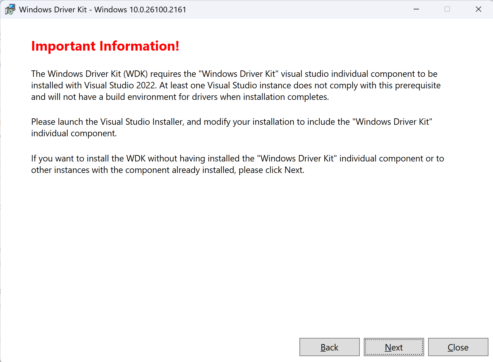
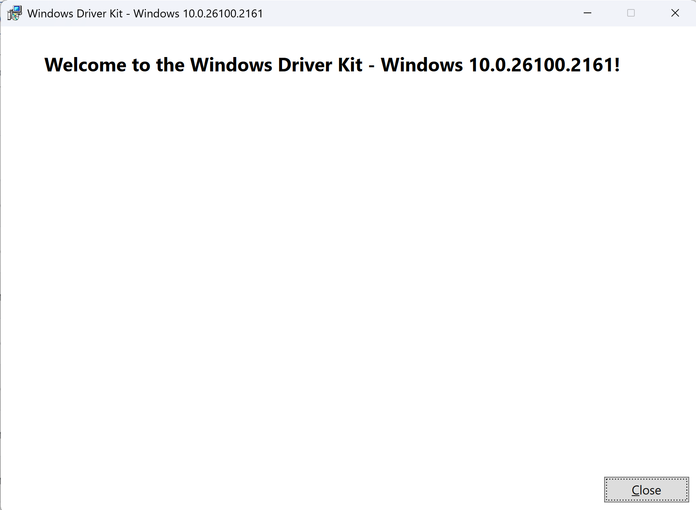

# Windows Driver Kits Release Notes

The following are features and bug fix in Windows 11 24H2 WDK update

## Version 10.0.26100.2161

*Released November 4, 2024*.

### Kasan Support
<<<<<<< HEAD
=======
Kernel Address Sanitizer (KASAN) is now supported on Windows Drivers. For more information see [Kasan](./devtest/kasan.md)
>>>>>>> 32a36a6d66bc8fe380a53f4bc6e1fd54c6160ec1

Kernel Address Sanitizer (Kasan), a bug-detection technology in now supported on Windows Drivers, enables the detection of several classes of illegal memory accesses. For more information, see [Kasan](./devtest/kasan.md)

### Azure File Sync

Azure file sync reparse tag definition is updated. For details, see [Azure File Sync](https://support.microsoft.com/en-us/topic/azure-file-sync-agent-v18-2-release-july-2024-613d00dc-998b-4885-86b9-73750195baf5)

### WDK MSI Update
<<<<<<< HEAD

WDK VSIX is now included as part of Visual Studio individual component, so WDK VSIX no longer ships with WDK MSI. When WDK is installed on a machine without WDK Visual Studio individual component installed, the user is asked to install VSIX from VS individual component.

However, if the WDK is installed on a machine with WDK VSIX installed, there's only a message confirming successful installation.
=======
As WDK VSIX is now included as part of Visual Studio individual component, consequently WDK VSIX will no longer ship with WDK MSI. When you try to install WDK MSI on a machine without WDK VSIX installed, the following warning message will be shown at the begining of installation


However, if WDK is installed on a machine with WDK VSIX installed, there will be only a graceful message confirming successful installation.


>>>>>>> 32a36a6d66bc8fe380a53f4bc6e1fd54c6160ec1

## Version 10.0.26100.1882

*Released October 14, 2024*.

### Audio Headers

Added AudioAggregation.h and AudioSensors.h for enabling SoundWire Device Class for Audio (SDCA) speaker aggregation and ultrasound support.

### EWDK VS Build Tools

The Visual Studio Build tools in EWDK are updated to version 17.10.5.

## Version 10.0.26100.1591

*Released September 18, 2024*.

### WDK VSIX installation

The WDK VSIX is added as a Visual Studio individual component starting with the VS 17.11 release. For more information, see the [Windows Drivers Kits download page](download-the-wdk.md).

:::image type="content" source="images/vs-wdk-selection.png" alt-text="Screenshot of Visual Studio WDK individual component selected.":::

### Static Tools Logo - Creating a Driver Verification Log

To create a Driver Verification Log (DVL) for the Static Tools Logo Test, see the [Creating a Driver Verification Log](./develop/creating-a-driver-verification-log.md) article.

Navigating to **Extensions > Drivers > Create Driver Verification Log** in Visual Studio now triggers the following redirection message.

:::image type="content" source="images/codeql-redirection.png" alt-text="Screenshot of Visual Studio notification for CodeQL DVL generation.":::

### Static Tools Logo - Placement requirement for CodeQL SARIF file

The process of generating DVL for CodeQL previously required placing the SARIF file in the same directory as the VCXProj file for the driver project. Recognizing the inconvenience posed for developers, we eliminated the requirement. Now users can generate the DVL and save it in any location of their choice by using this command:

```cmd
C:\Program Files (x86)\Windows Kits\10\Tools\dvl\dvl.exe" /manualCreate `<driverName>` `<driverArchitecture>` /`<path to sarif file>`'\
```

:::image type="content" source="images/sarif-placement-update.png" alt-text="Screenshot of SARIF placement updated.":::

### UMDF WiFiCX drivers

To support UMDF WiFiCX drivers, we added UMDF public header and library support. These changes ensure that WiFiCX drivers apply the [advantages of writing UMDF drivers](./wdf/advantages-of-writing-umdf-drivers.md). The following updates were made:

- Created a new UMDF version of WifiCxTlvGenParse.lib.
- Created UMDF equivalents of KMDF's dot11wificxintf.h, dot11wificxtypes.hpp, and WifiCxTlvGenParse.lib.

### Bug fixes for Device Fundamentals and WDTF test framework

Bugs associated with DevFund tests were fixed. This change improves the WDK bring up experience.
