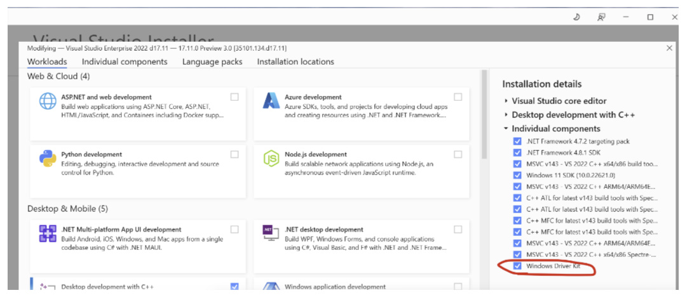
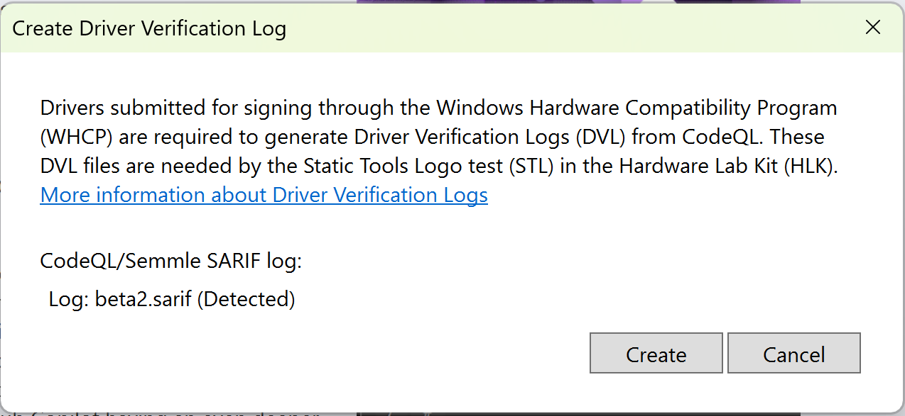
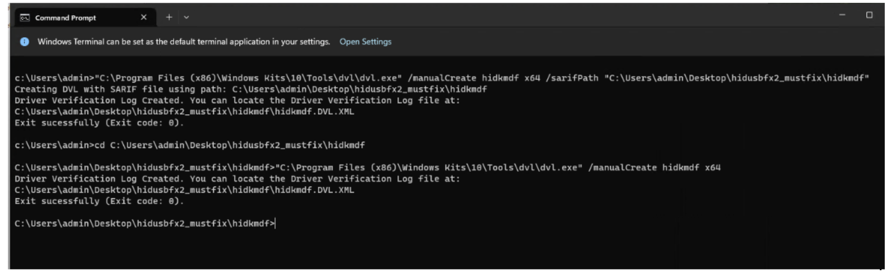

# Windows Driver Kits Release Notes

The following are new in the WDK with WDK version 10.0.26100.1591 release.

## Features

Version 10.0.26100.1591 (released September 18th, 2024)

| Features |
|--|--|
| [WDK VSIX Installation](#wdk-vsix-installation) |
| [Static Tools Logo - Creating a Driver Verification Log](#static-tools-logo---creating-a-driver-verification-log) |
| [Static Tools Logo - Placement requirement for CodeQL Sarif file](#static-tools-logo---placement-requirement-for-codeql-sarif-file) |
| [UMDF WiFiCX drivers](#umdf-wificx-drivers) |
| [Bug fixes for Device Fundamentals and WDTF test framework](#bug-fixes-for-device-fundamentals-and-wdtf-test-framework) |

## WDK VSIX installation

The WDK VSIX has been added as a Visual Studio individual component starting with the VS 17.11 release. For more information, see the [Windows Drivers Kits download page](download-the-wdk.md).



## Static Tools Logo - Creating a Driver Verification Log

To create a Driver Verification Log (DVL) for the Static Tools Logo Test, see the [Creating a Driver Verification Log](./develop/creating-a-driver-verification-log.md) article.

Navigating to **Extensions > Drivers > Create Driver Verification Log** in Visual Studio will now trigger the redirection message below.



## Static Tools Logo - Placement requirement for CodeQL Sarif file

The process of generating DVL for CodeQL previously required placing the SARIF file in the same directory as the VCXProj file for the driver project. Recognizing the inconvenience this posed for developers, we have eliminated this requirement. Now users can generate the DVL and save it in any location of their choice by using this command:

```cmd
C:\Program Files (x86)\Windows Kits\10\Tools\dvl\dvl.exe" /manualCreate `<driverName>` `<driverArchitecture>` /`<path to sarif file>`'\
```



## UMDF WiFiCX drivers

To support UMDF WiFiCX drivers, we have added UMDF public header and library support. These changes ensure that WiFiCX drivers leverage the [advantages of writing UMDF drivers](./wdf/advantages-of-writing-umdf-drivers.md). The following updates have been made:

- Created a new UMDF version of WifiCxTlvGenParse.lib.

- Created UMDF equivalents of KMDF's dot11wificxintf.h, dot11wificxtypes.hpp, and WifiCxTlvGenParse.lib.

## Bug fixes for Device Fundamentals and WDTF test framework

Certain bugs associated with DevFund tests were fixed, improving the WDK bring up experience.
