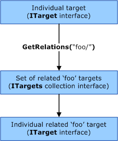

# Simple Data Evaluation Language Overview


WDTF includes a simple query language to simplify the task of collecting targets based on attributes or relationships. The Simple Data Evaluation Language (SDEL) is similar to XPath. For more information about XPath, see [XPath Reference](http://go.microsoft.com/fwlink/p/?linkid=33165).

The following sections within this topic describe how you can use SDEL.

**Note**  For a complete list of all namespace tokens and the attribute tokens within them, see [SDEL Tokens](https://msdn.microsoft.com/library/windows/hardware/ff539571).

 

### SDEL Syntax Basics

SDEL uses attribute tokens to perform matches and retrieve data. All SDEL tokens can contain only alphanumeric characters and hyphen (-).

An *attribute* refers to a piece a data that is attached to a target. Actual values in the attribute are stored as a **VARIANT**. If you place a comparison operator followed by a *test* value after the attribute, SDEL will perform a comparison match. You should place test values in single or double quotation marks--this notation enables you to use actual single or double quotation marks in your test value, but not both. If the test value consists of only alphanumeric characters and hyphens (-), you can omit the quotation marks.

### Comparison Operations

SDEL allows various comparison operators to follow an attribute token. At the time of a comparison, the actual value in the attribute to the left of the operator is made to be the same type of the test value to the right of the operator through the **VariantChangeType** method (which is described in the Microsoft Windows SDK documentation). The following table shows the different comparison operators that SDEL supports.

Comparison operator
Meaning
Equality (=)

After the types are changed, they are compared by using the **VarCmp** method (which is described in the Windows SDK documentation).

Inequality (!=)

Less than (&lt;)

Less than or equal (&lt;=)

Greater than (&gt;)

Greater than or equal (&gt;=)

Bitwise AND (&)

This operator forces types to VT\_I8 before performing a bitwise AND of the actual and test values.

No comparison operation (and no value) specified

If the actual value in the attribute is of type VT\_BOOL, the match is satisfied based on that value--that is, you do not need a comparison operator to do "IsDisableable=True". Otherwise, if there is any value at all (other than VT\_EMPTY), the match is satisfied.

 

When there is more than one actual value (or an array) in the attribute, all of the comparison operators should be interpreted to match at least one, except the inequality operator, which has the opposite behavior. If the types cannot be compared at all (that is, **VariantChangeType** fails), there is no match (except with the inequality operator, which has the opposite behavior).

### Understanding Attribute Namespaces

SDEL uses namespace tokens to group attributes. For a complete list of all namespace tokens and the attribute tokens within them, see [SDEL Tokens](https://msdn.microsoft.com/library/windows/hardware/ff539571).

To use any attribute that is outside the root namespace, you must prefix the attribute with the namespace name and then two colons (::). The following VBScript code example displays the value of the Disk::IsRemovable attribute.

```cpp
WScript.Echo "Is Removable?: " & DeviceObj.GetValue("Disk::IsRemovable")
```

### Examining a Target by Using GetValue and Eval

The [**IWDTFTarget2::GetValue**](https://msdn.microsoft.com/library/windows/hardware/hh439403) method lets you ask a target about its attributes. The following VBScript code example prints the value of the [FriendlyName](https://msdn.microsoft.com/library/windows/hardware/ff539571) attribute for a target.

```cpp
WScript.Echo "FriendlyName: " & Device.GetValue("FriendlyName")
```

For a full list of attribute tokens, see [SDEL Tokens](https://msdn.microsoft.com/library/windows/hardware/ff539571).

You can also use the [**IWDTFTarget2::Eval**](https://msdn.microsoft.com/library/windows/hardware/hh439396) method to evaluate an SDEL statement against a target. **Eval** returns **VARIANT\_TRUE** or **VARIANT\_FALSE**. The following VBScript code example uses **Eval** to determine if a device can be disabled.

```cpp
If Device.Eval("IsDisableable=true") Then 
    WScript.Echo "Target is disableable!"
End If
```

You can also use [**Eval**](https://msdn.microsoft.com/library/windows/hardware/hh439396) to test for the presence of an attribute. When you pass **Eval** an attribute but no comparison operator or value, **Eval** will return **VARIANT\_TRUE** if the attribute or namespace holds any value (other than **VT\_EMPTY**). The following VBScript code example uses **Eval** to determine if the target has a SymbolicLink keyword.

```cpp
If Device.Eval("SymbolicLink") Then 
    WScript.Echo "Target has a SymbolicLink!"
End If
```

Additionally, attributes that are missing a comparison operator but contain a **VT\_BOOL** value have an implicit '=true' comparison applied to them. This implicit comparison means that "IsDisableable" is equivalent to "IsDisableable='true'".

### Navigating Relationships

Testing often involves examining what happens when related devices change state. For example, when a USB hub is disabled, do the devices that are attached to it handle the state change properly? Additionally, you might want to locate a device based on information in related devices. To support this functionality, SDEL includes a way to specify one or more logical relationships before any attribute or namespace (but not after either of them). Relation tokens are separated from the attribute or namespace by a forward-slash (/). The following VBScript code example prints the value of the [FriendlyName](https://msdn.microsoft.com/library/windows/hardware/ff539571) attribute for the parent device of a target.

```cpp
WScript.Echo "FriendlyName: " & Device.GetValue("parent/FriendlyName")
```

You can also combine relation modifiers. The following VBScript code example prints the value of the [FriendlyName](https://msdn.microsoft.com/library/windows/hardware/ff539571) attribute of the grandparent device of the target object.

```cpp
WScript.Echo "FriendlyName: " & Device.GetValue("parent/parent/FriendlyName")
```

Sometimes, devices have many-to-many relationships. For example, a logical storage volume might reside on many physical disks, and those individual disks might contribute space to many volumes.

Within WDTF, all non-phantom devices (that is, physically present devices) are descendants of the root device (which you can retrieve from the [**RootDevice**](https://msdn.microsoft.com/library/windows/hardware/hh406413) property). (For more information about phantom devices, see [Creating WDTF Scenarios](creating-wdtf-scenarios.md).)

### Collecting Targets by Using GetRelations

The following illustration shows the [**IWDTFTarget2::GetRelations**](https://msdn.microsoft.com/library/windows/hardware/hh439400) method.



The [**IWDTFTarget2::GetRelations**](https://msdn.microsoft.com/library/windows/hardware/hh439400) method accepts only the relation specifier portion of the SDEL statement syntax and returns an [**IWDTFTargets2**](https://msdn.microsoft.com/library/windows/hardware/hh439458) collection interface that contains all of the targets that meet the relationship criteria. The following VBScript code example returns a collection that contains the original target and all of its siblings.

```cpp
Set TestDevices = Device.GetRelations("parent/child/", "")
```

The second parameter for [**GetRelations**](https://msdn.microsoft.com/library/windows/hardware/hh439400) can optionally include a statement to be passed to the [**Eval**](https://msdn.microsoft.com/library/windows/hardware/hh439396) method of each target that meets the specific relationship. For example, if you add *IsDisableable=true* as the second parameter, the preceding code example would return only the device and its siblings that can be disabled.

If there are no matches, a collection with zero items is returned.

### Collecting Targets by Using Query

The [**IWDTFDeviceDepot2**](https://msdn.microsoft.com/library/windows/hardware/hh406391) interface contains a **Query** method. This method takes an SDEL statement that is designed for the [**IWDTFTarget2::Eval**](https://msdn.microsoft.com/library/windows/hardware/hh439396) method and returns a new instance of the [**IWDTFTargets2**](https://msdn.microsoft.com/library/windows/hardware/hh439458) collection interface that contains a subset of the targets that meet the criteria of the query. The following VBScript code example enumerates all non-phantom devices and shows the friendly name for each device.

```cpp
For Each Device In WDTF.DeviceDepot.Query("IsPhantom=false")
    WScript.Echo Device.GetValue("FriendlyName")
Next
```

The returned collection has the [**IWDTFTargets2::Query**](https://msdn.microsoft.com/library/windows/hardware/hh439483) method, which has an identical implementation to **IWDTFDeviceDepot2::Query**. **IWDTFTargets2::Query** returns a subset of targets from the original collection that meets the SDEL statement.

### Boolean Logic in SDEL

The [**IWDTFTarget2::GetRelations**](https://msdn.microsoft.com/library/windows/hardware/hh439400) method can accept only the Boolean **OR** operator, but your calls to the [**IWDTFTargets2::Query**](https://msdn.microsoft.com/library/windows/hardware/hh439483), [**IWDTFTarget2::Eval**](https://msdn.microsoft.com/library/windows/hardware/hh439396), and [**IWDTFTarget2::GetValue**](https://msdn.microsoft.com/library/windows/hardware/hh439403) methods can use Boolean **AND** and **OR** operators. For the **Query** method and **Eval** method, the operators will act like normal Boolean operators, returning the result as expected. However, for the **GetValue** method, **AND** will compose the values on both sides of itself, and **OR** will return only the first value that is found (starting with the left).

### Parentheses in SDEL

All SDEL statements can use parentheses to specify the evaluation sequence for Boolean logic. You can also use parentheses to group sub-elements in a statement under a relation or namespace.

The following VBScript code example retrieves all volumes and children of a grandparent device.

```cpp
Set Devices = Device.GetRelations("parent/parent/(child/ OR volume/)", "")
```

The following VBScript code example retrieves all devices that have a child with removable media that is larger than 1,000,000 bytes.

```cpp
Set Devices = WDTF.DeviceDepot.Query("child/disk::(IsRemovable=true AND Size>1000000)")
```

### SDEL Syntax Parsing

If you pass an SDEL statement with bad syntax to any of the methods in WDTF, the method will fail and detailed error information will be returned and explain the issue.

**Note**   A misspelled attribute, namespace, or relation token does not cause a syntax error, because SDEL is designed to be dynamic based on the target: SDEL statements must be able to query for the existence of an attribute in a dynamic field set.

 

 

 


