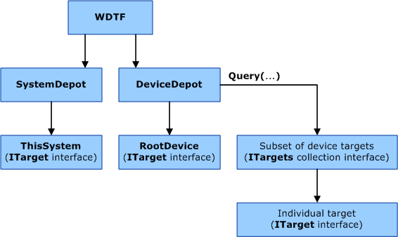
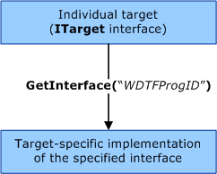

# WDTF Architecture

To understand the architecture of WDTF, you should first read [Windows Device Testing Framework Design Guide](wdtf-overview.md). The most important concept is that WDTF uses devices and the system by abstracting each of them into a *target* (an [**IWDTFTarget2**](https://msdn.microsoft.com/library/windows/hardware/hh439367) interface). The following illustration shows the core object model that WDTF provides.

Your scenario can use some or all of the following WDTF objects and interfaces:

WDTF aggregation object  
The WDTF aggregation object ([**IWDTF2**](https://msdn.microsoft.com/library/windows/hardware/ff539628)) is the initial instantiation point for the entire framework. Everything in the framework must be accessed through this object.

[**SystemDepot**](https://msdn.microsoft.com/library/windows/hardware/hh406309) property  
The [**SystemDepot**](https://msdn.microsoft.com/library/windows/hardware/hh406309) property ([**IWDTFSystemDepot2**](https://msdn.microsoft.com/library/windows/hardware/hh439331)) contains only the local computer, which you can access through the [**ThisSystem**](https://msdn.microsoft.com/library/windows/hardware/hh439354) property.

[**DeviceDepot**](https://msdn.microsoft.com/library/windows/hardware/hh406304) property  
The [**DeviceDepot**](https://msdn.microsoft.com/library/windows/hardware/hh406304) property ([**IWDTFDeviceDepot2**](https://msdn.microsoft.com/library/windows/hardware/hh406391)) represents a collection of all devices that are available on the computer. A scenario script can query (with the [**Query**](https://msdn.microsoft.com/library/windows/hardware/hh439483) method) the **DeviceDepot** property for devices that meet one or more criteria that you specify in a search string by using the [Simple Data Evaluation Language](simple-data-evaluation-language-overview.md) (SDEL). As shown in the previous figure, **Query** returns a collection of targets ([**IWDTFTargets2**](https://msdn.microsoft.com/library/windows/hardware/hh439458)) that meet the criteria. Additionally, the **DeviceDepot** property has a [**RootDevice**](https://msdn.microsoft.com/library/windows/hardware/hh406413) property that represents the logical device object that is the parent of all physically present (also known as *non-phantom*) devices in the computer.

[**IWDTFTarget2**](https://msdn.microsoft.com/library/windows/hardware/hh439367)  
The [**IWDTFTarget2**](https://msdn.microsoft.com/library/windows/hardware/hh439367) interface represents a *target* of testing activities. All activities that you perform with the framework involve at least one target. Targets can have one of the following forms:

-   A *device-type target* represents a hardware (or software) device that is attached to the computer.

-   A *system-type target* represents a computer as a whole.

A target contains attributes that describe the device or computer they represent.

[**IWDTFTargets2**](https://msdn.microsoft.com/library/windows/hardware/hh439458)  
The [**IWDTFTargets2**](https://msdn.microsoft.com/library/windows/hardware/hh439458) collection interface represents a collection of individual targets ([**IWDTFTarget2**](https://msdn.microsoft.com/library/windows/hardware/hh439367)). The [**IWDTFTargets2::Query**](https://msdn.microsoft.com/library/windows/hardware/hh439483) method enables you to retrieve another collection that contains a subset of the contained targets.

### Action Plug-ins

WDTF includes a set of interfaces and implementations ([**action interfaces**](https://msdn.microsoft.com/library/windows/hardware/ff538355)) that you can use in your test scenarios to control targets. Each implementation knows how to perform target-specific actions, such as enabling and disabling, or performing I/O operations. Your scripts can refer to these interfaces by their interface name, without understanding the specific implementation, as the following illustration shows.

For more information about these interfaces, see [Controlling Targets](controlling-targets.md).

### Simple Data Evaluation Language (SDEL)

WDTF includes a simple query language, Simple Data Evaluation Language (SDEL), that is similar to XPath and that simplifies the task of collecting targets based on attributes or relationships. SDEL enables you to form brief query statements that define selection constraints based on both the attributes of each target and relationships between them. For more information about SDEL, see [Simple Data Evaluation Language Overview](simple-data-evaluation-language-overview.md).

 

 

