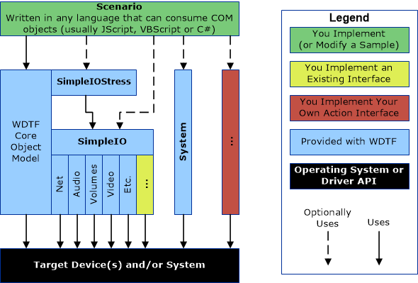

# WDTF Architecture and Overview

The Microsoft Windows Device Testing Framework (WDTF) enables you to create, manage, reuse, and extend device-centric, scenario-based automated tests.

The following illustration shows the typical WDTF model for creating scenarios at a very high-level.

Test scripts use WDTF objects through Component Object Model (COM) interfaces. You can use any programming language that supports COM automation to write these scenarios. This documentation provides code examples in VBScript, C++, and JScript.

Additionally, you can use some WDTF samples through Driver Test Manager (DTM) without any additional coding.

**Note**  DTM is part of the [Windows Hardware Certification Kit (HCK)](http://go.microsoft.com/fwlink/p/?linkid=254893) and Microsoft Windows Logo Kit (WLK). When you run WDTF-based tests in DTM, WDTF is installed for you.

 

The preceding figure shows a model for creating component-based scenarios that lets you focus on the common capabilities of a group of devices instead of individual devices. Even though many devices require special implementations for some of these interfaces, they are quite easy to add. When a scenario involves using a new feature, you can [add](extending-the-framework.md) a simple COM automation interface that wraps that feature to WDTF.

## In this section

-   [WDTF Architecture](wdtf-architecture.md)
-   [Extending the Framework](extending-the-framework.md)

 

 

