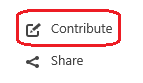

# What's new in driver development 

This section provides information about the new features and updates to Windows driver development in Windows 10.

The following is a list of new feature highlights for driver development in Windows 10.

* [Windows Hardware Dev Center dashboard](#windows-hardware-dev-center-dashboard)
* [Open publishing](#open-publishing)
* [Debugging Tools for Windows](#debugging-tools-for-windows)
* [Device and Driver Installation](#device-and-driver-installation)
* [Driver Verifier](#driver-verifier)
* [Windows Driver Frameworks](#windows-driver-frameworks-wdf)
* [Universal Windows drivers](#universal-windows-drivers)
* [Windows Compatible hardware development boards](#windows-compatible-hardware-development-boards)
* [Power Management Framework](#power-management-framework)
* [System-Supplied Driver Interfaces](#system-supplied-driver-interfaces)
* [WPP Software Tracing](#wpp-software-tracing)

The following table shows the feature updates in Windows 10, by driver technology and version.

|              Driver               | [1809](#whats-new-in-windows-10-version-1809-latest) |   [1803](#whats-new-in-windows-10-version-1803)    |       [1709](#whats-new-in-windows-10-version-1709)       |   [1703](#whats-new-in-windows-10-version-1703)    | [1607](#whats-new-in-windows-10-version-1607) |          [1507](#whats-new-in-windows-10-version-1507)          |
|-----------------------------------|:----------------------------------------------------:|:--------------------------------------------------:|:---------------------------------------------------------:|:--------------------------------------------------:|:---------------------------------------------:|:---------------------------------------------------------------:|
|               Audio               |              |            |                   |            |            |                                      |
|               ACPI                |                           |             |                    |                         |                    |                                      |
|             Biometric             |                           |                         |               |                         |                    |                                      |
|             Bluetooth             |          |        |                                |        |                    |                          |
|          Buses and Ports          |                           |                         |                                |                         |                    |                    |
|              Camera               |                           |           |                                |           |      |                        |
|             Cellular              |                           |                         |                                |                         |                    |                           |
|              Display              |            |          |                 |                         |                    |                            |
|          Driver security          |                           |         |                                |                         |                    |                            |
|      Hardware notifications       |                           |                         |  |                         |                    |                                      |
|   Human Interface Device (HID)    |                           |                         |                                |                         |                    |             |
|              Kernel               |             |           |                  |           |                    |                                      |
|             Location              |                           |                         |                                |                         |    |                      |
|         Mobile broadband          |    |  |         |  |                    |                                      |
|     Near Field Communication      |                           |                         |                                |                         |                    |           |
|            Networking             |         |       |              |       |                    |                    |
|                POS                |                           |                         |                                |              |                    |                                      |
|                PCI                |                           |              |                     |                         |                    |                                      |
|               Print               |                           |                         |                                |                         |       |                         |
|      Pulse Width Modulation       |                           |                         |                     |                         |                    |                                      |
|              Sensors              |            |          |                                |                         |                    |                                      |
|            Smart Card             |                           |                         |                                |                         |                    |                         |
|              Storage              |                           |                         |                 |                         |                    |                            |
| System-Supplied Driver Interfaces |                           |                         |                                |                         |                    |  |
|                USB                |                |              |                     |              |                    |                                |
|               WI-FI               |               |             |                                |                         |                    |                                      |
|               WLAN                |                           |                         |                                |                         |        |                          |

## What's new in driver development for Windows 10

[Back to Top](#top)

This section provides highlights of new features for driver development in Windows 10.

### Windows Hardware Dev Center dashboard

In Windows 10, version 1809, we added new and improved functionality in the way of [Hardware APIs](https://docs.microsoft.com/windows-hardware/drivers/dashboard/dashboard-api) for developers, IHVs, and OEMs to track and submit driver packages to the Windows hardware dashboard. 

Use the shipping label REST APIs to create and manage shipping labels, the method by which you distribute your drivers.

* [Manage Shipping Labels](https://docs.microsoft.com/windows-hardware/drivers/dashboard/manage-shipping-labels)
* [Get shipping label data](https://docs.microsoft.com/windows-hardware/drivers/dashboard/get-shipping-labels)

Use the asynchronous custom report methods to access reporting data for driver errors and OEM hardware errors. You can define reporting templates based on your needs, set a schedule and you will have data delivered to you at regular intervals.

* [Schedule custom reports for your driver failure details](https://docs.microsoft.com/windows-hardware/drivers/dashboard/schedule-custom-reports-for-driver-failure-details)

### Open publishing

We're making the docs more community-driven. On many pages of the Windows driver documentation, you can suggest changes directly. Look for the **Contribute** button in the upper right corner of a page. It looks like this:

When you click **Contribute**, you'll arrive at the Markdown source file for that topic in a [GitHub repository](https://github.com/MicrosoftDocs/windows-driver-docs). You can click **Edit** and suggest changes right here.

For more details, see [CONTRIBUTING.md](https://github.com/MicrosoftDocs/windows-driver-docs/blob/staging/CONTRIBUTING.md) in the repo. And thanks for taking the time to improve the docs!

### Debugging Tools for Windows

This section describes the changes in the debugging tools for Windows.

**Debugging in Windows 10, version 1809**

* **New Debugger Data Model API** – A new object oriented debugger data model interface to support debugger automation is now available using the dbgmodel.h header. The debugger data model is an extensible object model that is central to the way in which new debugger extensions (including those in JavaScript, NatVis, and C++) both consume information from the debugger and produce information that can be accessed from the debugger as well as other extensions. Constructs which are written to the data model APIs are available in the debugger's dx expression evaluator as well as from JavaScript extensions or C++ extensions. Documentation will be available at: [Overview of the Debugger Data Model C++ Interface](debugger/data-model-cpp-overview.md)  and the [dbgmodel.h](https://docs.microsoft.com/windows-hardware/drivers/ddi/content/dbgmodel/) header reference topics.

* **IPv6** - We are adding support for IPv6 to KDNET. To make room for the larger headers required for IPv6, we decreased the payload size of packets. As a result, we’re declaring a new version of the KDNET protocol, so that host PCs running the latest version of the debugger can be used to debug target PCs that only support IPv4. There is a version of WinDbg Preview available at http://aka.ms/windbgpreview that supports IPv6. Follow the Debugging Tools for Windows blog for updates on KDNET IPv6 support and see [Setting Up KDNET Network Kernel Debugging Manually](https://docs.microsoft.com/windows-hardware/drivers/debugger/setting-up-a-network-debugging-connection) for more details. 

**Debugging in Windows 10, version 1803**

[WinDbg Preview Time Travel Debugging (TTD) hands on lab](https://docs.microsoft.com/windows-hardware/drivers/debugger/time-travel-debugging-walkthrough) - This lab introduces Time Travel Debugging (TTD), using a small sample program with a code flaw. TTD is used to debug, identify and root cause the issue.

**Debugging in Windows 10, version 1709**

The following is a list of new content sets for the Debugger in Windows 10, version 1709:

* [Debugging Using WinDbg Preview](https://docs.microsoft.com/windows-hardware/drivers/debugger/debugging-using-windbg-preview) - A preview into the next generation debugger.
* [Time Travel Debugging - Overview](https://docs.microsoft.com/windows-hardware/drivers/debugger/time-travel-debugging-overview) - Record and replay an execution of your process.

**Debugging in Windows 10, version 1703**

The following table shows changes for the Debugger in Windows 10, version 1703:

| New topics | Updated topics |
| --- | --- |
| [JavaScript Debugger Scripting](https://docs.microsoft.com/windows-hardware/drivers/debugger/javascript-debugger-scripting) | [dtx (Display Type - Extended Debugger Object Model Information)](https://docs.microsoft.com/windows-hardware/drivers/debugger/dtx--display-type---extended-debugger-object-model-information-) command |
| 40 undocumented stop codes in the [Bug Check Code Reference](https://docs.microsoft.com/windows-hardware/drivers/debugger/bug-check-code-reference2) | Updates to the [Configuring tools.ini](https://docs.microsoft.com/windows-hardware/drivers/debugger/configuring-tools-ini) topic with additional options in the tools.ini file for the command line debuggers |
| [!ioctldecode command](https://docs.microsoft.com/windows-hardware/drivers/debugger/-ioctldecode) | New command capabilities in the [dx (Display Debugger Object Model Extension)](https://docs.microsoft.com/windows-hardware/drivers/debugger/dx--display-visualizer-variables-) command |

**Debugging in Windows 10, version 1607**

In Windows 10, version 1607, changes to the Debugger include a new topic about [Debugging a UWP app using WinDbg](https://docs.microsoft.com/windows-hardware/drivers/debugger/debugging-a-uwp-app-using-windbg), and updates to the 30 most-viewed developer bug check topics in [Bug Check Code Reference](https://docs.microsoft.com/windows-hardware/drivers/debugger/bug-check-code-reference2).

**Debugging in Windows 10, version 1507**

The following is a list of new commands for the Windows Debugger in Windows 10, version 1507:

* [**dx (Display NatVis Expression)**](https://docs.microsoft.com/windows-hardware/drivers/debugger/dx--display-visualizer-variables-) - A new debugger command which displays object information using the NatVis extension model.
* [**.settings**](https://docs.microsoft.com/windows-hardware/drivers/debugger/-settings--set-debug-settings-) - A new command that sets, modifies, displays, loads and saves settings in the Debugger.Settings namespace.

### Device and Driver Installation

In Windows 10, version 1809, the following content was added:

• [INF AddEventProvider Directive](https://docs.microsoft.com/windows-hardware/drivers/install/inf-addeventprovider-directive)
• [INF DDInstall.Events Section](https://docs.microsoft.com/windows-hardware/drivers/install/inf-ddinstall-events-section)

The following was updated:

* [Early Launch AntiMalware Requirements](https://docs.microsoft.com/windows-hardware/drivers/install/elam-driver-requirements)
* [Kernel-Mode Code Signing Requirements](https://docs.microsoft.com/windows-hardware/drivers/install/kernel-mode-code-signing-requirements--windows-vista-and-later-)

### Driver Verifier

Driver verifier includes new driver validation rules for the following technologies:

-   New [Rules for Audio Drivers](https://docs.microsoft.com/windows-hardware/drivers/devtest/rules-for-audio-drivers)
-   New [Rules for AVStream Drivers](https://docs.microsoft.com/windows-hardware/drivers/devtest/rules-for-avstream-drivers)
-   Four new [Rules for KMDF Drivers](https://docs.microsoft.com/windows-hardware/drivers/devtest/sdv-rules-for-kmdf-drivers)
-   Three new [Rules for NDIS Drivers](https://docs.microsoft.com/windows-hardware/drivers/devtest/sdv-rules-for-ndis-drivers)
-   New [Nullcheck rules](https://docs.microsoft.com/windows-hardware/drivers/devtest/nullcheck) *Added in version 1703*

### Windows Driver Frameworks (WDF)

**WDF in Windows 10, version 1809**

In Windows 10, version 1809, the Windows Driver Framework (WDF) includes Kernel-Mode Driver Framework (KMDF) version 1.27 and User-Mode Driver Framework version 2.27. For info on what's included in these framework versions, see [What's New for WDF Drivers in Windows 10](https://docs.microsoft.com/windows-hardware/drivers/wdf/).
To see what was added in previous versions of WDF, see [KMDF Version History](https://docs.microsoft.com/windows-hardware/drivers/wdf/kmdf-version-history) and [UMDF Version History](https://docs.microsoft.com/windows-hardware/drivers/wdf/umdf-version-history).
The following topic is new for WDF:

* [WdfDriverRetrieveDriverDataDirectoryString](https://docs.microsoft.com/windows-hardware/drivers/ddi/content/wdfdriver/nf-wdfdriver-wdfdriverretrievedriverdatadirectorystring)

**WDF in Windows 10, version 1803**

In Windows 10, version 1803, the Windows Driver Framework (WDF) includes Kernel-Mode Driver Framework (KMDF) version 1.25 and User-Mode Driver Framework version 2.25. For info on what's included in these framework versions, see [What's New for WDF Drivers in Windows 10](wdf/index.md).

To see what was added in previous versions of WDF, see [KMDF Version History](wdf/kmdf-version-history.md) and [UMDF Version History](wdf/umdf-version-history.md).

The following topics are new for WDF:

* [Building a WDF driver for multiple versions of Windows](wdf/building-a-wdf-driver-for-multiple-versions-of-windows.md)
* [**WdfDeviceRetrieveDeviceDirectoryString**](https://docs.microsoft.com/windows-hardware/drivers/ddi/content/wdfdevice/nf-wdfdevice-wdfdeviceretrievedevicedirectorystring)

### Universal Windows drivers

This section describes new and updated features for Universal Windows drivers in Windows 10.

**Universal Drivers in Windows 10, version 1809**

Starting in Windows 10, version 1809, Windows supports flexible linking, which enables you to use a single binary to target OneCore and Desktop SKUs.
To enable flexible linking, use the following new SDK API:

* [IsApiSetImplemented](https://docs.microsoft.com/windows/desktop/api/apiquery2/nf-apiquery2-isapisetimplemented)

This existing topic has been enhanced to describe how to use flexible linking to comply with the U requirement of the [DCHU driver design principles](https://docs.microsoft.com/windows-hardware/drivers/develop/getting-started-with-universal-drivers#design-principles):

* [Building for OneCore](https://docs.microsoft.com/windows-hardware/drivers/develop/building-for-onecore)

**Universal Drivers in Windows 10, version 1803**

See the latest recommendations for universal drivers in [Getting started with universal drivers](develop/getting-started-with-universal-drivers.md).

**Universal Drivers in Windows 10, version 1709**

The following is a list of new features to Universal Drivers in Windows 10, version 1709:

* [Updating Device Firmware using Windows Update](https://docs.microsoft.com/windows-hardware/drivers/install/updating-device-firmware-using-windows-update) - Describes how to update a removable or in-chassis device's firmware by using the Windows Update (WU) service.
* [Reg2inf](https://docs.microsoft.com/windows-hardware/drivers/devtest/reg2inf) - The Driver Package INF Registry Conversion Tool (reg2inf.exe) converts a registry key and its values or a COM .dll implementing a DLL RegisterServer routine, into a set of INF AddReg directives. These directives are included in the driver package INF file.

The following is a list of updates to Universal Drivers in Windows 10, version 1709:

* The [Universal Drivers Scenario](https://docs.microsoft.com/windows-hardware/drivers/develop/universal-driver-scenarios) has a new COM component example
* [INF AddComponent Directive](https://docs.microsoft.com/windows-hardware/drivers/install/inf-addcomponent-directive)
* [Using an Extension INF file](https://docs.microsoft.com/windows-hardware/drivers/install/using-an-extension-inf-file)
* [Using a Component INF file](https://docs.microsoft.com/windows-hardware/drivers/install/using-a-component-inf-file)

**Universal Drivers in Windows 10**

Starting in Windows 10, you can write a single driver that works on OneCoreUAP-based editions of Windows, such as Windows 10 for desktop editions (Home, Pro, Enterprise, and Education), Windows 10 Mobile, and Windows 10 IoT Core (IoT Core). Such a driver is called a Universal Windows driver. A Universal Windows driver calls a subset of the interfaces that are available to a Windows driver. For information about how to build, install, deploy, and debug a Universal Windows driver for Windows 10, see [Getting Started with Universal Windows drivers](https://docs.microsoft.com/windows-hardware/drivers/develop/getting-started-with-universal-drivers).

When you build a Universal Windows driver using Microsoft Visual Studio 2015, Visual Studio automatically checks if the APIs that your driver calls are valid for a Universal Windows driver. You can also use the ApiValidator.exe as a standalone tool to perform this task. The ApiValidator.exe tool is part of the Windows Driver Kit (WDK) for Windows 10. For info, see [Validating Universal Windows drivers](https://docs.microsoft.com/windows-hardware/drivers/develop/validating-universal-drivers).

Universal Windows drivers also require a special kind of INF file called a *universal INF*. A universal INF can use a subset of the directives and sections available to a legacy INF file. To learn more, see [Using a Universal INF File](https://docs.microsoft.com/windows-hardware/drivers/install/using-a-universal-inf-file). To see which sections and directives apply, see [INF File Sections and Directives](https://docs.microsoft.com/windows-hardware/drivers/install/inf-file-sections-and-directives).

When you're ready, use the [InfVerif](https://docs.microsoft.com/windows-hardware/drivers/devtest/infverif) tool to test your driver's INF file. In addition to reporting INF syntax problems, the tool reports if the INF file will work with a Universal Windows driver.

You can also find information about which APIs you can call from a Universal Windows driver. This information is located in the Requirements block at the bottom of driver reference pages.

For example, you'll see a listing similar to this one that tells you if a given DDI is **Universal.**

For more info, see [Target platform on driver reference pages](https://docs.microsoft.com/windows-hardware/drivers/develop/windows-10-editions-for-universal-drivers).

### Windows compatible hardware development boards

Windows is now supported on more affordable boards such as the Raspberry Pi 2. Become a part of our early adopter community and load Windows on that board. For more information, see [Windows compatible hardware development boards](https://docs.microsoft.com/windows-hardware/drivers/gettingstarted/windows-compatible-hardware-development-boards).

### Power Management Framework (PoFx)

The power management framework (PoFx) enables a driver to define one or more sets of individually adjustable performance states for individual components within a device. The driver can use performance states to throttle a component's workload to provide just enough performance for its current needs. For more information, see [Component-Level Performance State Management](https://docs.microsoft.com/windows-hardware/drivers/kernel/component-level-performance-management).

### WPP Software Tracing

[WPP Software Tracing](https://docs.microsoft.com/windows-hardware/drivers/devtest/wpp-software-tracing) introduces a new feature: *Inflight Trace Recorder*. If the driver enables WPP tracing and WPP Recorder, trace logging is turned on automatically and you can easily view messages without starting or stopping trace sessions. For more fine tuned control over the log, WPP Recorder allows a KMDF driver to create and manage custom buffers.

-   [WPP Recorder for logging traces](https://docs.microsoft.com/windows-hardware/drivers/devtest/using-wpp-recorder)
-   [WppRecorderLogGetDefault](https://docs.microsoft.com/windows-hardware/drivers/ddi/content/wpprecorder/nf-wpprecorder-imp_wpprecorderloggetdefault)
-   [WppRecorderLogCreate](https://docs.microsoft.com/windows-hardware/drivers/ddi/content/wpprecorder/nf-wpprecorder-wpprecorderlogcreate) (KMDF only)
-   [WppRecorderDumpLiveDriverData](https://docs.microsoft.com/windows-hardware/drivers/ddi/content/wpprecorder/nf-wpprecorder-wpprecorderdumplivedriverdata)

## What's new in Windows 10, version 1809 (latest)

This section describes new features and updates for driver development in Windows 10, version 1809 (Windows 10 October 2018 Update).

[Back to Top](#top)

### Audio

Documentation on the new [sidebandaudio](https://docs.microsoft.com/windows-hardware/drivers/ddi/content/sidebandaudio/) and [usbsidebandaudio](https://docs.microsoft.com/windows-hardware/drivers/ddi/content/usbsidebandaudio/) headers is  now available.

### Bluetooth

* HCI_VS_MSFT_Read_Supported_Features has been updated to include a new flag for secure simple pairing process. See, [Microsoft-defined Bluetooth HCI commands and events](https://docs.microsoft.com/windows-hardware/drivers/bluetooth/microsoft-defined-bluetooth-hci-commands-and-events#hcivsmsftreadsupportedfeatures).

* New QDID for Windows 10, version 1809 is available here: [108589](https://launchstudio.bluetooth.com/ListingDetails/55701). For a complete list of QD ID for all releases, see [Bluetooth](https://docs.microsoft.com/windows-hardware/design/component-guidelines/bluetooth).

### Display

Updates to Display driver development in Windows 10, version 1809 include the following:

* **Raytracing** New Direct3D DDI's were created in parallel of Direct3D API's, in order to support hardware-accelerated raytracing. Example DDIs include: [PFND3D12DDI_BUILD_RAYTRACING_ACCELERATION_STRUCTURE_0054](https://docs.microsoft.com/windows-hardware/drivers/ddi/content/d3d12umddi/nc-d3d12umddi-pfnd3d12ddi_build_raytracing_acceleration_structure_0054), [PFND3D12DDI_COPY_RAYTRACING_ACCELERATION_STRUCTURE_0054](https://docs.microsoft.com/windows-hardware/drivers/ddi/content/d3d12umddi/nc-d3d12umddi-pfnd3d12ddi_copy_raytracing_acceleration_structure_0054). For more info about raytracing, see [Announcing Microsoft DirectX Raytracing](https://blogs.msdn.microsoft.com/directx/2018/03/19/announcing-microsoft-directx-raytracing/).

* **Universal Driver Requirements** WDDM 2.5 drivers will need to ensure their DirectX11 UMD, DirectX12 UMD, KMDs, and any other DLL loaded by these components, adhere to the Universal API.

* **SRV-Only Tiled Resource Tier 3** In Windows 10, version 1809, Tiled Resource Tier 3 capabilities can be supported less-orthogonally by GPUs. Direct3D12 now supports sparse volume textures without requiring unordered-access and render-target operations. SRV-Only Tiled Resource Tier 3 is a conceptual tier that fits between Tier 2 and Tier 3. Hardware support is optional, just like orthogonal Tiled Resource Tier 3 support currently is. But, supporting SRV-Only Tiled Resource Tier 3 is a super-set tier that requires support for Tiled Resource Tier 2.
   Drivers that already advertise support for orthogonal Tiled Resource Tier 3 merely have to update their drivers to support the latest “options caps” DDI structure version. The runtime will advertise SRV-Only Tiled Resource Tier 3 support to applications for any hardware that already supports orthogonal Tiled Resource Tier 3.

* **Render Pass** The Render Pass feature was added to:

    * Allow new APIs to be run on existing drivers.
    * Allow user mode drivers to choose optimal rendering path without heavy CPU penalty.

* **Meta-commands** A Meta-command is Direct3D12 object that represents an IHV-accelerated algorithm. It’s an opaque reference to a command generator implemented by the driver. Meta-command updates include Descriptor Table Binding and Texture binding. See [D3D12DDI_META_COMMAND_PARAMETER_TYPE](https://docs.microsoft.com/windows-hardware/drivers/ddi/content/d3d12umddi/ne-d3d12umddi-d3d12ddi_meta_command_parameter_type) and [D3D12DDIARG_META_COMMAND_PARAMETER_DESC](https://docs.microsoft.com/windows-hardware/drivers/ddi/content/d3d12umddi/ns-d3d12umddi-d3d12ddiarg_meta_command_parameter_desc).

    * Enable Compute Algorithms to use Texture Resources (swizzled memory)
    * Enable Graphics Pipeline Algorithms

* **HDR Brightness Compensation** A new SDR brightness boost was introduced to raise the reference white of SDR content to the user-desired value, allowing SDR content to be reproduced to a typical 200-240 nits, which is equivalent to what users have expected for SDR displays. SDR brightness boost affects overall Brightness3 behavior in two ways:

  1. This boost is applied pre-blend only on SDR content. HDR content is not affected. Meanwhile, for most laptop/brightness3 scenarios, users expect all content (SDR and HDR) to be adjusted.
  2. When the Brightness3 stack in the OS determines the desired nits value, it is not aware of the already applied SDR boost.

     The driver must then apply a compensation to the desired nits value coming from Brightness3 DDIs for HDR. Since Graphics drivers (and downstream TCON etc.) will be modifying the pixel values of the content to get desired nits value, there should also be a compensation applied to the HDR content metadata as provided by the applications via [D3DDDI_HDR_METADATA_HDR10](https://docs.microsoft.com/windows-hardware/drivers/ddi/content/d3dukmdt/ns-d3dukmdt-_d3dddi_hdr_metadata_hdr10) or OS defaults via [DxgkDdiSetTargetAdjustedColorimetry](https://docs.microsoft.com/windows-hardware/drivers/ddi/content/dispmprt/nc-dispmprt-dxgkddi_settargetadjustedcolorimetry). Since Graphics driver (TCONs) are responsible for modifying the pixel data, it is the driver’s responsibility to compensate the HDR content metadata.

* **HDR Pixel Format Support** This kernel mode device driver interface (DDI) change is part of WDDM 2.5 to expose new capabilities to be reported by driver/device, providing information regarding the HDR functionality supported by the driver/device.  Currently, OS determines if the driver/device supports HDR based on the *HighColorSpace* bit of the [DXGK_MONITORLINKINFO_CAPABILITIES](https://docs.microsoft.com/windows-hardware/drivers/ddi/content/d3dkmdt/ns-d3dkmdt-_dxgk_monitorlinkinfo_capabilities) structure as read from [DdiUpdateMonitorLinkInfo](https://docs.microsoft.com/windows-hardware/drivers/ddi/content/d3dkmddi/nc-d3dkmddi-dxgkddi_updatemonitorlinkinfo). The *HighColorSpace* bit gives a combination of driver/link/monitor capability to run in HDR mode.  The HDR capabilities reporting by the driver now includes a Driver/Device level capabilities, which will let OS know if the Driver/Device supports true HDR (i.e. FP16HDR), or only supports a limited form of HDR (i.e. ARGB10HDR), as defined below:

  * FP16HDR: Driver/device can take FP16 pixel format surfaces with scRGB/CCCS colorspace and apply PQ/2084 encoding and BT.2020 primaries during scanout pipeline to convert output signal to HDR10.
  * ARGB10HDR: Driver/device can take ARGB10 pixel format surfaces which are already PQ/2084 encoded and scan out HDR10 signal. Driver/device can’t handle FP16HDR as defined above or cannot handle the extended numeric range of scRGB FP16.

    Graphics drivers can only report support for either FP16HDR or ARGB10HDR as they are not really superset/subset configurations and OS will fail the Start Adapter if both are reported as supported at the same time. See [DXGK_MONITORLINKINFO_CAPABILITIES](https://docs.microsoft.com/windows-hardware/drivers/ddi/content/d3dkmdt/ns-d3dkmdt-_dxgk_monitorlinkinfo_capabilities) and [_DXGK_DISPLAY_DRIVERCAPS_EXTENSION](https://docs.microsoft.com/windows-hardware/drivers/ddi/content/d3dkmddi/ns-d3dkmddi-_dxgk_display_drivercaps_extension).

* **SDR White Level** A kernel mode device driver interface change includes adding new parameters to existing DDIs to let the Graphics drivers know the “SDR white level” value that is being applied by the OS compositor for all the SDR content, for a display which is running in HDR mode. See _DXGK_COLORIMETRY.

### Windows kernel

Several new APIs have been added in the core kernel:

* [RtlQueryRegistryValueWithFallback function](https://docs.microsoft.com/windows-hardware/drivers/ddi/content/ntddk/nf-ntddk-rtlqueryregistryvaluewithfallback): Querying the registry value entry by using a fallback handle in absence of a primary handle. 
* [PsGetSiloContainerId function](https://docs.microsoft.com/windows-hardware/drivers/ddi/content/ntddk/nf-ntddk-psgetsilocontainerid) and [PsGetThreadServerSilo function](https://docs.microsoft.com/windows-hardware/drivers/ddi/content/ntddk/nf-ntddk-psgetthreadserversilo)
* New information classes added to: [_FILE_INFORMATION_CLASS](https://docs.microsoft.com/windows-hardware/drivers/ddi/content/wdm/ne-wdm-_file_information_class)
    * FileLinkInformationExBypassAccessCheck
    * FileCaseSensitiveInformationForceAccessCheck
    * FileStorageReserveIdInformation
        ○ FileLinkInformationEx
* Extended version of NtCreateSection added [NtCreateSectionEx function](https://docs.microsoft.com/windows-hardware/drivers/ddi/content/ntifs/nf-ntifs-ntcreatesectionex) to indicate that this is actually an AWE section. 
* New Ex macros grant direct access to actual push lock APIs exported by Ntoskernel. 
    * [ExAcquirePushLockExclusive macro](https://docs.microsoft.com/windows-hardware/drivers/ddi/content/wdm/nf-wdm-exacquirepushlockexclusive)
    * [ExAcquirePushLockShared macro](https://docs.microsoft.com/windows-hardware/drivers/ddi/content/wdm/nf-wdm-exacquirepushlockshared)
    * [ExInitializePushLock function](https://docs.microsoft.com/windows-hardware/drivers/ddi/content/wdm/nf-wdm-exinitializepushlock)
    * [ExReleasePushLockExclusive macro](https://docs.microsoft.com/windows-hardware/drivers/ddi/content/wdm/nf-wdm-exreleasepushlockexclusive)
    * [ExReleasePushLockShared macro](https://docs.microsoft.com/windows-hardware/drivers/ddi/content/wdm/nf-wdm-exreleasepushlockshared)
* [KzLowerIrql](https://review.docs.microsoft.com/windows-hardware/drivers/ddi/content/wdm/nf-wdm-kzlowerirql) and [KzRaiseIrql](https://review.docs.microsoft.com/windows-hardware/drivers/ddi/content/wdm/nf-wdm-kzraiseirql) were moved to a supported extern forceinline for kernel components targeting Windows 8 and later versions, instead of relying on the forwarders to instantiate a special case of the inline functions.
* Flattening Portal Bridge (FPB) for PCI is now supported. For more information, see the [Official Specification](https://pcisig.com/sites/default/files/specification_documents/ECN_FPB_9_Feb_2017.pdf). The new APIs (_PCI_FPB_*) are declared in [Ntddk.h](https://review.docs.microsoft.com/windows-hardware/drivers/ddi/content/ntddk/).

### Networking

**NetAdapterCx**

* New [INF files for NetAdapterCx client drivers](https://docs.microsoft.com/windows-hardware/drivers/netcx/inf-files-for-netadaptercx-client-drivers) topic.
* Transmit and receive queues have been consolidated into one object type called a packet queue, to simplify the API surface. A new section called [Polling model](https://docs.microsoft.com/windows-hardware/drivers/netcx/transmit-and-receive-queues#polling-model) has been added to the [Transmit and receive queues](https://docs.microsoft.com/windows-hardware/drivers/netcx/transmit-and-receive-queues) topic.
* [Hardware offloads](https://docs.microsoft.com/windows-hardware/drivers/netcx/netadaptercx-hardware-offloads) have been added to NetAdapterCx, which also automates the registration of associated packet extensions for client drivers.
* Network interfaces are now decoupled from the driver's WDF device object. The *EvtNetAdapterSetCapabilities* callback function was removed to support this. NetAdapterCx client drivers can now have multiple network interfaces, including a default one.   Topics updated to support network interface/device object decoupling include the following:

    * [Summary of NetAdapterCx objects](https://docs.microsoft.com/windows-hardware/drivers/netcx/summary-of-netadaptercx-objects)
    * [Device and adapter initialization](https://docs.microsoft.com/windows-hardware/drivers/netcx/device-and-adapter-initialization)
    * [Power-up sequence for a NetAdapterCx client driver](https://docs.microsoft.com/windows-hardware/drivers/netcx/power-up-sequence-for-a-netadaptercx-client-driver)
    * [Power-down sequence for a NetAdapterCx client driver](https://docs.microsoft.com/windows-hardware/drivers/netcx/power-down-sequence-for-a-netadaptercx-client-driver)

* DDIs supporting [NetAdapterCx Receive side scaling (RSS)](https://docs.microsoft.com/windows-hardware/drivers/netcx/netadaptercx-receive-side-scaling-rss-) have been simplified.
* Packet context token helper macros have been removed.

**NDIS**

[Receive side scaling version 2 (RSSv2)](https://docs.microsoft.com/windows-hardware/drivers/network/receive-side-scaling-version-2-rssv2-) has been updated to version 1.01.

### Mobile broadband

* New [OID](https://docs.microsoft.com/windows-hardware/drivers/network/oid-wwan-mpdp) and DDIs to support multiple packet data protocol (MPDP) interfaces for MBB devices.
* New [Device-based Reset and Recovery](https://docs.microsoft.com/windows-hardware/drivers/network/mb-device-based-reset-and-recovery) feature for more robust reset recovery for MBB devices and drivers.

**Mobile Broadband WDF class extension (MBBCx)**

MBBCx power management methods have been simplified.

Though preview content for MBBCx was available in Windows 10, version 1803, MBBCx now ships in the Windows 10, version 1809 version of the WDK.

**Mobile operators**

The [AutoConnectOrder setting](https://docs.microsoft.com/windows-hardware/drivers/mobilebroadband/desktop-cosa-apn-database-settings#apn-database-and-desktop-cosa-settings) is now supported in desktop COSA.

### Sensors

Support for auto Brightness feature:

The PKEY_SensorData_IsValid data field has been added to support auto brightness in sensors.

See [Light sensor data fields](https://docs.microsoft.com/windows-hardware/drivers/sensors/light-sensor-data-fields) for more info.

### USB

**New feature for USB Type-C driver developers:**

If  your hardware is UCSI compliant and requires communication over a non-ACPI transport, you can utilize the new class extension &mdash; (UcmUcsiCx.sys). This implements the UCSI specification in a transport agnostic way. With minimal amount of code, your driver, which is a client to UcmUcsiCx, can communicate with the USB Type-C hardware over non-ACPI transport. This topic describes the services provided by the UCSI class extension and the expected behavior of the client driver.

* [Write a UCSI client driver](https://docs.microsoft.com/windows-hardware/drivers/usbcon/write-a-ucsi-driver)
* [UcmUcsiCx class extensions reference](https://docs.microsoft.com/windows-hardware/drivers/ddi/content/_usbref/#type-c-driver-reference)
* [UcmUcsiCx client driver sample](https://github.com/Microsoft/Windows-driver-samples/tree/master/usb/UcmUcsiAcpiSample)

**New feature for USB Type-C driver developers that allows you to monitor the activities of USB Type-C connectors and/or get involved in policy decisions on USB Type-C connectors.** 

For example, control their device’s charging based on thermal conditions, so that the device won’t be overheated. 

* [Write a USB Type-C Policy Manager client driver](https://microsoft.com/windows-hardware/drivers/usbcon/policy-manager-client)
*  New APIs are available in [Usbpmapi.h](https://docs.microsoft.com/windows-hardware/drivers/ddi/content/usbpmapi/)

**New versions of the class extensions available for emulated USB devices (UDE) -- 1.1 and USB host controller (Ucx) 1.5:**

Emulated devices now support better reset recovery through function (FLDR) and platform (PLDR) resets. The client driver can now inform the system that the device needs a reset  and the type of reset: function or platform.

* [UdecxWdfDeviceNeedsReset function](https://docs.microsoft.com/windows-hardware/drivers/ddi/content/udecxwdfdevice/nf-udecxwdfdevice-udecxwdfdeviceneedsreset)

The host controller can also opt for FLDR and PLDR resets through: 

* [EVT_UCX_USBDEVICE_DISABLE](https://docs.microsoft.com/windows-hardware/drivers/ddi/content/ucxusbdevice/nc-ucxusbdevice-evt_ucx_usbdevice_disable)

### Wi-fi

The WLAN device driver interface (WDI) spec has been updated to version 1.1.7.

* Added support for the latest 802.11ax PHY type for WDI drivers.
* Added support for unsolicited device service indications.

## What's new in Windows 10, version 1803

This section describes new features and updates for driver development in Windows 10, version 1803 (Windows 10 April 2018 Update).

### ACPI

Windows 10, version 1803 includes updates to ACPI DDIs to support platform capabilities and physical device location.

### Audio

The [voice activation](https://docs.microsoft.com/windows-hardware/drivers/audio/voice-activation) topic was updated to include additional information on APO requirements.

### Bluetooth

Windows 10, version 1803 introduces support for Swift Pair. Users no longer need to navigate the Settings App and find their peripheral to pair. Windows can now do this for them by popping a notification when a new peripheral is nearby and ready. There are two sets of requirements to ensure your peripheral works with Swift Pair. One set is for the peripheral’s behavior, and another for the structure and values in a Microsoft defined vendor advertisement section. For more information, see:

* [Bluetooth Swift Pair](https://docs.microsoft.com/windows-hardware/design/component-guidelines/bluetooth-swift-pair)
* [Bluetooth Features and Recommendations](https://docs.microsoft.com/windows-hardware/design/component-guidelines/bluetooth)

Windows 10, version 1803 supports Bluetooth version 5.0. For information about profile support, see [Bluetooth Version and Profile Support in Windows 10](https://docs.microsoft.com/windows-hardware/drivers/bluetooth/general-bluetooth-support-in-windows).

### Camera

Updates to Camera driver development include:

* [DShow (DirectShow) Bridge implementation guidance for UVC devices](https://docs.microsoft.com/windows-hardware/drivers/stream/dshow-bridge-implementation-guidance-for-usb-video-class-devices) - Implementation guidance for configuring DShow Bridge for cameras and devices that comply with the USB Video Class (UVC) specification. The platform uses Microsoft OS Descriptors from the USB bus standard to configure DShow Bridge. The Extended Properties OS Descriptors are an extension of USB standard descriptors and are used by USB devices to return Windows specific device properties that are not enabled through standard specifications.
* [360 camera video capture](https://docs.microsoft.com/windows-hardware/drivers/stream/360-camera-video-capture) - Provides support for 360 camera preview, capture, and record with existing MediaCapture APIs. This enables the platform to expose spherical frame sources (for example, equirectangular frames ), enabling apps to detect and handle 360 video camera streams as well as to provide a 360 capture experience.

### Display

The following are updates to Display driver development in Windows 10, version 1803:

* **Indirect Display UMDF class extension** - The Indirect Display driver can pass the SRM to the rendering GPU and have a mechanism to query the SRM version being used.

* **IOMMU hardware-based GPU isolation support** - Increases security by restricting GPU access to system memory.

* **GPU paravirtualization support** - Enables display drivers to provide rendering capabilities to Hyper-V virtualized environments.

* **Brightness** - A new brightness interface to support multiple displays that can be set to calibrated nit-based brightness levels.

* **D3D11 bitstream encryption** - Additional GUIDS and parameters to D3D11 to support exposing CENC, CENS, CBC1, and CBCS with 8 or 16 byte initialization vectors.

* **D3D11 and D3D12 video decode histogram** - A luminance histogram allows the media team to leverage fixed function hardware for histogram to improve tone mapping quality for HDR/EDR scenarios. Fixed function hardware is useful when GPU is already saturated in these scenarios and to enable parallel processing. This feature is optional and should only be implemented if fixed function hardware is available. This feature should not be implemented with 3D or Compute.

* **D3D12 video decode** now supports Decode Tier II, indicating driver supports *Array of Textures* that enable applications to amortize allocation cost and reduce peak memory usage during resolution change.

* **Tiled resource tier and LDA atomics** - A new cross node sharing tier to add support for atomic shader instructions working across linked adapter (LDA) nodes. This improves ISVs ability to implement multiple GPU rendering techniques like split frame rendering (SFR) and clearly advances the capabilities over what is possible in D3D11.

* **GPU dithering support** - Drivers can report the ability to perform dithering on the wire signal for a given timing mode. This allows the OS to explicitly request dithering in scenarios where a higher effective bit depth is needed than is physically available on the monitor link, for example for HDR10 over HDMI 2.0.

* **Post-processing color enhancement override** - Adds the ability for the OS to request that the driver temporarily disable any post-processing that enhances or alters display colors. This is to support scenarios where specific applications want to enforce colorimetrically accurate color behavior on the display, and safely coexist with OEM or IHV-proprietary display color enhancements.

* **Direct3D12 and Video** - New API and DDI to provide access to the following capabilities:
    * Hardware accelerated video decoding
    * Content Protection
    * Video processing

* **DisplayID** - A new DDI, designed to allow the VESA’s DisplayID descriptor to be queried from a display controlled by a graphics adapter and shall support DisplayID v1.3 and DisplayID v2.0. The DDI is an extension of existing DxgkDdiQueryAdapterInfo DDI and shall be supported by all drivers with DXGKDDI_INTERFACE_VERSION >= DXGKDDI_INTERFACE_VERSION_WDDM2_3, including kernel mode display only drivers and indirect display drivers.

* **GPU performance data** - Extensions to DdiQueryAdapterInfo will expose information such as temperature, fan speed, clock speeds for engines and memory, memory bandwidth, power draw, and voltages

* Miscellaneous - A new SupportContextlessPresent driver cap to help IHV onboard new driver.

* Improvements to External/Removable GPU support in the OS. As a first step to add better support, Dxgkrnl needs to determine if a GPU is “detachable”, i.e. hot-pluggable. For RS4 we would like to leverage the driver’s knowledge about this instead of building our own infrastructure. For this purpose, we are adding a “Detachable” bit to DXGK_ DRIVERCAPS struct. Driver will set this bit during adapter initialization if the adapter is hot-pluggable.

* **Display Diagnostics** - Kernel mode device driver interface (DDI) changes to allow the driver for a display controller to report diagnostic events to the OS.  This provides a channel through which the driver can log events which would otherwise be invisible to the OS as the events are not a response to an OS request or something the OS needs to react to.

* **Shared graphics power components** - Allows non-graphics drivers to participate in the power management of a graphics device.  A non-graphics driver will use a driver interface to manage one or more of these shared power components in coordination with the graphics driver.

* **Shared texture improvements** - Includes increasing the types of textures that can be shared across processes and D3D devices. This design enables the frame server OS component to support monochrome with minimal memory copying.

### Driver security

Updates to [Windows Driver Security Guidance](https://docs.microsoft.com/windows-hardware/drivers/driversecurity/)
and the [Driver security checklist](https://docs.microsoft.com/windows-hardware/drivers/driversecurity/driver-security-checklist), which provides a driver security checklist for driver developers.

### Windows kernel

This section describes the new and updated features for Windows kernel driver development in Windows 10, version 1803.

A set of new APIs has been added to the kit to enable third parties to create their own KDNET extensibility modules or KdSerial transport layers. For sample code, see “Kernel Transport Samples” (ddk\samples\kdserial and ddk\samples\kdnet) in the Debuggers folder.

Support was added to provide drivers with a sanctioned location (that the operating system knows about) where they can store file state.  With this approach, the system can associate files in that location with a device or driver.

There are distinct locations to store file states specific to the internals of a driver and specific to a device. For drivers that have file state, you can decide if the state written to disk is:

* Driver state ([IoGetDriverDirectory](https://docs.microsoft.com/windows-hardware/drivers/ddi/content/wdm/nf-wdm-iogetdriverdirectory)): global to the driver that might be controlling multiple devices), or

* Device state ([IoGetDeviceDirectory](https://docs.microsoft.com/windows-hardware/drivers/ddi/content/wdm/nf-wdm-iogetdevicedirectory)): specific to the driver-controlled single device and other devices might have different values for similar state.

Function drivers (FDO) can now negotiate additional power when their respective PCIe devices are in a D3Cold state. This includes:

* Auxiliary power requirement [D3COLD_REQUEST_AUX_POWER](https://docs.microsoft.com/windows-hardware/drivers/ddi/content/wdm/nc-wdm-d3cold_request_aux_power).
* Core power rail [D3COLD_REQUEST_CORE_POWER_RAIL](https://docs.microsoft.com/windows-hardware/drivers/ddi/content/wdm/nc-wdm-d3cold_request_core_power_rail).
* Requirement for a fixed delay time between the message is received at the PCI Express Downstream Port and the time the platform asserts PERST# to the slot during the corresponding endpoint’s or PCI Express Upstream Port’s transition to D3cold while the system is in an ACPI operational state. See [D3COLD_REQUEST_PERST_DELAY](https://docs.microsoft.com/windows-hardware/drivers/ddi/content/wdm/nc-wdm-d3cold_request_perst_delay).

NT services and kernel-mode and user-mode drivers can raise a custom trigger for a device by using the [RtlRaiseCustomSystemEventTrigger](https://docs.microsoft.com/windows-hardware/drivers/ddi/content/ntddk/nf-ntddk-rtlraisecustomsystemeventtrigger) function. A custom trigger, owned by the driver developer, notifies system event broker to start an associated background task with it, which is identified by a custom trigger identifier.

You can now register for active session change notification and get a callback when the notification is fired. As part of this notification, some data is also shared with the caller. This associated data is delivered via the [PO_SPR_ACTIVE_SESSION_DATA structure](https://docs.microsoft.com/windows-hardware/drivers/ddi/content/ntpoapi/ns-ntpoapi-_po_spr_active_session_data).

### Networking

This section outlines new features and improvements for Windows Networking driver development in Windows 10, version 1803.

**NDIS and NetAdapterCx**

Updates to NDIS include:

* [Receive side scaling V2](https://docs.microsoft.com/windows-hardware/drivers/network/receive-side-scaling-version-2-rssv2-in-ndis-6-80) has been updated with further details about steering parameters
* The [Synchronous OID interface](https://docs.microsoft.com/windows-hardware/drivers/network/synchronous-oid-request-interface-in-ndis-6-80) now supports NDIS light weight filter drivers

The following topics are new for the Network Adapter WDF class extension (NetAdapterCx):

* [Introduction to NetAdapterCx 1.2](https://docs.microsoft.com/windows-hardware/drivers/netcx/introduction-to-netadaptercx-1-2)
* [Packet descriptors and extensions](https://docs.microsoft.com/windows-hardware/drivers/netcx/packet-descriptors-and-extensions)
* [Network data buffer management](https://docs.microsoft.com/windows-hardware/drivers/netcx/network-data-buffer-management)
* [NetAdapterCx receive side scaling (RSS)](https://docs.microsoft.com/windows-hardware/drivers/netcx/netadaptercx-receive-side-scaling-rss-)

Additionally, new topics are available for a preview-only feature, the Mobile Broadband class extension (MBBCx), which uses the NetAdapterCx model for mobile broadband connectivity.

* [Mobile Broadband Class Extension (MBBCx)](https://docs.microsoft.com/windows-hardware/drivers/netcx/mobile-broadband-mbb-wdf-class-extension-mbbcx-)
    * [Writing an MBBCx client driver](https://docs.microsoft.com/windows-hardware/drivers/netcx/writing-an-mbbcx-client-driver)
    * [MBBCx API reference](https://docs.microsoft.com/windows-hardware/drivers/netcx/mbbcx-api-reference)

### Mobile broadband

In mobile broadband, a new topic detailing [MB low level UICC access](https://docs.microsoft.com/windows-hardware/drivers/network/mb-low-level-uicc-access) is available.

**Mobile operators**

New Hotspot and AppID settings are now a part of [desktop COSA](https://docs.microsoft.com/windows-hardware/drivers/mobilebroadband/desktop-cosa-apn-database-settings#desktop-cosa-only-settings). Mobile operators are strongly encouraged to transition from broadband app experience apps with [Sysdev metadata packages](https://docs.microsoft.com/windows-hardware/drivers/mobilebroadband/service-metadata) to [MO UWP Apps](https://docs.microsoft.com/windows-hardware/drivers/mobilebroadband/uwp-mobile-broadband-apps) and the [COSA database](https://docs.microsoft.com/windows-hardware/drivers/mobilebroadband/desktop-cosa-apn-database-settings).

### PCIe

New ACPI _DSD methods have been added to support these Modern Standby and PCI hot plug scenarios:

* Directed Deepest Runtime Idle Power State (DDRIPS) support on PCIe Root Ports
* Identifying PCIe Root Ports supporting hot plug in D3
* Identifying externally exposed PCIe Root Ports

For information, see [ACPI Interface: Device Specific Data (_DSD) for PCIe Root Ports](https://docs.microsoft.com/windows-hardware/drivers/pci/dsd-for-pcie-root-ports).

### Sensors

The [SENSOR_CONNECTION_TYPES enumeration](https://docs.microsoft.com/windows-hardware/drivers/ddi/content/sensorsdef/ne-sensorsdef-sensor_connection_types) was added to clarify connection type properties.

### USB

New APIs were added to simulate detach for shared connectors. If a USB device is attached to a host or has shared connector while the stack is being removed while the device is attached to a host or has shared connectors, you can simulate a detach event. At this point all attach/detach notification mechanisms are disabled. For more information, see [UfxDeviceNotifyFinalExit function](https://docs.microsoft.com/windows-hardware/drivers/ddi/content/ufxclient/nf-ufxclient-ufxdevicenotifyfinalexit).

### Wi-fi

Updates to Wi-fi driver development include a new [TLV for the Nic Auto Power Saver (NAPS) advanced power management feature](https://docs.microsoft.com/windows-hardware/drivers/network/wdi-tlv-os-power-management-features) and updates to the platform level device recovery service (PLDR).

## What's new in Windows 10, version 1709

This section describes new features and updates for driver development in Windows 10, version 1709.

[Back to Top](#top)

### Audio

The following is a list of updates to Windows Audio driver development in Windows 10, version 1709:

* New [Configure and query audio device modules](https://docs.microsoft.com/windows-hardware/drivers/audio/configure-and-query-audiodevicemodules)
* Extensive updates to [voice activation](https://docs.microsoft.com/windows-hardware/drivers/audio/voice-activation)
    * More details on chained and keyword only activation
    * A new glossary of terms
    * Additional information on training and recognition, such as pin and audio format information
    * An updated keyword system overview
    * Updated information on wake on voice

### ACPI

The following is a list of new Advanced Configuration and Power Interface (ACPI) DDIs to support input/output buffers.

* [ACPI_EVAL_INPUT_BUFFER_COMPLEX_V1](https://docs.microsoft.com/windows-hardware/drivers/ddi/content/acpiioct/ns-acpiioct-_acpi_eval_input_buffer_complex_v1)
* [ACPI_EVAL_INPUT_BUFFER_COMPLEX_V1_EX](https://docs.microsoft.com/windows-hardware/drivers/ddi/content/acpiioct/ns-acpiioct-_acpi_eval_input_buffer_complex_v1_ex)
* [ACPI_EVAL_INPUT_BUFFER_COMPLEX_V2](https://docs.microsoft.com/windows-hardware/drivers/ddi/content/acpiioct/ns-acpiioct-_acpi_eval_input_buffer_complex_v2)
* [ACPI_EVAL_INPUT_BUFFER_COMPLEX_V2_EX](https://docs.microsoft.com/windows-hardware/drivers/ddi/content/acpiioct/ns-acpiioct-_acpi_eval_input_buffer_complex_v2_ex)
* [ACPI_EVAL_INPUT_BUFFER_SIMPLE_INTEGER_V1](https://docs.microsoft.com/windows-hardware/drivers/ddi/content/acpiioct/ns-acpiioct-_acpi_eval_input_buffer_simple_integer_v1)
* [ACPI_EVAL_INPUT_BUFFER_SIMPLE_INTEGER_V2](https://docs.microsoft.com/windows-hardware/drivers/ddi/content/acpiioct/ns-acpiioct-_acpi_eval_input_buffer_simple_integer_v2)
* [ACPI_EVAL_INPUT_BUFFER_SIMPLE_INTEGER_V2_EX](https://docs.microsoft.com/windows-hardware/drivers/ddi/content/acpiioct/ns-acpiioct-_acpi_eval_input_buffer_simple_integer_v2_ex)
* [ACPI_EVAL_INPUT_BUFFER_SIMPLE_STRING_V1](https://docs.microsoft.com/windows-hardware/drivers/ddi/content/acpiioct/ns-acpiioct-_acpi_eval_input_buffer_simple_string_v1)
* [ACPI_EVAL_INPUT_BUFFER_SIMPLE_STRING_V1_EX](https://docs.microsoft.com/windows-hardware/drivers/ddi/content/acpiioct/ns-acpiioct-_acpi_eval_input_buffer_simple_string_v1_ex)
* [ACPI_EVAL_INPUT_BUFFER_SIMPLE_STRING_V2](https://docs.microsoft.com/windows-hardware/drivers/ddi/content/acpiioct/ns-acpiioct-_acpi_eval_input_buffer_simple_string_v2)
* [ACPI_EVAL_INPUT_BUFFER_SIMPLE_STRING_V2_EX](https://docs.microsoft.com/windows-hardware/drivers/ddi/content/acpiioct/ns-acpiioct-_acpi_eval_input_buffer_simple_string_v2_ex)
* [ACPI_EVAL_INPUT_BUFFER_V1](https://docs.microsoft.com/windows-hardware/drivers/ddi/content/acpiioct/ns-acpiioct-_acpi_eval_input_buffer_v1)
* [ACPI_EVAL_INPUT_BUFFER_V1_EX](https://docs.microsoft.com/windows-hardware/drivers/ddi/content/acpiioct/ns-acpiioct-_acpi_eval_input_buffer_v1_ex)
* [ACPI_EVAL_INPUT_BUFFER_V2](https://docs.microsoft.com/windows-hardware/drivers/ddi/content/acpiioct/ns-acpiioct-_acpi_eval_input_buffer_v2)
* [ACPI_EVAL_INPUT_BUFFER_V2_EX](https://docs.microsoft.com/windows-hardware/drivers/ddi/content/acpiioct/ns-acpiioct-_acpi_eval_input_buffer_v2_ex)
* [ACPI_EVAL_OUTPUT_BUFFER_V1](https://docs.microsoft.com/windows-hardware/drivers/ddi/content/acpiioct/ns-acpiioct-_acpi_eval_output_buffer_v1)
* [ACPI_EVAL_OUTPUT_BUFFER_V2](https://docs.microsoft.com/windows-hardware/drivers/ddi/content/acpiioct/ns-acpiioct-_acpi_eval_output_buffer_v2)
* [ACPI_METHOD_ARGUMENT_V1](https://docs.microsoft.com/windows-hardware/drivers/ddi/content/acpiioct/ns-acpiioct-_acpi_method_argument_v1)
* [ACPI_METHOD_ARGUMENT_V2 ](https://docs.microsoft.com/windows-hardware/drivers/ddi/content/acpiioct/ns-acpiioct-_acpi_method_argument_v2)
* [GIC_ITS](https://docs.microsoft.com/windows-hardware/drivers/ddi/content/acpitabl/ns-acpitabl-_gic_its)

### Biometric

There are new signing requirements for Windows Biometric Drivers. For more information, see [Signing WBDI Drivers](https://docs.microsoft.com/windows-hardware/drivers/biometric/signing-wbdi-drivers).

### Display

The following is a list of new features for Windows Display driver development in Windows 10, version 1709.

* Display ColorSpace Transform DDIs provide additional control over color space transforms applied in the post-composition display pipeline.
* The D3D12 Copy Queue Timestamp Queries feature will allow applications to issue timestamp queries on COPY command lists/queues. These timestamps are specified to function identically to timestamps on other engines.
* Enhanced Video integration into Direct3D12 Runtime through:
    1. Hardware accelerated video decoding
    2. Content protection
    3. Video processing

### Hardware notifications

In Windows 10, version 1709, there is support for hardware-agnostic support of notification components such as LEDs and vibration mechanisms. For more information, see:

* [Hardware notifications support](https://docs.microsoft.com/windows-hardware/drivers/gpiobtn/hardware-notifications-support)
* [Hardware notifications reference](https://docs.microsoft.com/windows-hardware/drivers/ddi/content/_gpiobtn/)

### Windows kernel

In Windows 10, version 1709, several new routines to the Windows Kernel for drivers have been added.

* ExGetFirmwareType and ExIsSoftBoot &ndash; Executive library support routines.
* [PsSetLoadImageNotifyRoutineEx](https://docs.microsoft.com/windows-hardware/drivers/ddi/content/ntddk/nf-ntddk-pssetloadimagenotifyroutineex) &ndash; An extended image notify routine for all executable images, including images that have a different architecture from the native architecture of the operating system.
* [MmMapMdl](https://docs.microsoft.com/windows-hardware/drivers/ddi/content/wdm/nf-wdm-mmmapmdl) &ndash; A [memory manager](https://docs.microsoft.com/windows-hardware/drivers/kernel/windows-kernel-mode-memory-manager) routine for mapping physical pages described by a memory descriptor list (MDL) into the system virtual address space.
* [PoFxSetTargetDripsDevicePowerState ](https://docs.microsoft.com/windows-hardware/drivers/ddi/content/wdm/nf-wdm-pofxsettargetdripsdevicepowerstate) &ndash; A PoFx routine to notify the power manager of the device's target device power state for DRIPS.
* The following is a list of new options for the [ZwSetInformationThread](https://docs.microsoft.com/windows-hardware/drivers/ddi/content/ntddk/nf-ntddk-zwsetinformationthread) routine, that are related to process policies:

    * [PROCESS_MITIGATION_CHILD_PROCESS_POLICY](https://docs.microsoft.com/windows-hardware/drivers/ddi/content/ntddk/ns-ntddk-_process_mitigation_child_process_policy)
    * [PROCESS_MITIGATION_PAYLOAD_RESTRICTION_POLICY](https://docs.microsoft.com/windows-hardware/drivers/ddi/content/ntddk/ns-ntddk-_process_mitigation_payload_restriction_policy)
    * PROCESS_READWRITEVM_LOGGING_INFORMATION

* [PsGetServerSiloActiveConsoleId](https://docs.microsoft.com/windows-hardware/drivers/ddi/content/ntddk/nf-ntddk-psgetserversiloactiveconsoleid) and [PsGetParentSilo](https://docs.microsoft.com/windows-hardware/drivers/ddi/content/ntddk/nf-ntddk-psgetparentsilo) &ndash; New Silo APIs to get information about server silos that are created and destroyed on a machine.
* The following is a list of new RTL functions for using correlation vector to reference events and the generated logs for diagnostic purposes.
    * [CORRELATION_VECTOR](https://docs.microsoft.com/windows-hardware/drivers/ddi/content/ntddk/ns-ntddk-correlation_vector)
    * [RtlExtendCorrelationVector](https://docs.microsoft.com/windows-hardware/drivers/ddi/content/ntddk/nf-ntddk-rtlextendcorrelationvector)
    * [RtlIncrementCorrelationVector](https://docs.microsoft.com/windows-hardware/drivers/ddi/content/ntddk/nf-ntddk-rtlincrementcorrelationvector)
    * [RtlInitializeCorrelationVector](https://docs.microsoft.com/windows-hardware/drivers/ddi/content/ntddk/nf-ntddk-rtlinitializecorrelationvector)
    * [RtlValidateCorrelationVector](https://docs.microsoft.com/windows-hardware/drivers/ddi/content/ntddk/nf-ntddk-rtlvalidatecorrelationvector)

### Mobile broadband

The following is a list of new features for Windows Mobile Broadband and Mobile Operator Scenarios for driver development in Windows 10, version 1709:

* [UICC reset](https://docs.microsoft.com/windows-hardware/drivers/network/mb-uicc-reset-operations) and [modem reset](https://docs.microsoft.com/windows-hardware/drivers/network/mb-modem-reset-operations)
* [Protocol Configuration Operations (PCO)](https://docs.microsoft.com/windows-hardware/drivers/network/mb-protocol-configuration-operations--pco-)
* [Base stations information query](https://docs.microsoft.com/windows-hardware/drivers/network/mb-base-stations-information-query-support)
* [eSIM and MBIM ReadyState guidance](https://docs.microsoft.com/windows-hardware/drivers/network/mb-esim-mbim-ready-state-guidance)

In Windows 10, version 1709, the [desktop COSA documentation](https://docs.microsoft.com/windows-hardware/drivers/mobilebroadband/planning-your-desktop-cosa-apn-database-submission) was updated to include new branding-related fields.
See the list of [deprecated features](#deprecated-features) for other changes to Mobile Operator Scenarios.

### Networking

This section outlines new features and improvements for Windows Networking driver development in Windows 10, version 1709.

The following is a list of new and updated features for NDIS:

* Introduction to NetAdapterCx 1.1, which includes new NewAdapterCx features:
    * More packet context options
    * Finer link state control
    * Improved receive buffer management and performance
    * General performance improvements
* New [Synchronous OID request interface](https://docs.microsoft.com/windows-hardware/drivers/network/synchronous-oid-request-interface-in-ndis-6-80) in NDIS 6.80
* New [Receive Side Scaling Version 2 (RSSv2)](https://docs.microsoft.com/windows-hardware/drivers/network/receive-side-scaling-version-2-rssv2-in-ndis-6-80) in NDIS 6.80
* [Introduction to NDIS 6.80](https://docs.microsoft.com/windows-hardware/drivers/network/introduction-to-ndis-6-80)
* [Porting NDIS 6.x drivers to NDIS 6.80](https://docs.microsoft.com/windows-hardware/drivers/network/porting-ndis-6-x-drivers-to-ndis-6-80)

### Virtualized PCI

There are new programming interfaces for writing a Physical Function driver for devices that conform to the PCI Express Single-Root I/O Virtualization (SR-IOV) specification. The interfaces are declared in Pcivirt.h. For more information, see [PCI virtualization](https://docs.microsoft.com/windows-hardware/drivers/ddi/content/pcivirt/).

### Pulse Width Modulation (PWM) Controllers

In Windows 10, version 1709, to provide access to a Pulse width modulation (PWM) controller that is part of the SoC and memory-mapped to the SoC address space, you need to write a kernel-mode driver. For more information, see [PWM driver for an on-SoC PWM module](https://docs.microsoft.com/windows-hardware/drivers/spb/pulse-width-controller%20driver?branch=spb).

To parse and validate pin paths and extract the pin number, kernel model drivers should use [PwmParsePinPath](https://docs.microsoft.com/windows-hardware/drivers/ddi/content/pwmutil/nf-pwmutil-pwmparsepinpath).

An app can send requests to the controller driver by sending [PWM IOCTLs](https://docs.microsoft.com/windows-hardware/drivers/spb/pulse-width-controller%20driver#pwm-ioctl-requests) requests.

### Storage and File Systems

In File Systems and Storage, the ufs.h header was added in Windows 10, version 1709 to provide additional support to Universal Flash Storage.

Posix updates include new functions **delete** and **rename**.

The following is a list of headers that were updated in Windows 10, version 1709:

* ata.h
* fltKernel.h
* minitape.h
* ntddscsi.h
* ntddstor.h
* ntddvol.h
* ntifs.h
* scsi.h
* storport.h

### USB

This section describes the new features for USB in Windows 10, version 1709.

#### Media Agnostic USB (MA-USB) protocol

The USB driver stack can send USB packets over non-USB physical mediums such as Wi-Fi by using the Media Agnostic USB (MA-USB) protocol. To implement this feature, new programming interfaces have been released. The new DDIs allow the driver to determine the delays associated with the [_URB_GET_ISOCH_PIPE_TRANSFER_PATH_DELAYS](https://docs.microsoft.com/windows-hardware/drivers/ddi/content/usb/ns-usb-_urb_get_isoch_pipe_transfer_path_delays). That information can be retrieved by building a new URB request.
For information about this new feature, see the following topics:

* [USB client drivers for Media-Agnostic (MA-USB)](https://docs.microsoft.com/windows-hardware/drivers/usbcon/usb-client-drivers-for-ma-usb)
* [_URB_GET_ISOCH_PIPE_TRANSFER_PATH_DELAYS](https://docs.microsoft.com/windows-hardware/drivers/ddi/content/usb/ns-usb-_urb_get_isoch_pipe_transfer_path_delays)
* [USB Request Blocks (URBs)](https://docs.microsoft.com/windows-hardware/drivers/usbcon/communicating-with-a-usb-device)

To support MA-USB, the host controller driver must provide the transport characteristics by implementing specific callback functions. The following table shows the callback functions and structures that support MA-USB.

| Callback Functions | Structures |
| ----- | ----- |
| [EVT_UCX_USBDEVICE_GET_CHARACTERISTIC](https://docs.microsoft.com/windows-hardware/drivers/ddi/content/ucxusbdevice/nc-ucxusbdevice-evt_ucx_usbdevice_get_characteristic) | [UCX_ENDPOINT_ISOCH_TRANSFER_PATH_DELAYS](https://docs.microsoft.com/windows-hardware/drivers/ddi/content/ucxendpoint/ns-ucxendpoint-_ucx_endpoint_isoch_transfer_path_delays) |
| [EVT_UCX_USBDEVICE_RESUME](https://docs.microsoft.com/windows-hardware/drivers/ddi/content/ucxusbdevice/nc-ucxusbdevice-evt_ucx_usbdevice_resume) | [UCX_CONTROLLER_ENDPOINT_CHARACTERISTIC_PRIORITY](https://docs.microsoft.com/windows-hardware/drivers/ddi/content/ucxendpoint/ne-ucxendpoint-_ucx_endpoint_characteristic_priority) |
| [EVT_UCX_USBDEVICE_SUSPEND](https://docs.microsoft.com/windows-hardware/drivers/ddi/content/ucxusbdevice/nc-ucxusbdevice-evt_ucx_usbdevice_suspend) | [UCX_ENDPOINT_CHARACTERISTIC](https://docs.microsoft.com/windows-hardware/drivers/ddi/content/ucxendpoint/ns-ucxendpoint-_ucx_endpoint_characteristic) |
| [EVT_UCX_ENDPOINT_GET_ISOCH_TRANSFER_PATH_DELAYS](https://docs.microsoft.com/windows-hardware/drivers/ddi/content/ucxendpoint/nc-ucxendpoint-evt_ucx_endpoint_get_isoch_transfer_path_delays) | [UCX_ENDPOINT_CHARACTERISTIC_TYPE](https://docs.microsoft.com/windows-hardware/drivers/ddi/content/ucxendpoint/ne-ucxendpoint-_ucx_endpoint_characteristic_type) |
| [EVT_UCX_ENDPOINT_SET_CHARACTERISTIC](https://docs.microsoft.com/windows-hardware/drivers/ddi/content/ucxendpoint/nc-ucxendpoint-evt_ucx_endpoint_set_characteristic) | [UCX_ENDPOINT_ISOCH_TRANSFER_PATH_DELAYS](https://docs.microsoft.com/windows-hardware/drivers/ddi/content/ucxendpoint/ns-ucxendpoint-_ucx_endpoint_isoch_transfer_path_delays) |

#### Synchronized system QPC with USB frame and microframes

There are new programming interfaces that retrieve the system query performance counter (QPC) value synchronized with the frame and microframe.

This information is retrieved only when the caller enables the feature in the host controller. To enable the feature, a host controller driver must implement the following callback functions.

* [EVT_UCX_CONTROLLER_GET_FRAME_NUMBER_AND_QPC_FOR_TIME_SYNC](https://docs.microsoft.com/windows-hardware/drivers/ddi/content/ucxcontroller/nc-ucxcontroller-evt_ucx_controller_get_frame_number_and_qpc_for_time_sync)
* [EVT_UCX_CONTROLLER_START_TRACKING_FOR_TIME_SYNC](https://docs.microsoft.com/windows-hardware/drivers/ddi/content/ucxcontroller/nc-ucxcontroller-evt_ucx_controller_start_tracking_for_time_sync)
* [EVT_UCX_CONTROLLER_STOP_TRACKING_FOR_TIME_SYNC](https://docs.microsoft.com/windows-hardware/drivers/ddi/content/ucxcontroller/nc-ucxcontroller-evt_ucx_controller_stop_tracking_for_time_sync)

An application can use these APIs to enable/disable the feature and retrieve the information:

* [WinUsb_GetCurrentFrameNumberAndQpc](https://docs.microsoft.com/windows/desktop/api/winusb/nf-winusb-winusb_getcurrentframenumberandqpc)
* [WinUsb_StartTrackingForTimeSync](https://docs.microsoft.com/windows/desktop/api/winusb/nf-winusb-winusb_starttrackingfortimesync)
* [WinUsb_StopTrackingForTimeSync](https://docs.microsoft.com/windows/desktop/api/winusb/nf-winusb-winusb_stoptrackingfortimesync)

Other drivers can send these IOCTL requests to enable/disable the feature and retrieve the information:

* [IOCTL_USB_GET_FRAME_NUMBER_AND_QPC_FOR_TIME_SYNC](https://docs.microsoft.com/windows-hardware/drivers/ddi/content/usbioctl/ni-usbioctl-ioctl_usb_get_frame_number_and_qpc_for_time_sync)
* [IOCTL_USB_START_TRACKING_FOR_TIME_SYNC](https://docs.microsoft.com/windows-hardware/drivers/ddi/content/usbioctl/ni-usbioctl-ioctl_usb_start_tracking_for_time_sync)
* [IOCTL_USB_STOP_TRACKING_FOR_TIME_SYNC](https://docs.microsoft.com/windows-hardware/drivers/ddi/content/usbioctl/ni-usbioctl-ioctl_usb_stop_tracking_for_time_sync)

Here are the supporting structures for synchronized system OPC with USB frame and microframes:

* [USB_START_TRACKING_FOR_TIME_SYNC_INFORMATION](https://docs.microsoft.com/windows-hardware/drivers/ddi/content/usbioctl/ns-usbioctl-_usb_start_tracking_for_time_sync_information)
* [USB_STOP_TRACKING_FOR_TIME_SYNC_INFORMATION](https://docs.microsoft.com/windows-hardware/drivers/ddi/content/usbioctl/ns-usbioctl-_usb_stop_tracking_for_time_sync_information)
* [USB_FRAME_NUMBER_AND_QPC_FOR_TIME_SYNC_INFORMATION](https://docs.microsoft.com/windows-hardware/drivers/ddi/content/usbioctl/ns-usbioctl-_usb_frame_number_and_qpc_for_time_sync_information)

**IOCTL_UCMTCPCI_PORT_CONTROLLER_DISPLAYPORT_DISPLAY_OUT_STATUS_CHANGED**

The [IOCTL_UCMTCPCI_PORT_CONTROLLER_DISPLAYPORT_DISPLAY_OUT_STATUS_CHANGED](https://docs.microsoft.com/windows-hardware/drivers/ddi/content/ucmtcpciportcontrollerrequests/ni-ucmtcpciportcontrollerrequests-ioctl_ucmtcpci_port_controller_displayport_display_out_status_changed) request is a new request in USB Type-C Port Controller Interface framework extension. This request notifies the client driver that the display out status of the DisplayPort connection has changed.

Here are the structures that support the IOCTL_UCMTCPCI_PORT_CONTROLLER_DISPLAYPORT_DISPLAY_OUT_STATUS_CHANGED request:

* [UCMTCPCI_PORT_CONTROLLER_DISPLAYPORT_DISPLAY_OUT_STATUS_CHANGED_IN_PARAMS](https://docs.microsoft.com/windows-hardware/drivers/ddi/content/ucmtcpciportcontrollerrequests/ns-ucmtcpciportcontrollerrequests-_ucmtcpci_port_controller_displayport_display_out_status_changed_in_params)
* [UCMTCPCI_PORT_CONTROLLER_DISPLAYPORT_DISPLAY_OUT_STATUS](https://docs.microsoft.com/windows-hardware/drivers/ddi/content/ucmtcpciportcontrollerrequests/ne-ucmtcpciportcontrollerrequests-_ucmtcpci_port_controller_displayport_display_out_status)

## What's new in Windows 10, version 1703

This section describes new and improved features for driver development in Windows 10, version 1703.

[Back to Top](#top)

### Audio

The following is a list of new topics for Audio driver development in Windows 10, version 1703:

* [Implementing Audio Module Communication](https://docs.microsoft.com/windows-hardware/drivers/audio/implementing-audio-module-communication) - Describes the support for communication from Universal Windows Platform (UWP) apps to kernel mode audio device drivers.
* New DDIs and properties reference topics to support APO Module Communications discovery:
    - [KSPROPSETID_AudioModule](https://docs.microsoft.com/windows-hardware/drivers/audio/kspropsetid-audiomodule) - A new KS Property Set that defines three properties specific to audio modules.
    - [KSPROPERTY_AUDIOMODULE_COMMAND](https://docs.microsoft.com/windows-hardware/drivers/audio/ksproperty-audiomodule-command) property - Allows Audio Module clients to send custom commands to query and set parameters on Audio Modules.
    - [IPortClsNotifications](https://docs.microsoft.com/windows-hardware/drivers/ddi/content/portcls/nn-portcls-iportclsnotifications) - New Port Class Notifications that provide notification helpers to miniports, to support audio module communication.

### Bluetooth

The following is a list of updates to Bluetooth in Windows 10 version 1703:

* Hands-Free Profile (HFP) 1.6 specification with Wideband speech on Windows 10 for desktop editions.
* Support for [Call Control APIs](https://docs.microsoft.com/uwp/api/Windows.ApplicationModel.Calls) on Windows 10 for desktop editions.
* Support for GATT Server, Bluetooth LE Peripheral and non-paired support for Bluetooth LE. See our [developer post](http://aka.ms/bluetoothgatt) for more details.

For more information about what's new for Bluetooth, see [Bluetooth](https://docs.microsoft.com/windows-hardware/design/component-guidelines/bluetooth) and [Bluetooth LE pre-pairing](https://docs.microsoft.com/windows-hardware/design/component-guidelines/bluetooth-prepairing).

### Camera

The following is a list of updates to Camera driver development in Windows 10, version 1703:

* [USB Video Class (UVC) driver implementation guide](https://docs.microsoft.com/windows-hardware/drivers/stream/uvc-driver-implementation-checklist)
* [Microsoft extensions to USB Video Class 1.5 specification](https://docs.microsoft.com/windows-hardware/drivers/stream/uvc-extensions-1-5)
* [Device transform manager (DTM) events](https://docs.microsoft.com/windows-hardware/drivers/stream/device-mft-events)
* [IMFDeviceTransform interface](https://docs.microsoft.com/windows/desktop/api/mftransform/nn-mftransform-imfdevicetransform)
* KSCategory_Xxx Device Interface Classes
    - [KSCATEGORY_SENSOR_CAMERA](https://docs.microsoft.com/windows-hardware/drivers/install/kscategory-sensor-camera)
    - [KSCATEGORY_VIDEO_CAMERA](https://docs.microsoft.com/windows-hardware/drivers/install/kscategory-video-camera)

### Windows kernel

[Windows Kernel-Mode Process and Thread Manager](https://docs.microsoft.com/windows-hardware/drivers/kernel/windows-kernel-mode-process-and-thread-manager) - Starting in Windows 10 version 1703, the Windows Subsystem for Linux (WSL) enables a user to run native Linux ELF64 binaries on Windows, alongside other Windows applications. For more information about WSL architecture and the user-mode and kernel-mode components that are required to run the binaries, see the posts on the [Windows Subsystem for Linux](https://blogs.msdn.microsoft.com/wsl/) blog.

### Mobile broadband

Updates to [**Mobile Broadband (MB)**](https://docs.microsoft.com/windows-hardware/drivers/network/mobile-broadband--mb--design-guide) include improved [LTE attach features](https://docs.microsoft.com/windows-hardware/drivers/network/mb-lte-attach-operations), support for [Multi-SIM Operations](https://docs.microsoft.com/windows-hardware/drivers/network/mb-multi-sim-operations), support for [provisioning contexts](https://docs.microsoft.com/windows-hardware/drivers/network/mb-provisioned-context-operations) into the modem, support for the [Specific Absorption Rate platform](https://docs.microsoft.com/windows-hardware/drivers/network/mb-sar-platform-support), and support for [network blacklisting](https://docs.microsoft.com/windows-hardware/drivers/network/mb-network-blacklist-operations).

Updates to [**Mobile Operator Scenarios (MOs)**](https://docs.microsoft.com/windows-hardware/drivers/mobilebroadband/apn-database-overview) include a new database format called [COSA FAQ](https://docs.microsoft.com/windows-hardware/drivers/mobilebroadband/cosa-overview), for MOs to provision Windows Desktop MB devices. See these topics for more updates:

* [Planning your COSA/APN database submission](https://docs.microsoft.com/windows-hardware/drivers/mobilebroadband/planning-your-desktop-cosa-apn-database-submission)
* [Submitting the COSA/APN database update](https://docs.microsoft.com/windows-hardware/drivers/mobilebroadband/submitting-the-desktop-cosa-apn-database-update)
* [Testing your COSA/APN database submission](https://docs.microsoft.com/windows-hardware/drivers/mobilebroadband/testing-your-desktop-cosa-apn-database-submission)

### Networking

Updates to Networking driver development in Windows 10, version 1703 includes a new type of socket called Stream Sockets, which support Linux networking applications on Windows. See [**Winsock Kernel**](https://docs.microsoft.com/windows-hardware/drivers/network/winsock-kernel-socket-categories) for more info. New functions and structures include [WskConnectEx](https://docs.microsoft.com/windows-hardware/drivers/ddi/content/wsk/nc-wsk-pfn_wsk_connect_ex), [WskListen](https://docs.microsoft.com/windows-hardware/drivers/ddi/content/wsk/nc-wsk-pfn_wsk_listen), [WSK_CLIENT_STREAM_DISPATCH](https://docs.microsoft.com/windows-hardware/drivers/ddi/content/wsk/ns-wsk-_wsk_client_stream_dispatch), and [WSK_PROVIDER_STREAM_DISPATCH](https://docs.microsoft.com/windows-hardware/drivers/ddi/content/wsk/ns-wsk-_wsk_provider_stream_dispatch)

### POS

The following is a list of new topics for POS in Windows 10, version 1703:

* [Bluetooth barcode scanner UUIDs](https://docs.microsoft.com/windows-hardware/drivers/pos/barcode-scanner-bluetooth-service-uuids)
* [BarcodeSymbologyDecodeLenthType enumeration](https://docs.microsoft.com/windows-hardware/drivers/ddi/content/pointofservicecommontypes/ne-pointofservicecommontypes-_barcodesymbologydecodelengthtype)
* [BarcodeSymbologyAttributesData structure](https://docs.microsoft.com/windows-hardware/drivers/ddi/content/pointofservicecommontypes/ns-pointofservicecommontypes-_barcodesymbologyattributesdata)

There is a new Gs1DWCode symbology to the [BarcodeSymbology enumeration](https://docs.microsoft.com/windows-hardware/drivers/ddi/content/pointofservicecommontypes/ne-pointofservicecommontypes-_barcodesymbology).

### USB

Windows 10 version 1703 provides a new class extension (UcmTcpciCx.sys) that supports the Universal Serial Bus Type-C Port Controller Interface Specification. A USB Type-C connector driver does not need to maintain any internal PD/Type-C state. The complexity of managing the USB Type-C connector and USB Power Delivery (PD) state machines is handled by the system. You only need to write a client driver that communicates hardware events to the system through the class extension. For more information, see [USB Type-C Controller Interface driver class extensions reference](https://msdn.microsoft.com/library/windows/hardware/mt805826).

## What's new in Windows 10, version 1607

[Back to Top](#top)

This section describes new features and improvements for driver development in Windows 10, version 1607.

### Audio

The following is a list of new topics for Audio driver development in Windows 10, version 1607.

* [Windows Audio Architecture](https://docs.microsoft.com/windows-hardware/drivers/audio/windows-audio-architecture)
* Structures and properties to better support the Cortana experience:
    * [**KSPROPERTY\_AUDIO\_MIC\_SENSITIVITY**](https://docs.microsoft.com/windows-hardware/drivers/audio/ksproperty-audio-mic-sensitivity)
    * [**KSPROPERTY\_AUDIO\_MIC\_SNR**](https://docs.microsoft.com/windows-hardware/drivers/audio/ksproperty-audio-mic-snr)
    * [**KSAUDIO\_PACKETSIZE\_CONSTRAINTS2**](https://docs.microsoft.com/windows-hardware/drivers/ddi/content/ksmedia/ns-ksmedia-_ksaudio_packetsize_constraints2)
* [PKEY\_AudioEndpoint\_Default\_VolumeInDb](https://docs.microsoft.com/windows-hardware/drivers/audio/pkey-audioendpoint-default-volumeindb) &ndash; An INF key that provides the user a better experience when appropriate gain or attenuation is applied to the audio signal.

### Camera

Camera driver development in Windows 10, version 1607 includes new and updated topics to support Windows Hello and face authentication:

* [Windows Hello camera driver bring up guide](https://docs.microsoft.com/windows-hardware/drivers/stream/windows-hello-camera-driver-bring-up-guide)
* [Extended camera controls](https://docs.microsoft.com/windows-hardware/drivers/stream/standardized-extended-controls-)
* [**KSPROPERTY\_CAMERACONTROL\_EXTENDED\_FACEAUTH\_MODE**](https://docs.microsoft.com/windows-hardware/drivers/stream/ksproperty-cameracontrol-extended-faceauth-mode)

### Location

Location driver development in Windows 10, version 1607 includes the following new GNSS Breadcrumb DDIs:

* [**GNSS\_BREADCRUMB\_LIST**](https://docs.microsoft.com/windows-hardware/drivers/ddi/content/gnssdriver/ns-gnssdriver-gnss_breadcrumb_list)
* [**GNSS\_BREADCRUMB\_V1**](https://docs.microsoft.com/windows-hardware/drivers/ddi/content/gnssdriver/ns-gnssdriver-gnss_breadcrumb_v1)
* [**GNSS\_BREADCRUMBING\_ALERT\_DATA**](https://docs.microsoft.com/windows-hardware/drivers/ddi/content/gnssdriver/ns-gnssdriver-gnss_breadcrumbing_alert_data)
* [**GNSS\_BREADCRUMBING\_PARAM**](https://docs.microsoft.com/windows-hardware/drivers/ddi/content/gnssdriver/ns-gnssdriver-gnss_breadcrumbing_param)
* [**IOCTL\_GNSS\_LISTEN\_BREADCRUMBING\_ALERT**](https://docs.microsoft.com/windows-hardware/drivers/ddi/content/gnssdriver/ni-gnssdriver-ioctl_gnss_listen_breadcrumbing_alert)
* [**IOCTL\_GNSS\_POP\_BREADCRUMBS**](https://docs.microsoft.com/windows-hardware/drivers/ddi/content/gnssdriver/ni-gnssdriver-ioctl_gnss_pop_breadcrumbs)
* [**IOCTL\_GNSS\_START\_BREADCRUMBING**](https://docs.microsoft.com/windows-hardware/drivers/ddi/content/gnssdriver/ni-gnssdriver-ioctl_gnss_start_breadcrumbing)
* [**IOCTL\_GNSS\_STOP\_BREADCRUMBING**](https://docs.microsoft.com/windows-hardware/drivers/ddi/content/gnssdriver/ni-gnssdriver-ioctl_gnss_stop_breadcrumbing)

### Print

Printer driver development in Windows 10, version 1607 includes [JSConstraintsDebug](https://docs.microsoft.com/windows-hardware/drivers/devtest/jsconstraintsdebug), a command-line tool that provides debugging support for JavaScript Constraints while developing a V4 printer driver.

### WLAN

In Windows 10, version 1607, there are new and updated topics for WLAN Device Driver Interface (WDI) version 1.0.21. For details, see [WDI doc change history](https://docs.microsoft.com/windows-hardware/drivers/network/wdi-doc-change-history).

## What's new in Windows 10, version 1507

[Back to Top](#top)

This section describes new and updated features for driver development in Windows 10.

### Bluetooth

In Windows 10, new [Microsoft-defined Bluetooth HCI extensions](https://docs.microsoft.com/windows-hardware/drivers/bluetooth/microsoft-defined-bluetooth-hci-commands-and-events) have been added.

### Buses and Ports

Driver programming interfaces and in-box drivers for Simple Peripheral Bus (SPB) such as I2C and SPI, and GPIO are part of OneCoreUAP-based editions of Windows. Those drivers will run on both Windows 10 for desktop editions and Windows 10 Mobile, as well as other Windows 10 versions.

### Camera

The camera driver DDIs have converged into a Universal Windows driver model, including new [camera DDIs](https://docs.microsoft.com/windows-hardware/drivers/stream/windows-10-technical-preview-camera-drivers-reference). Additional features include:

* [Digital video stabilization](https://docs.microsoft.com/windows-hardware/drivers/stream/ksproperty-cameracontrol-extended-videostabilization)
* [Variable frame rate](https://docs.microsoft.com/windows-hardware/drivers/stream/ksproperty-cameracontrol-extended-vfr)
* [Face detection](https://docs.microsoft.com/windows-hardware/drivers/stream/ksproperty-cameracontrol-extended-facedetection)
* [Video high dynamic range (HDR)](https://docs.microsoft.com/windows-hardware/drivers/stream/ksproperty-cameracontrol-extended-videohdr)
* [Optical stabilization](https://docs.microsoft.com/windows-hardware/drivers/stream/ksproperty-cameracontrol-extended-ois)
* [Scene analysis: photo HDR, flash no flash, ultra low light](https://docs.microsoft.com/windows-hardware/drivers/stream/ksproperty-cameracontrol-extended-advancedphoto)
* [Capture stats: metadata framework/attributes, histograms](https://docs.microsoft.com/windows-hardware/drivers/stream/ksproperty-cameracontrol-extended-histogram)
* [Smooth zoom](https://docs.microsoft.com/windows-hardware/drivers/stream/ksproperty-cameracontrol-extended-zoom)
* [Hardware optimization hints](https://docs.microsoft.com/windows-hardware/drivers/stream/ksproperty-cameracontrol-extended-optimizationhint-)
* [Camera profiles](https://docs.microsoft.com/windows-hardware/drivers/stream/camera-driver-functions)

### Cellular

[Cellular architecture and implementation](https://docs.microsoft.com/windows-hardware/drivers/network/cellular-architecture-and-driver-model) for Windows 10 has been updated.

### Display

The [display driver model](https://docs.microsoft.com/windows-hardware/drivers/ddi/content/_display/) from Windows 8.1 and Windows Phone have converged into a unified model for Windows 10.

A new memory model is implemented that gives each GPU a per-process virtual address space. Direct addressing of video memory is still supported by WDDMv2 for graphics hardware that requires it, but that is considered a legacy case. IHVs are expected to develop new hardware that supports virtual addressing. Significant changes have been made to the DDI to enable this new memory model.

### Human Interface Device (HID)

The new Virtual HID Framework (VHF) eliminates the need for writing a kernel-mode transport minidriver. The framework comprises a Microsoft-provided static library (Vhfkm.lib) that exposes programming elements used by your driver. It also includes a Microsoft-provided in-box driver (Vhf.sys) that enumerates one or more child devices and proceeds to build a virtual [Human Interface Device](https://docs.microsoft.com/windows-hardware/drivers/hid/) (HID) tree.

* [Write a HID source driver by using Virtual HID Framework (VHF)](https://docs.microsoft.com/windows-hardware/drivers/hid/virtual-hid-framework--vhf-)
* [Virtual HID Framework](https://docs.microsoft.com/windows-hardware/drivers/ddi/content/vhf/)

### Location

The Global Navigation Satellite System (GNSS) driver DDIs have converged to a [GNSS Universal Windows driver model](https://docs.microsoft.com/windows-hardware/drivers/ddi/content/_gnss/) (UMDF 2.0).

### Near Field Communication (NFC)

The [NFC DDIs](https://docs.microsoft.com/windows-hardware/drivers/ddi/content/_nfpdrivers/) have a new converged driver model to support mobile and desktop solutions.

[NFC Class Extension](https://docs.microsoft.com/windows-hardware/drivers/nfc/nfc-class-extension-): A new NFC class extension driver is available. The NFC class extension driver implements all of the Windows-defined DDIs to interact with the NFC controller, secure elements, and remote RF endpoints.

### Networking

The new [PacketDirect Provider Interface (PDPI)](https://docs.microsoft.com/windows-hardware/drivers/network/introduction-to-ndis-pdpi) is available as an extension to the existing NDIS miniport driver model. The PDPI provides an I/O model that allows applications to manage their own buffers, poll processors, and directly manage sending and receiving packets over a miniport adapter. The combination of these capabilities allow the application to completely control its own contexts leading to a much higher packet-per-second (pps) ratio.

### Print

The print driver is updated with v4 Print driver improvements and changes to support wireless printing from mobile devices, as well as the following:

* [V4 Driver Manifest](https://docs.microsoft.com/windows-hardware/drivers/print/v4-driver-manifest) &ndash; Provides information on changes to the v4 print driver manifest to support the PWG Raster rendering filter, including updated DriverConfig and DriverRender directives, and an updated example manifest.
* [WS-Discovery Mobile Printing Support](https://docs.microsoft.com/windows-hardware/drivers/print/ws-discovery-mobile-printing-support) &ndash; Describes the WS-Discovery requirements to enable mobile printing from Windows 10 Mobile devices to Windows 10 Mobile compatible printers.
* [**IXpsRasterizationFactory2 interface**](https://docs.microsoft.com/windows-hardware/drivers/ddi/content/xpsrassvc/nn-xpsrassvc-ixpsrasterizationfactory2) &ndash; Supports printer content conversion from XPS to PWG Raster using the XPS Rasterization Service. PWG Raster supports non-square DPIs.
* [**Print Pipeline Property Bag**](https://docs.microsoft.com/windows-hardware/drivers/print/print-pipeline-property-bag) &ndash; New PrintDeviceCapabilities property to enable XPS rendering filters to retrieve the new PrintDeviceCapabilities XML files from the Print filter pipeline property bag.
* [GetWithArgument Request and Response Schemas](https://docs.microsoft.com/windows-hardware/drivers/print/getwithargument-request-and-response-schemas) &ndash; Provides support for mobile printing with a formal definition and example for the GetWithArgument request and response bidirectional communications schemas.
* [**IBidiSpl::SendRecv method**](https://docs.microsoft.com/windows-hardware/drivers/ddi/content/bidispl/nf-bidispl-ibidispl-sendrecv) &ndash; Adds support for mobile printing with the GetWithArgument bidirectional schema value.

### Smart Card

In Windows 10, there is a new class extension module, Wudfsmcclassext.dll, which handles complex driver operations. Smart card hardware-specific tasks are handled by your client driver. There are new programming interfaces that your client driver can use to send information about the card to the class extension so that it can process requests. Those driver programming interfaces are part of OneCoreUAP-based editions of Windows.

* [Smart card client driver event callback functions](https://msdn.microsoft.com/library/windows/hardware/dn946583)
* [Smart card client driver support methods](https://msdn.microsoft.com/library/windows/hardware/dn946584)

### Storage

In Windows 10, new storage firmware updates (IOCTL interface) allow partners to update their storage device firmware. These updates include:

* Storage protocol pass through &ndash; The updated storage pass through IOCTL interface supports newer protocols including non-volatile memory express (NVMe).
* Expanded storage query interfaces &ndash; The expanded storage query interface allows applications to query protocol-dependent information.

### System-Supplied Driver Interfaces

The [GUID\_DEVICE\_RESET\_INTERFACE\_STANDARD](https://docs.microsoft.com/windows-hardware/drivers/ddi/content/wdm/ns-wdm-_device_reset_interface_standard) interface defines a standard way for function drivers to attempt to reset and recover a malfunctioning device.

### USB

Here are the new features for USB in Windows 10. For more information, see [Windows 10: What's new for USB](https://docs.microsoft.com/windows-hardware/drivers/usbcon/windows-10--what-s-new-for-usb).

* Native support for USB Type-C as defined in the USB 3.1 specification. If you are building a system with USB Type-C connectors, you can use the in-box [USB Type-C Connector System Software Interface (UCSI) driver](https://docs.microsoft.com/windows-hardware/drivers/usbcon/ucsi) or [write a USB Type-C connector driver.](https://docs.microsoft.com/windows-hardware/drivers/usbcon/bring-up-a-usb-type-c-connector-on-a-windows-system).
* The dual role feature allows a mobile device, such as a phone, a phablet or a tablet, to designate itself as being a *device* or a *host*. See [USB Dual Role Driver Stack Architecture](https://docs.microsoft.com/windows-hardware/drivers/usbcon/usb-dual-role-driver-stack-architecture) for more information.
* Support for writing a driver for USB emulated devices by using the [Microsoft-provided USB device emulation class extension (UdeCx)](https://docs.microsoft.com/windows-hardware/drivers/usbcon/system-supplied-usb-drivers).
* Support for writing a driver for a host controller that is not xHCI specification-compliant or a virtual host controller. To write such a driver, see [Developing Windows drivers for USB host controllers](https://docs.microsoft.com/windows-hardware/drivers/usbcon/developing-windows-drivers-for-usb-host-controllers).
* Support writing function controller driver by using USB function class extension (UFX). See [Developing Windows drivers for USB function controllers](https://docs.microsoft.com/windows-hardware/drivers/usbcon/developing-windows-drivers-for-usb-function-controllers).

### WLAN

WDI (WLAN Device Driver Interface) is a new [WLAN Universal Windows driver model](https://docs.microsoft.com/windows-hardware/drivers/network/wifi-universal-driver-model) that converges the WLAN drivers on Windows 10 for desktop editions and Windows 10 Mobile.

[Back to Top](#top) 

## Deprecated features

The following table describes Windows driver development features that have been removed in Windows 10.

| Driver technology | Feature | Deprecated in |
|---|---|---|
| GNSS/Location | [Geolocation driver sample for Windows 8.1](https://docs.microsoft.com/windows-hardware/drivers/gnss/sensors-geolocation-driver-sample) and related documentation | Windows 10, version 1709 |
| Mobile Operator Scenarios (Networking) | [AllowStandardUserPinUnlock](https://docs.microsoft.com/windows-hardware/drivers/mobilebroadband/allowstandarduserpinunlock) | Windows 10, version 1709 |
| Scan/Image | [WSD (Web Services for Devices) Challenger](https://docs.microsoft.com/windows-hardware/drivers/image/challenging-a-disconnected-scanner-with-the-wsd-challenger) functionality and related documentation | Windows 10, version 1709 |
|Mobile Operators| Mobile broadband app experience apps with Sysdev metadata packages are deprecated in favor of MO UWP APPS and COSA. | Windows 10, version 1803|
