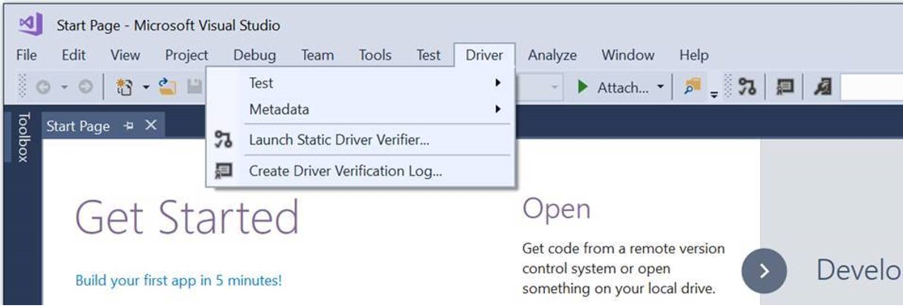

# What's new in driver development

This section provides information about the new features and updates to Windows driver development in Windows 10.

The following is a list of new feature highlights for driver development in Windows 10.

* [Windows 10, version 1903 WDK supports Visual Studio 2019](#wdk-supports-visual-studio-2019)
* [Windows Hardware Dev Center dashboard](#windows-hardware-dev-center-dashboard)
* [Debugging Tools for Windows](#debugging-tools-for-windows)
* [Device and Driver Installation](#device-and-driver-installation)
* [Windows Driver Frameworks](#windows-driver-frameworks-wdf)
* [Windows Compatible hardware development boards](#windows-compatible-hardware-development-boards)
* [Power Management Framework](#power-management-framework)
* [System-Supplied Driver Interfaces](#system-supplied-driver-interfaces)
* [WPP Software Tracing](#wpp-software-tracing)

## WDK supports Visual Studio 2019

Starting in Windows 10, version 1809, the Windows Driver Kit (WDK) supports Visual Studio 2019. This release of the WDK is not compatible with Visual Studio 2017.
Developers can continue working with Visual Studio 2017 by using releases 1709 thru 1809 of the WDK,  found in [Other WDK downloads](https://docs.microsoft.com/windows-hardware/drivers/other-wdk-downloads). To learn about what is new with Visual Studio 2019, see the [Visual Studio 2019 version 16.5 Release Notes](https://docs.microsoft.com/visualstudio/releases/2019/release-notes#whats-new-in-visual-studio-2019).

The following are a few of the notable changes in Visual Studio 2019 that Windows driver developers will see.

### WDK GUI Driver Menu moved

In Visual Studio 2019 the WDK Driver menu has been moved to live under the Extension menu as seen below.

The WDK Driver menu in Visual Studio 2017 is located in the top menu options as seen below.

### Driver Templates discoverability

In Visual Studio 2019 the WDK Driver templates will be discoverable under Project Type, Drivers. The Driver Project Type will appear in the first official update release of Visual Studio 2019. Until then the Driver templates can be discovered by searching for them in the search menu.

The WDK Driver templates were previously found in Visual Studio 2017 under New Projects> Visual C++> Windows Driver as seen below.

## Windows compatible hardware development boards

Windows is now supported on more affordable boards such as the Raspberry Pi 2. Become a part of our early adopter community and load Windows on that board. For more information, see [Windows compatible hardware development boards](https://docs.microsoft.com/windows-hardware/drivers/gettingstarted/windows-compatible-hardware-development-boards).

## What's new in Windows 10, version 2004 (latest)

This section describes new features and updates for driver development in Windows 10, version 2004 (Windows 10 May 2020 Update).

[Back to Top](#top)

### Windows Drivers

Windows 10, version 2004 is a transition release for universal drivers. In this release, universal drivers still exist, but are being replaced by Windows Drivers. A Windows Driver is a universal driver with a few additional requirements.

Windows Drivers are distinguished from Windows Desktop Drivers. While Windows Drivers run on Windows 10X and Windows 10 Desktop editions,  Windows Desktop Drivers run only on Windows 10 Desktop editions.

No changes are required to universal drivers for the version 2004 release, but documentation is available now so that you can plan ahead for upcoming changes.

For information about how to build, install, deploy, and debug a Windows Driver, see [Getting Started with Universal Windows drivers](https://docs.microsoft.com/windows-hardware/drivers/develop/getting-started-with-windows-drivers).

## Related Topics

For information on what was new for drivers in past Windows releases, see the following pages:

* [Driver development changes for Windows 10, version 1903](driver-changes-for-windows-10-version-1903.md)
* [Driver development changes for Windows 10, version 1809](driver-changes-for-windows-10-version-1809.md)
* [Driver development changes for Windows 10, version 1809](driver-changes-for-windows-10-version-1803.md)

[Back to Top](#top)

## Deprecated features

The following table describes Windows driver development features that have been removed in Windows 10.

| Driver technology | Feature | Deprecated in |
|---|---|---|
| GNSS/Location | [Geolocation driver sample for Windows 8.1](https://docs.microsoft.com/windows-hardware/drivers/gnss/sensors-geolocation-driver-sample) and related documentation | Windows 10, version 1709 |
| Mobile Operator Scenarios (Networking) | [AllowStandardUserPinUnlock](https://docs.microsoft.com/windows-hardware/drivers/mobilebroadband/allowstandarduserpinunlock) | Windows 10, version 1709 |
| Scan/Image | [WSD (Web Services for Devices) Challenger](https://docs.microsoft.com/windows-hardware/drivers/image/challenging-a-disconnected-scanner-with-the-wsd-challenger) functionality and related documentation | Windows 10, version 1709 |
|Mobile Operators| Mobile broadband app experience apps with Sysdev metadata packages are deprecated in favor of MO UWP APPS and COSA. | Windows 10, version 1803|
