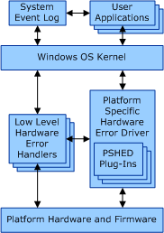

# Components of the Windows Hardware Error Architecture

The following diagram shows the major components of the Windows Hardware Error Architecture (WHEA).

For each hardware [error source](hardware-errors-and-error-sources.md) that is discovered by the operating system, there is a corresponding *low-level hardware error handler* (LLHEH). An LLHEH is the first operating system code that runs in response to a hardware error condition. An LLHEH can be an interrupt handler, an exception handler, a polling routine, or a callback routine that is invoked by the system firmware. Each LLHEH is implemented in the most appropriate software module: for I/O buses, they exist in their respective bus drivers; for platform trap handlers, they exist in the operating system kernel or the hardware abstraction layer (HAL).

Each LLHEH performs the following tasks:

-   Acknowledges the hardware error.

-   Captures the available error information related to the hardware error.

-   Reports the hardware error condition to the operating system.

Typically, LLHEHs interact directly with the hardware and firmware to retrieve hardware error information. LLHEHs compile all of the information related to a hardware error into a hardware error packet. In situations where the firmware initially processes a hardware error, the corresponding LLHEH interacts with the firmware to retrieve the error packet. All LLHEHs report hardware errors to the Windows operating system kernel by passing the hardware error packet data to a common error reporting function.

Both the LLHEHs and the Windows kernel draw upon the services of the *platform-specific hardware error driver* (PSHED) to collect platform-specific error information. The PSHED provides an abstraction of the hardware error reporting facilities of the underlying platform by hiding the details of a platform's error handling mechanisms from the operating system and exposing a consistent interface to the Windows operating system. On platforms that involve a system firmware interface to hardware error handling resources, the PSHED handles interfacing with the firmware. This allows the core Windows components to access only the error status registers that are considered to be architectural while also providing a mechanism through which richer and more detailed platform-specific hardware error information can be obtained.

For each processor architecture (x86, x64, and Itanium), Microsoft provides a PSHED that implements core error handling behavior that is common to that architecture. Platform vendors can supplement the default PSHED functionality by providing PSHED plug-ins that take advantage of platform-specific capabilities. A PSHED plug-in is a special-purpose Windows device driver that implements a callback interface that is called by the PSHED. The purpose of a PSHED plug-in is to augment or override the default behavior of the Microsoft-provided PSHED.

A PSHED plug-in is intended to be implemented by platform vendors as a software interface to the hardware platform's hardware error reporting and recovery capabilities. A PSHED plug-in can interface with the platform firmware by using whatever private interfaces or mechanisms are defined by the platform vendor. This allows the platform vendor to continue using existing firmware for hardware error handling. In time, Microsoft expects that more hardware error reporting and recovery capabilities will be standardized. Therefore the need for PSHED plug-ins for general error handling and reporting will diminish such that PSHED plug-ins will only be required for supporting vendor-specific features that provide additional value beyond the standard hardware error handling functionality.

For more information about how to implement a PSHED plug-in, see [Platform-Specific Hardware Error Driver Plug-Ins](platform-specific-hardware-error-driver-plug-ins2.md).

Upon notification by an LLHEH of a hardware error condition, Windows creates an [error record](error-records.md) in a standardized format that describes the hardware error condition. Windows then calls into the PSHED so that it can add any additional hardware error information to the error record to better describe the hardware error condition. If a PSHED plug-in is installed and is registered to participate in error information retrieval, the PSHED will in turn call into the PSHED plug-in so that it can further augment the information in the error record. After Windows has compiled all of the hardware error information into the error record, it logs the error information in the system event log and notifies user-mode applications by raising an Event Tracing for Windows (ETW) event.

Under certain hardware error conditions, the operating system is forced to restart the system to recover from the error. In these situations, Windows does not log the error information in the system event log or notify user-mode applications until after the system has been restarted. Therefore, the operating system must save the error record to some form of nonvolatile storage before restarting the system. The PSHED provides an interface through which the operating system can store and retrieve an error record so that the error information is preserved during the system restart. If a PSHED plug-in is installed and is registered to participate in error record persistence, the PSHED plug-in can provide a platform-specific implementation for storing and retrieving error records. When the system is restarted, the operating system retrieves the saved error record so that it can be properly logged in the system event log and user-mode applications can be notified.

For more information about how WHEA processes hardware errors, see [Error Processing](error-processing.md).

Windows also provides a hardware error management API so that user-mode error management applications can set and retrieve hardware error source information, configure the error handling for a particular error source, and inject hardware errors into the hardware platform for testing purposes.

For more information about how to implement a WHEA management application, see [WHEA Management Applications](whea-management-applications.md).

 

 

